# System Architecture Analysis

## Overview

- **Project**: /home/tom/github/wronai/redsl
- **Primary Language**: python
- **Languages**: python: 41, shell: 1
- **Analysis Mode**: static
- **Total Functions**: 219
- **Total Classes**: 44
- **Modules**: 42
- **Entry Points**: 178

## Architecture by Module

### redsl.analyzers.parsers
- **Functions**: 22
- **Classes**: 1
- **File**: `parsers.py`

### redsl.analyzers.analyzer
- **Functions**: 20
- **Classes**: 1
- **File**: `analyzer.py`

### redsl.memory
- **Functions**: 18
- **Classes**: 4
- **File**: `__init__.py`

### redsl.main
- **Functions**: 15
- **File**: `main.py`

### redsl.commands.pyqual
- **Functions**: 14
- **Classes**: 1
- **File**: `pyqual.py`

### redsl.refactors.direct
- **Functions**: 14
- **Classes**: 3
- **File**: `direct.py`

### redsl.analyzers.quality_visitor
- **Functions**: 14
- **Classes**: 1
- **File**: `quality_visitor.py`

### redsl.dsl.engine
- **Functions**: 12
- **Classes**: 6
- **File**: `engine.py`

### redsl.cli
- **Functions**: 11
- **File**: `cli.py`

### redsl.formatters
- **Functions**: 10
- **File**: `formatters.py`

### redsl.orchestrator
- **Functions**: 9
- **Classes**: 2
- **File**: `orchestrator.py`

### redsl.refactors.engine
- **Functions**: 7
- **Classes**: 1
- **File**: `engine.py`

### examples.03-full-pipeline.refactor_output.refactor_extract_functions_20260407_145021.00_orders__service
- **Functions**: 6
- **File**: `00_orders__service.py`

### redsl.consciousness_loop
- **Functions**: 6
- **Classes**: 1
- **File**: `consciousness_loop.py`

### refactor_output.refactor_extract_functions_20260407_143102.00_app__models
- **Functions**: 5
- **File**: `00_app__models.py`

### examples.05-api-integration.main
- **Functions**: 4
- **File**: `main.py`

### redsl.llm
- **Functions**: 4
- **Classes**: 2
- **File**: `__init__.py`

### archive.legacy_scripts.batch_refactor_semcod
- **Functions**: 3
- **File**: `batch_refactor_semcod.py`

### redsl.commands.batch
- **Functions**: 3
- **File**: `batch.py`

### redsl.analyzers.utils
- **Functions**: 3
- **File**: `utils.py`

## Key Entry Points

Main execution flows into the system:

### redsl.api.create_app
> Tworzenie aplikacji FastAPI.
- **Calls**: FastAPI, app.add_middleware, AgentConfig.from_env, RefactorOrchestrator, app.get, app.post, app.post, app.post

### archive.legacy_scripts.hybrid_llm_refactor.main
> Process semcod projects with hybrid refactoring.
- **Calls**: Path, semcod_root.iterdir, None.exists, print, print, sorted, print, print

### archive.legacy_scripts.hybrid_quality_refactor.main
> Process semcod projects with hybrid refactoring.
- **Calls**: Path, semcod_root.iterdir, print, print, sorted, print, print, print

### redsl.commands.hybrid.run_hybrid_batch
> Run hybrid refactoring on all semcod projects.
- **Calls**: semcod_root.iterdir, print, print, sorted, print, print, print, sum

### archive.legacy_scripts.batch_refactor_semcod.main
> Process semcod projects.
- **Calls**: Path, semcod_root.iterdir, print, sorted, print, print, print, print

### redsl.analyzers.analyzer.CodeAnalyzer._analyze_python_files
> T004: Fallback — analiza .py przez stdlib ast gdy brak toon plików.
- **Calls**: AnalysisResult, redsl.analyzers.utils._load_gitignore_patterns, len, sum, sum, logger.info, len, str

### examples.04-memory-learning.main.main
- **Calls**: AgentMemory, InMemoryCollection, InMemoryCollection, InMemoryCollection, print, print, print, print

### archive.legacy_scripts.batch_quality_refactor.main
> Process semcod projects.
- **Calls**: Path, semcod_root.iterdir, print, sorted, print, print, print, sum

### examples.02-custom-rules.main.main
- **Calls**: DSLEngine, print, print, print, print, engine.add_rule, engine.add_rule, print

### redsl.commands.pyqual.run_pyqual_analysis
> Run pyqual analysis on a project.
- **Calls**: PyQualAnalyzer, analyzer.analyze_project, analyzer.save_report, print, print, print, print, print

### redsl.dsl.engine.DSLEngine._load_default_rules
> Załaduj domyślny zestaw reguł refaktoryzacji.
- **Calls**: Rule, Rule, Rule, Rule, Rule, Rule, Rule, Rule

### redsl.refactors.direct.ReturnTypeAdder._infer_return_type
> Infer return type from function body.
- **Calls**: ast.walk, set, isinstance, ast.Name, isinstance, len, types.pop, isinstance

### archive.legacy_scripts.apply_semcod_refactor.main
> Apply reDSL to a semcod project.
- **Calls**: Path, logger.info, AgentConfig, RefactorOrchestrator, print, orchestrator.explain_decisions, print, len

### redsl.refactors.direct.DirectRefactorEngine.extract_constants
> Extract magic numbers into named constants.
- **Calls**: len, file_path.read_text, source.splitlines, enumerate, lines.insert, len, file_path.write_text, self.applied_changes.append

### examples.01-basic-analysis.main.main
- **Calls**: CodeAnalyzer, analyzer.analyze_from_toon_content, print, print, print, print, print, print

### redsl.cli.refactor
> Run refactoring on a project.
- **Calls**: cli.command, click.argument, click.option, click.option, click.option, AgentConfig.from_env, RefactorOrchestrator, orchestrator.analyzer.analyze_project

### redsl.orchestrator.RefactorOrchestrator._execute_decision
> Wykonaj pojedynczą decyzję refaktoryzacji.
- **Calls**: logger.info, source_path.exists, self.memory.recall_strategies, self.refactor_engine.generate_proposal, self.refactor_engine.apply_proposal, self.memory.remember_action, self._execute_direct_refactor, self.analyzer.resolve_file_path

### redsl.analyzers.parsers.ToonParser.parse_functions_toon
> T006: Parsuj project.functions.toon — format YAML per-funkcja z CC.

Format:
    project: name
    modules[N]{path,lang,items}:
      file.py,python,1
- **Calls**: content.splitlines, line.strip, stripped.startswith, re.match, None.strip, stripped.split, len, None.append

### redsl.commands.batch.run_semcod_batch
> Run batch refactoring on semcod projects.
- **Calls**: semcod_root.iterdir, print, sorted, print, print, print, redsl.commands.batch.measure_todo_reduction, print

### redsl.analyzers.parsers.ToonParser.parse_duplication_toon
> Parsuj duplication_toon — obsługuje formaty legacy i code2llm [hash] ! STRU.
- **Calls**: content.splitlines, line.strip, duplicates.append, re.search, stripped.startswith, re.search, duplicates.append, re.match

### redsl.commands.pyqual.run_pyqual_fix
> Run automatic fixes based on pyqual analysis.
- **Calls**: PyQualAnalyzer, pyqual_analyzer.analyze_project, print, AgentConfig, RefactorOrchestrator, CodeAnalyzer, code_analyzer.analyze_project, analysis.to_dsl_contexts

### archive.legacy_scripts.debug_decisions.debug_decisions
> Show all decisions generated for a project.
- **Calls**: print, print, print, AgentConfig.from_env, RefactorOrchestrator, CodeAnalyzer, analyzer.analyze_project, analysis.to_dsl_contexts

### redsl.commands.pyqual.PyQualAnalyzer._analyze_ast_issues
> Analyze AST for custom rules.
- **Calls**: len, len, len, len, ast.parse, CodeQualityVisitor, visitor.visit, ast.walk

### redsl.refactors.engine.RefactorEngine.generate_proposal
> Wygeneruj propozycję refaktoryzacji na podstawie decyzji DSL.
- **Calls**: PROMPTS.get, prompt_template.format, self.llm.call_json, response_data.get, response_data.get, RefactorProposal, logger.info, changes.append

### archive.legacy_scripts.debug_llm_config.debug_llm
> Debug LLM configuration.
- **Calls**: print, print, print, print, print, print, print, AgentConfig.from_env

### redsl.commands.pyqual.PyQualAnalyzer._calculate_metrics
> Calculate code metrics.
- **Calls**: None.get, None.get, sum, sum, max, logger.warning, len, len

### redsl.orchestrator.RefactorOrchestrator.run_cycle
> Jeden pełny cykl refaktoryzacji.

1. PERCEIVE: analiza projektu
2. DECIDE: ewaluacja reguł DSL
3. PLAN + EXECUTE: generowanie i aplikowanie zmian
4. R
- **Calls**: CycleReport, logger.info, self.analyzer.analyze_project, logger.info, analysis.to_dsl_contexts, self.dsl_engine.top_decisions, len, logger.info

### redsl.refactors.direct.DirectRefactorEngine.fix_module_execution_block
> Wrap module-level code in if __name__ == '__main__' guard.
- **Calls**: file_path.read_text, ast.parse, source.splitlines, min, lines.insert, sorted, file_path.write_text, self.applied_changes.append

### examples.03-full-pipeline.main.main
- **Calls**: AgentConfig.from_env, RefactorOrchestrator, print, print, print, print, orchestrator.run_from_toon_content, print

### redsl.cli.debug_decisions
> Debug DSL decision making.
- **Calls**: debug.command, click.argument, click.option, CodeAnalyzer, analyzer.analyze_project, analysis.to_dsl_contexts, RefactorOrchestrator, orchestrator.dsl_engine.evaluate

## Process Flows

Key execution flows identified:

### Flow 1: create_app
```
create_app [redsl.api]
```

### Flow 2: main
```
main [archive.legacy_scripts.hybrid_llm_refactor]
```

### Flow 3: run_hybrid_batch
```
run_hybrid_batch [redsl.commands.hybrid]
```

### Flow 4: _analyze_python_files
```
_analyze_python_files [redsl.analyzers.analyzer.CodeAnalyzer]
  └─ →> _load_gitignore_patterns
```

### Flow 5: run_pyqual_analysis
```
run_pyqual_analysis [redsl.commands.pyqual]
```

### Flow 6: _load_default_rules
```
_load_default_rules [redsl.dsl.engine.DSLEngine]
```

### Flow 7: _infer_return_type
```
_infer_return_type [redsl.refactors.direct.ReturnTypeAdder]
```

### Flow 8: extract_constants
```
extract_constants [redsl.refactors.direct.DirectRefactorEngine]
```

### Flow 9: refactor
```
refactor [redsl.cli]
```

### Flow 10: _execute_decision
```
_execute_decision [redsl.orchestrator.RefactorOrchestrator]
```

## Key Classes

### redsl.analyzers.parsers.ToonParser
> Parser plików toon — obsługuje wiele formatów wyjścia code2llm.
- **Methods**: 22
- **Key Methods**: redsl.analyzers.parsers.ToonParser.parse_project_toon, redsl.analyzers.parsers.ToonParser._parse_header_lines, redsl.analyzers.parsers.ToonParser._detect_section_change, redsl.analyzers.parsers.ToonParser._parse_section_line, redsl.analyzers.parsers.ToonParser._parse_health_line, redsl.analyzers.parsers.ToonParser._parse_alerts_line, redsl.analyzers.parsers.ToonParser._parse_hotspots_line, redsl.analyzers.parsers.ToonParser._parse_modules_line, redsl.analyzers.parsers.ToonParser._parse_layers_section_line, redsl.analyzers.parsers.ToonParser._parse_refactors_line

### redsl.analyzers.analyzer.CodeAnalyzer
> Główny analizator kodu.
Łączy dane z toon.yaml, linterów i własnej analizy w zunifikowane metryki.
- **Methods**: 20
- **Key Methods**: redsl.analyzers.analyzer.CodeAnalyzer.__init__, redsl.analyzers.analyzer.CodeAnalyzer.analyze_project, redsl.analyzers.analyzer.CodeAnalyzer._select_project_key, redsl.analyzers.analyzer.CodeAnalyzer._process_project_ton, redsl.analyzers.analyzer.CodeAnalyzer._convert_modules_to_metrics, redsl.analyzers.analyzer.CodeAnalyzer._process_hotspots, redsl.analyzers.analyzer.CodeAnalyzer._process_alerts, redsl.analyzers.analyzer.CodeAnalyzer._process_duplicates, redsl.analyzers.analyzer.CodeAnalyzer._process_validation, redsl.analyzers.analyzer.CodeAnalyzer._resolve_and_filter_metrics

### redsl.analyzers.quality_visitor.CodeQualityVisitor
> Detects common code quality issues in Python AST.
- **Methods**: 14
- **Key Methods**: redsl.analyzers.quality_visitor.CodeQualityVisitor.__init__, redsl.analyzers.quality_visitor.CodeQualityVisitor.visit_Import, redsl.analyzers.quality_visitor.CodeQualityVisitor.visit_ImportFrom, redsl.analyzers.quality_visitor.CodeQualityVisitor.visit_Name, redsl.analyzers.quality_visitor.CodeQualityVisitor.visit_Attribute, redsl.analyzers.quality_visitor.CodeQualityVisitor.visit_Constant, redsl.analyzers.quality_visitor.CodeQualityVisitor.visit_FunctionDef, redsl.analyzers.quality_visitor.CodeQualityVisitor.visit_AsyncFunctionDef, redsl.analyzers.quality_visitor.CodeQualityVisitor.visit_If, redsl.analyzers.quality_visitor.CodeQualityVisitor._is_main_guard
- **Inherits**: ast.NodeVisitor

### redsl.commands.pyqual.PyQualAnalyzer
> Python code quality analyzer.
- **Methods**: 12
- **Key Methods**: redsl.commands.pyqual.PyQualAnalyzer.__init__, redsl.commands.pyqual.PyQualAnalyzer._load_config, redsl.commands.pyqual.PyQualAnalyzer._get_default_config, redsl.commands.pyqual.PyQualAnalyzer.analyze_project, redsl.commands.pyqual.PyQualAnalyzer._find_python_files, redsl.commands.pyqual.PyQualAnalyzer._analyze_with_ruff, redsl.commands.pyqual.PyQualAnalyzer._analyze_with_mypy, redsl.commands.pyqual.PyQualAnalyzer._analyze_with_bandit, redsl.commands.pyqual.PyQualAnalyzer._analyze_ast_issues, redsl.commands.pyqual.PyQualAnalyzer._calculate_metrics

### redsl.orchestrator.RefactorOrchestrator
> Główny orkiestrator — „mózg" systemu.

Łączy:
- CodeAnalyzer (percepcja)
- DSLEngine (decyzje)
- Ref
- **Methods**: 9
- **Key Methods**: redsl.orchestrator.RefactorOrchestrator.__init__, redsl.orchestrator.RefactorOrchestrator.run_cycle, redsl.orchestrator.RefactorOrchestrator.run_from_toon_content, redsl.orchestrator.RefactorOrchestrator._execute_decision, redsl.orchestrator.RefactorOrchestrator._execute_direct_refactor, redsl.orchestrator.RefactorOrchestrator._reflect_on_cycle, redsl.orchestrator.RefactorOrchestrator.explain_decisions, redsl.orchestrator.RefactorOrchestrator.get_memory_stats, redsl.orchestrator.RefactorOrchestrator.add_custom_rules

### redsl.memory.AgentMemory
> Kompletny system pamięci z trzema warstwami.

- episodic: „co zrobiłem" — historia refaktoryzacji
- 
- **Methods**: 8
- **Key Methods**: redsl.memory.AgentMemory.__init__, redsl.memory.AgentMemory.remember_action, redsl.memory.AgentMemory.recall_similar_actions, redsl.memory.AgentMemory.learn_pattern, redsl.memory.AgentMemory.recall_patterns, redsl.memory.AgentMemory.store_strategy, redsl.memory.AgentMemory.recall_strategies, redsl.memory.AgentMemory.stats

### redsl.refactors.engine.RefactorEngine
> Silnik refaktoryzacji z pętlą refleksji.

1. Generuj propozycję (LLM)
2. Reflektuj (self-critique)
3
- **Methods**: 7
- **Key Methods**: redsl.refactors.engine.RefactorEngine.__init__, redsl.refactors.engine.RefactorEngine.estimate_confidence, redsl.refactors.engine.RefactorEngine.generate_proposal, redsl.refactors.engine.RefactorEngine.reflect_on_proposal, redsl.refactors.engine.RefactorEngine.validate_proposal, redsl.refactors.engine.RefactorEngine.apply_proposal, redsl.refactors.engine.RefactorEngine._save_proposal

### redsl.refactors.direct.DirectRefactorEngine
> Applies simple refactorings directly via AST manipulation.
- **Methods**: 7
- **Key Methods**: redsl.refactors.direct.DirectRefactorEngine.__init__, redsl.refactors.direct.DirectRefactorEngine.remove_unused_imports, redsl.refactors.direct.DirectRefactorEngine.fix_module_execution_block, redsl.refactors.direct.DirectRefactorEngine.extract_constants, redsl.refactors.direct.DirectRefactorEngine._generate_constant_name, redsl.refactors.direct.DirectRefactorEngine.add_return_types, redsl.refactors.direct.DirectRefactorEngine.get_applied_changes

### redsl.dsl.engine.DSLEngine
> Silnik ewaluacji reguł DSL.

Przyjmuje zbiór reguł i konteksty plików/funkcji,
zwraca posortowaną li
- **Methods**: 7
- **Key Methods**: redsl.dsl.engine.DSLEngine.__init__, redsl.dsl.engine.DSLEngine._load_default_rules, redsl.dsl.engine.DSLEngine.add_rule, redsl.dsl.engine.DSLEngine.add_rules_from_yaml, redsl.dsl.engine.DSLEngine.evaluate, redsl.dsl.engine.DSLEngine.top_decisions, redsl.dsl.engine.DSLEngine.explain

### redsl.memory.MemoryLayer
> Warstwa pamięci oparta na ChromaDB.
- **Methods**: 6
- **Key Methods**: redsl.memory.MemoryLayer.__init__, redsl.memory.MemoryLayer._get_collection, redsl.memory.MemoryLayer.store, redsl.memory.MemoryLayer.recall, redsl.memory.MemoryLayer.count, redsl.memory.MemoryLayer.clear

### redsl.consciousness_loop.ConsciousnessLoop
> Ciągła pętla „świadomości" agenta.

Agent nie czeka na polecenia — sam analizuje, myśli i planuje.
- **Methods**: 5
- **Key Methods**: redsl.consciousness_loop.ConsciousnessLoop.__init__, redsl.consciousness_loop.ConsciousnessLoop.run, redsl.consciousness_loop.ConsciousnessLoop._inner_thought, redsl.consciousness_loop.ConsciousnessLoop._self_assessment, redsl.consciousness_loop.ConsciousnessLoop.stop

### redsl.llm.LLMLayer
> Warstwa abstrakcji nad LLM z obsługą:
- wywołań tekstowych
- odpowiedzi JSON
- zliczania tokenów
- f
- **Methods**: 5
- **Key Methods**: redsl.llm.LLMLayer.__init__, redsl.llm.LLMLayer.call, redsl.llm.LLMLayer.call_json, redsl.llm.LLMLayer.reflect, redsl.llm.LLMLayer.total_calls

### redsl.memory.InMemoryCollection
> Fallback gdy ChromaDB nie jest dostępne.
- **Methods**: 4
- **Key Methods**: redsl.memory.InMemoryCollection.__init__, redsl.memory.InMemoryCollection.add, redsl.memory.InMemoryCollection.query, redsl.memory.InMemoryCollection.count

### redsl.refactors.direct.ReturnTypeAdder
> AST transformer to add return type annotations.
- **Methods**: 4
- **Key Methods**: redsl.refactors.direct.ReturnTypeAdder.__init__, redsl.refactors.direct.ReturnTypeAdder.visit_FunctionDef, redsl.refactors.direct.ReturnTypeAdder.visit_AsyncFunctionDef, redsl.refactors.direct.ReturnTypeAdder._infer_return_type
- **Inherits**: ast.NodeTransformer

### redsl.refactors.direct.UnusedImportRemover
> AST transformer to remove unused imports.
- **Methods**: 3
- **Key Methods**: redsl.refactors.direct.UnusedImportRemover.__init__, redsl.refactors.direct.UnusedImportRemover.visit_Import, redsl.refactors.direct.UnusedImportRemover.visit_ImportFrom
- **Inherits**: ast.NodeTransformer

### redsl.dsl.engine.Rule
> Reguła DSL: warunki → akcja z priorytetem.
- **Methods**: 3
- **Key Methods**: redsl.dsl.engine.Rule.evaluate, redsl.dsl.engine.Rule.score, redsl.dsl.engine.Rule._calculate_impact

### redsl.dsl.engine.Condition
> Pojedynczy warunek DSL.
- **Methods**: 2
- **Key Methods**: redsl.dsl.engine.Condition.evaluate, redsl.dsl.engine.Condition.__repr__

### redsl.config.LLMConfig
> Konfiguracja warstwy LLM.
- **Methods**: 1
- **Key Methods**: redsl.config.LLMConfig.is_local

### redsl.config.AgentConfig
> Główna konfiguracja agenta.
- **Methods**: 1
- **Key Methods**: redsl.config.AgentConfig.from_env

### redsl.analyzers.metrics.CodeMetrics
> Metryki pojedynczej funkcji/modułu.
- **Methods**: 1
- **Key Methods**: redsl.analyzers.metrics.CodeMetrics.to_dsl_context

## Data Transformation Functions

Key functions that process and transform data:

### examples.03-full-pipeline.refactor_output.refactor_extract_functions_20260407_145021.00_orders__service.process_order
> Funkcja z CC=25 i fan-out=10 — idealny kandydat do refaktoryzacji.
- **Output to**: examples.03-full-pipeline.refactor_output.refactor_extract_functions_20260407_145021.00_orders__service._is_order_terminal, examples.03-full-pipeline.refactor_output.refactor_extract_functions_20260407_145021.00_orders__service._calculate_order_total, shipping.calculate, examples.03-full-pipeline.refactor_output.refactor_extract_functions_20260407_145021.00_orders__service._finalize_order, examples.03-full-pipeline.refactor_output.refactor_extract_functions_20260407_145021.00_orders__service._validate_order_and_user

### examples.03-full-pipeline.refactor_output.refactor_extract_functions_20260407_145021.00_orders__service._validate_order_and_user
> Validate that order and user exist.
- **Output to**: logger.error, logger.error

### examples.03-full-pipeline.refactor_output.refactor_extract_functions_20260407_145021.00_orders__service._process_physical_item
> Process physical item inventory and pricing logic.
- **Output to**: inventory.check, logger.warning, inventory.backorder, ValueError

### refactor_output.refactor_extract_functions_20260407_143102.00_app__models.process_data

### refactor_output.refactor_extract_functions_20260407_143102.00_app__models.validate_data

### redsl.formatters.format_refactor_plan
> Format refactoring plan in specified format.
- **Output to**: redsl.formatters._format_yaml, redsl.formatters._format_json, redsl.formatters._format_text

### redsl.formatters._format_yaml
> Format as YAML.
- **Output to**: yaml.dump, redsl.formatters._get_timestamp, redsl.formatters._serialize_analysis, redsl.formatters._serialize_decision, len

### redsl.formatters._format_json
> Format as JSON.
- **Output to**: json.dumps, redsl.formatters._get_timestamp, redsl.formatters._serialize_analysis, redsl.formatters._serialize_decision, len

### redsl.formatters._format_text
> Format as rich text.
- **Output to**: output.append, redsl.formatters._count_decision_types, output.append, output.append, enumerate

### redsl.formatters._serialize_analysis
> Serialize analysis object to dict.
- **Output to**: len, len, str

### redsl.formatters._serialize_decision
> Serialize decision object to dict.
- **Output to**: hasattr, hasattr, hasattr, str, hasattr

### redsl.formatters.format_batch_results
> Format batch processing results.
- **Output to**: yaml.dump, json.dumps, enumerate, len, sum

### redsl.formatters.format_debug_info
> Format debug information.
- **Output to**: yaml.dump, json.dumps, info.items, None.join, isinstance

### redsl.refactors.engine.RefactorEngine.validate_proposal
> Waliduj propozycję: syntax check + basic sanity.
- **Output to**: RefactorResult, len, code.strip, result.errors.append, compile

### redsl.analyzers.analyzer.CodeAnalyzer._process_project_ton
> Parsuj plik project_toon i zaktualizuj result.
- **Output to**: toon_file.read_text, project_data.get, health.get, health.get, health.get

### redsl.analyzers.analyzer.CodeAnalyzer._convert_modules_to_metrics
> Konwertuj moduły z toon na CodeMetrics.
- **Output to**: CodeMetrics, result.metrics.append

### redsl.analyzers.analyzer.CodeAnalyzer._process_hotspots
> Dodaj fan-out z hotspotów do istniejących metryk.
- **Output to**: max

### redsl.analyzers.analyzer.CodeAnalyzer._process_alerts
> Przetwórz alerty i zaktualizuj lub dodaj metryki.
- **Output to**: alert.get, alert.get, alert.get, func_index.get, CodeMetrics

### redsl.analyzers.analyzer.CodeAnalyzer._process_duplicates
> Parsuj duplikaty i dodaj metryki.
- **Output to**: self.parser.parse_duplication_toon, None.read_text, dup.get, dup.get, max

### redsl.analyzers.analyzer.CodeAnalyzer._process_validation
> Parsuj walidację i dodaj metryki lintera.
- **Output to**: self.parser.parse_validation_toon, None.read_text, issue.get, issue.get

### redsl.analyzers.parsers.ToonParser.parse_project_toon
> Parsuj plik toon — obsługuje formaty: legacy, code2llm v2 (HEALTH[N]/LAYERS), M[N] list.
- **Output to**: self._parse_header_lines, content.splitlines, line.strip, self._detect_section_change, self._parse_section_line

### redsl.analyzers.parsers.ToonParser._parse_header_lines
> T017: Parsuj nagłówki z pierwszych 3 linii.
- **Output to**: content.splitlines, line.startswith, self._parse_header_line, None.update

### redsl.analyzers.parsers.ToonParser._parse_section_line
> Parsuj pojedynczą linię w kontekście aktualnej sekcji.
- **Output to**: self._parse_health_line, self._parse_alerts_line, self._parse_hotspots_line, self._parse_modules_line, self._parse_layers_section_line

### redsl.analyzers.parsers.ToonParser._parse_health_line
> Parsuj linię w sekcji HEALTH.
- **Output to**: stripped.split, stripped.startswith, self._parse_emoji_alert_line, part.split, redsl.analyzers.utils._try_number

### redsl.analyzers.parsers.ToonParser._parse_alerts_line
> Parsuj linię w sekcji ALERTS.
- **Output to**: stripped.startswith, self._parse_alert_line, None.append

## Public API Surface

Functions exposed as public API (no underscore prefix):

- `redsl.api.create_app` - 79 calls
- `archive.legacy_scripts.hybrid_llm_refactor.main` - 68 calls
- `archive.legacy_scripts.hybrid_quality_refactor.main` - 58 calls
- `redsl.commands.hybrid.run_hybrid_batch` - 51 calls
- `archive.legacy_scripts.batch_refactor_semcod.main` - 46 calls
- `redsl.main.cmd_analyze` - 45 calls
- `examples.04-memory-learning.main.main` - 39 calls
- `archive.legacy_scripts.batch_quality_refactor.main` - 38 calls
- `examples.02-custom-rules.main.main` - 35 calls
- `redsl.commands.pyqual.run_pyqual_analysis` - 35 calls
- `archive.legacy_scripts.hybrid_llm_refactor.apply_changes_with_llm_supervision` - 34 calls
- `archive.legacy_scripts.apply_semcod_refactor.main` - 29 calls
- `redsl.refactors.direct.DirectRefactorEngine.extract_constants` - 29 calls
- `examples.01-basic-analysis.main.main` - 28 calls
- `redsl.cli.refactor` - 28 calls
- `redsl.analyzers.parsers.ToonParser.parse_functions_toon` - 28 calls
- `redsl.commands.batch.run_semcod_batch` - 27 calls
- `redsl.analyzers.parsers.ToonParser.parse_duplication_toon` - 27 calls
- `redsl.commands.pyqual.run_pyqual_fix` - 26 calls
- `archive.legacy_scripts.debug_decisions.debug_decisions` - 25 calls
- `archive.legacy_scripts.batch_quality_refactor.apply_quality_refactors` - 25 calls
- `redsl.refactors.engine.RefactorEngine.generate_proposal` - 25 calls
- `archive.legacy_scripts.debug_llm_config.debug_llm` - 24 calls
- `redsl.orchestrator.RefactorOrchestrator.run_cycle` - 22 calls
- `redsl.refactors.direct.DirectRefactorEngine.fix_module_execution_block` - 22 calls
- `archive.legacy_scripts.hybrid_quality_refactor.apply_all_quality_changes` - 21 calls
- `examples.03-full-pipeline.main.main` - 21 calls
- `redsl.commands.hybrid.run_hybrid_quality_refactor` - 21 calls
- `redsl.main.cmd_refactor` - 21 calls
- `redsl.cli.debug_decisions` - 20 calls
- `redsl.orchestrator.RefactorOrchestrator.explain_decisions` - 20 calls
- `redsl.formatters.format_batch_results` - 19 calls
- `redsl.analyzers.analyzer.CodeAnalyzer.analyze_from_toon_content` - 19 calls
- `redsl.dsl.engine.DSLEngine.add_rules_from_yaml` - 18 calls
- `redsl.analyzers.parsers.ToonParser.parse_validation_toon` - 16 calls
- `redsl.orchestrator.RefactorOrchestrator.run_from_toon_content` - 15 calls
- `redsl.cli.batch_semcod` - 14 calls
- `examples.05-api-integration.main.example_curl_commands` - 13 calls
- `redsl.consciousness_loop.ConsciousnessLoop.run` - 13 calls
- `redsl.formatters.format_debug_info` - 13 calls

## System Interactions

How components interact:

```mermaid
graph TD
    create_app --> FastAPI
    create_app --> add_middleware
    create_app --> from_env
    create_app --> RefactorOrchestrator
    create_app --> get
    main --> Path
    main --> iterdir
    main --> exists
    main --> print
    main --> sorted
    run_hybrid_batch --> iterdir
    run_hybrid_batch --> print
    run_hybrid_batch --> sorted
    _analyze_python_file --> AnalysisResult
    _analyze_python_file --> _load_gitignore_patt
    _analyze_python_file --> len
    _analyze_python_file --> sum
    main --> AgentMemory
    main --> InMemoryCollection
    main --> DSLEngine
    run_pyqual_analysis --> PyQualAnalyzer
    run_pyqual_analysis --> analyze_project
    run_pyqual_analysis --> save_report
    run_pyqual_analysis --> print
    _load_default_rules --> Rule
    _infer_return_type --> walk
    _infer_return_type --> set
    _infer_return_type --> isinstance
    _infer_return_type --> Name
    main --> info
```



## Reverse Engineering Guidelines

1. **Entry Points**: Start analysis from the entry points listed above
2. **Core Logic**: Focus on classes with many methods
3. **Data Flow**: Follow data transformation functions
4. **Process Flows**: Use the flow diagrams for execution paths
5. **API Surface**: Public API functions reveal the interface

## Context for LLM

Maintain the identified architectural patterns and public API surface when suggesting changes.