# System Architecture Analysis

## Overview

- **Project**: /home/tom/github/semcod/redsl
- **Primary Language**: python
- **Languages**: python: 255, md: 75, yaml: 65, php: 31, json: 9
- **Analysis Mode**: static
- **Total Functions**: 4649
- **Total Classes**: 288
- **Modules**: 457
- **Entry Points**: 3809

## Architecture by Module

### project.map.toon
- **Functions**: 10007
- **File**: `map.toon.yaml`

### SUMD
- **Functions**: 997
- **Classes**: 11
- **File**: `SUMD.md`

### project_test.map.toon
- **Functions**: 797
- **File**: `map.toon.yaml`

### SUMR
- **Functions**: 57
- **Classes**: 11
- **File**: `SUMR.md`

### www.project.map.toon
- **Functions**: 38
- **File**: `map.toon.yaml`

### redsl.cli.planfile
- **Functions**: 30
- **File**: `planfile.py`

### redsl.commands.batch_pyqual.reporting
- **Functions**: 25
- **File**: `reporting.py`

### redsl.main
- **Functions**: 23
- **File**: `main.py`

### redsl.awareness.git_timeline
- **Functions**: 23
- **Classes**: 1
- **File**: `git_timeline.py`

### redsl.analyzers.radon_analyzer
- **Functions**: 23
- **Classes**: 1
- **File**: `radon_analyzer.py`

### redsl.config_standard.store
- **Functions**: 22
- **Classes**: 5
- **File**: `store.py`

### redsl.commands.cli_autonomy
- **Functions**: 20
- **File**: `cli_autonomy.py`

### redsl.api.cqrs.events
- **Functions**: 19
- **Classes**: 9
- **File**: `events.py`

### redsl.formatters.cycle
- **Functions**: 18
- **File**: `cycle.py`

### redsl.memory
- **Functions**: 18
- **Classes**: 4
- **File**: `__init__.py`

### redsl.analyzers.quality_visitor
- **Functions**: 18
- **Classes**: 1
- **File**: `quality_visitor.py`

### redsl.analyzers.parsers.project_parser
- **Functions**: 18
- **Classes**: 1
- **File**: `project_parser.py`

### test_refactor_bad.complex_code
- **Functions**: 17
- **Classes**: 1
- **File**: `complex_code.py`

### redsl.commands.doctor_detectors
- **Functions**: 17
- **File**: `doctor_detectors.py`

### redsl.analyzers.incremental
- **Functions**: 17
- **Classes**: 2
- **File**: `incremental.py`

## Key Entry Points

Main execution flows into the system:

### redsl.api.cqrs.commands.ScanRemoteHandler.handle
> Execute remote scan with event sourcing.
- **Calls**: ScanStarted, ScanProgress, event_store.append, project.map.toon._validate_repo_url, ScanFailed, event_store.append, asyncio.to_thread, ScanFailed

### redsl.cli.planfile.planfile_validate
> Check whether planfile.yaml tickets are still current.

For each open task, validates:
- File still exists (otherwise: STALE_FILE_MISSING)
- For reduc
- **Calls**: planfile_group.command, click.argument, click.option, click.option, redsl.analyzers.incremental.EvolutionaryCache.set, history_file.exists, sum, click.echo

### redsl.llm.registry.aggregator.RegistryAggregator._load_stale_cache
> Load cache even if stale (when network fails).
- **Calls**: self.cache_path.exists, json.loads, datetime.fromisoformat, None.total_seconds, None.items, log.warning, self.cache_path.read_text, log.error

### redsl.cli.models.estimate_cost
> Estimate monthly cost for given tier and usage pattern.

Example:
    redsl models estimate-cost --tier cheap --ops-per-day 50
    redsl models estima
- **Calls**: models_group.command, click.option, click.option, click.option, click.option, click.option, redsl.cli.models._build_selector, Console

### redsl.cli.workflow.workflow_show
> Show effective workflow config for PROJECT_DIR (resolved with fallbacks).
- **Calls**: workflow_group.command, click.argument, None.resolve, project.map.toon.load_workflow, click.echo, click.echo, click.echo, click.echo

### redsl.cli.events.events_cycles
> Show per-cycle summary from cycle_started / cycle_completed events.
- **Calls**: events_group.command, click.argument, redsl.cli.events._load_events, sorted, click.echo, click.echo, e.get, e.get

### redsl.cli.deploy.deploy_migrate
> Full detect → plan → apply on HOST in one command.
- **Calls**: deploy.command, click.argument, click.option, click.option, click.option, click.option, click.option, click.option

### redsl.cli.events.events_summary
> Print a statistical summary of all recorded events.
- **Calls**: events_group.command, click.argument, redsl.cli.events._load_events, len, Counter, sum, sum, sum

### redsl.cli.deploy.deploy_run
> Run full pipeline from a migration spec YAML (source + target in one file).
- **Calls**: deploy.command, click.argument, click.option, click.option, click.option, click.option, Console, console.print

### redsl.execution.planfile_updater.add_decision_tasks
> Convert refactor decisions into todo tasks in planfile.yaml.

Used with ``--to-planfile`` flag — instead of (or in addition to) generating
a markdown 
- **Calls**: redsl.execution.planfile_updater._load_yaml_module, redsl.execution.planfile_updater._load_planfile_data, redsl.execution.planfile_updater._get_tasks, None.isoformat, str, str, float, str

### redsl.execution.cycle.run_cycle
> Run a complete refactoring cycle driven by WorkflowConfig.

If *workflow* is None, ``load_workflow(project_dir)`` is called automatically
which search
- **Calls**: logger.debug, redsl.execution.cycle._new_cycle_report, getattr, orchestrator.history.record_event, orchestrator.history.record_event, project.map.toon.load_workflow, hasattr, orchestrator.llm.set_chat_log

### redsl.analyzers.sumd_bridge.SumdAnalyzer.generate_map_toon
> Generate map.toon.yaml content compatible with redsl.

Args:
    project_dir: Path to project root

Returns:
    map.toon.yaml content as string
- **Calls**: self.analyze, None.isoformat, None.join, a, a, a, None.join, a

### redsl.cli.deploy.deploy_plan
> Generate migration-plan.yaml from infra.yaml + desired state.
- **Calls**: deploy.command, click.option, click.option, click.option, click.option, click.option, click.option, click.option

### redsl.cli.config.config_apply
> Apply a ConfigChangeProposal atomically.
- **Calls**: config.command, click.option, click.argument, click.option, click.option, click.option, redsl.cli.config._resolve_store, yaml.safe_load

### redsl.cli.events.events_show
> Show decision events for a project from .redsl/history.jsonl.
- **Calls**: events_group.command, click.argument, click.option, click.option, click.option, click.option, click.option, redsl.cli.events._load_events

### redsl.cli.refactor.refactor
> Run refactoring on a project.
- **Calls**: click.command, click.argument, click.option, click.option, click.option, click.option, click.option, click.option

### redsl.cli.workflow.workflow_scan
> Scan PROJECT_DIR and build a map of configuration files.

By default prints the detected map.  Use --write to persist it into
the project's redsl.yaml
- **Calls**: workflow_group.command, click.argument, click.option, click.option, None.resolve, project.map.toon.scan_project, click.echo, click.echo

### redsl.llm.registry.sources.base.OpenRouterSource.fetch
> Fetch models from OpenRouter with full pricing and capabilities.
- **Calls**: self._http_get, self._fetch_programming_category, data.get, m.get, m.get, m.get, m.get, m.get

### redsl.cli.planfile.source_add
> Add a GitHub source to planfile.yaml.


Examples:
  redsl planfile source add --repo org/myproject
  redsl planfile source add --repo org/myproject -
- **Calls**: source_group.command, click.option, click.option, click.option, click.option, click.option, click.option, any

### redsl.refactors.engine.RefactorEngine.generate_proposal
> Wygeneruj propozycję refaktoryzacji na podstawie decyzji DSL.
- **Calls**: PROMPTS.get, SUMD.build_ecosystem_context, prompt_template.format, self.llm.call_json, response_data.get, self._resolve_confidence, RefactorProposal, logger.info

### redsl.api.cqrs.commands.RefactorHandler.handle
> Execute refactoring cycle with event sourcing.
- **Calls**: Path, RefactorStarted, event_store.append, RefactorProgress, AgentConfig.from_env, RefactorOrchestrator, RefactorCompleted, ws_manager.broadcast_event

### redsl.api.scan_routes._register_scan_routes
> Register remote scan endpoints.
- **Calls**: app.post, redsl.api.scan_routes._clone_repo, redsl.api.scan_routes._validate_repo_url, HTTPException, HTTPException, CodeAnalyzer, analyzer.analyze_project, logger.info

### redsl.config_standard.applier.ConfigApplier.apply
- **Calls**: self.store.lock, self.store.load, self._check_preconditions, self._backup, current.model_dump, datetime.now, updated.compute_fingerprint, self.store.validate

### redsl.commands.pyqual.run_pyqual_fix
> Run automatic fixes based on pyqual analysis.
- **Calls**: PyQualAnalyzer, pyqual_analyzer.analyze_project, dict, SUMD.build_pyqual_fix_decisions, docs.model-policy-quickstart.print, AgentConfig, Path, RefactorOrchestrator

### redsl.cli.config.config_diff
> Diff current config against another config file or root.
- **Calls**: config.command, click.option, click.option, click.option, redsl.cli.config._resolve_store, store.load, redsl.cli.config._load_document_from_path, store.diff_documents

### redsl.cli.deploy.deploy_detect
> Probe infrastructure on HOST and save infra.yaml.
- **Calls**: deploy.command, click.argument, click.option, click.option, click.option, Console, console.print, project.map.toon.detect_and_save

### redsl.api.create_app
> Tworzenie aplikacji FastAPI.
- **Calls**: FastAPI, app.add_middleware, FastAPI, v1_app.add_middleware, redsl.api._build_api_orchestrator, SUMD._register_health_route, SUMD._register_refactor_routes, SUMD._register_debug_routes

### redsl.analyzers.python_analyzer.PythonAnalyzer._scan_top_nodes
> Iteruj po węzłach top-level i class-level, zbieraj CC, nesting i alerty.
- **Calls**: rel_path.endswith, ast.iter_child_nodes, isinstance, ast.iter_child_nodes, isinstance, isinstance, SUMD.ast_cyclomatic_complexity, SUMD.ast_max_nesting_depth

### redsl.cli.llm_banner.print_llm_banner
> Print the LLM config banner to stderr.

Parameters
----------
mode:
    One of ``"llm"`` (command may call LLM), ``"direct"`` (AST-only),
    ``"mixed
- **Calls**: AgentConfig.from_env, redsl.cli.llm_banner._provider_for_model, redsl.cli.llm_banner._find_dotenv, lines.append, lines.append, lines.append, lines.append, click.echo

### redsl.cli.config.config_init
> Initialize a new redsl-config layout.
- **Calls**: config.command, click.option, click.option, click.option, click.option, redsl.cli.config._resolve_store, store.ensure_layout, store.create_default

## Process Flows

Key execution flows identified:

### Flow 1: handle
```
handle [redsl.api.cqrs.commands.ScanRemoteHandler]
  └─ →> _validate_repo_url
```

### Flow 2: planfile_validate
```
planfile_validate [redsl.cli.planfile]
  └─ →> set
      └─ →> _file_hash
```

### Flow 3: _load_stale_cache
```
_load_stale_cache [redsl.llm.registry.aggregator.RegistryAggregator]
```

### Flow 4: estimate_cost
```
estimate_cost [redsl.cli.models]
```

### Flow 5: workflow_show
```
workflow_show [redsl.cli.workflow]
  └─ →> load_workflow
```

### Flow 6: events_cycles
```
events_cycles [redsl.cli.events]
  └─> _load_events
```

### Flow 7: deploy_migrate
```
deploy_migrate [redsl.cli.deploy]
```

### Flow 8: events_summary
```
events_summary [redsl.cli.events]
  └─> _load_events
```

### Flow 9: deploy_run
```
deploy_run [redsl.cli.deploy]
```

### Flow 10: add_decision_tasks
```
add_decision_tasks [redsl.execution.planfile_updater]
  └─> _load_yaml_module
  └─> _load_planfile_data
```

## Key Classes

### redsl.awareness.git_timeline.GitTimelineAnalyzer
> Build a historical metric timeline from git commits — facade.

This is a thin facade that delegates 
- **Methods**: 23
- **Key Methods**: redsl.awareness.git_timeline.GitTimelineAnalyzer.__init__, redsl.awareness.git_timeline.GitTimelineAnalyzer.build_timeline, redsl.awareness.git_timeline.GitTimelineAnalyzer.analyze_trends, redsl.awareness.git_timeline.GitTimelineAnalyzer.predict_future_state, redsl.awareness.git_timeline.GitTimelineAnalyzer.find_degradation_sources, redsl.awareness.git_timeline.GitTimelineAnalyzer.summarize, redsl.awareness.git_timeline.GitTimelineAnalyzer._resolve_repo_root, redsl.awareness.git_timeline.GitTimelineAnalyzer._project_rel_path, redsl.awareness.git_timeline.GitTimelineAnalyzer._git_log, redsl.awareness.git_timeline.GitTimelineAnalyzer._snapshot_for_commit

### redsl.config_standard.store.ConfigStore
> Manage a redsl-config directory with manifest, profiles and history.
- **Methods**: 22
- **Key Methods**: redsl.config_standard.store.ConfigStore.__init__, redsl.config_standard.store.ConfigStore.resolve, redsl.config_standard.store.ConfigStore.ensure_layout, redsl.config_standard.store.ConfigStore.create_default, redsl.config_standard.store.ConfigStore.apply_profile, redsl.config_standard.store.ConfigStore.load_document, redsl.config_standard.store.ConfigStore.load, redsl.config_standard.store.ConfigStore.load_any, redsl.config_standard.store.ConfigStore.save, redsl.config_standard.store.ConfigStore.write_schema_files

### redsl.analyzers.quality_visitor.CodeQualityVisitor
> Detects common code quality issues in Python AST.
- **Methods**: 18
- **Key Methods**: redsl.analyzers.quality_visitor.CodeQualityVisitor.__init__, redsl.analyzers.quality_visitor.CodeQualityVisitor.visit_Import, redsl.analyzers.quality_visitor.CodeQualityVisitor.visit_ImportFrom, redsl.analyzers.quality_visitor.CodeQualityVisitor.visit_Name, redsl.analyzers.quality_visitor.CodeQualityVisitor.visit_Assign, redsl.analyzers.quality_visitor.CodeQualityVisitor.visit_Attribute, redsl.analyzers.quality_visitor.CodeQualityVisitor._get_root_name, redsl.analyzers.quality_visitor.CodeQualityVisitor.visit_Constant, redsl.analyzers.quality_visitor.CodeQualityVisitor._count_untyped_params, redsl.analyzers.quality_visitor.CodeQualityVisitor.visit_FunctionDef
- **Inherits**: ast.NodeVisitor

### redsl.analyzers.parsers.project_parser.ProjectParser
> Parser sekcji project_toon.
- **Methods**: 18
- **Key Methods**: redsl.analyzers.parsers.project_parser.ProjectParser.parse_project_toon, redsl.analyzers.parsers.project_parser.ProjectParser._parse_header_lines, redsl.analyzers.parsers.project_parser.ProjectParser._detect_section_change, redsl.analyzers.parsers.project_parser.ProjectParser._parse_section_line, redsl.analyzers.parsers.project_parser.ProjectParser._parse_health_line, redsl.analyzers.parsers.project_parser.ProjectParser._parse_alerts_line, redsl.analyzers.parsers.project_parser.ProjectParser._parse_hotspots_line, redsl.analyzers.parsers.project_parser.ProjectParser._parse_modules_line, redsl.analyzers.parsers.project_parser.ProjectParser._parse_layers_section_line, redsl.analyzers.parsers.project_parser.ProjectParser._parse_refactors_line

### redsl.autonomy.scheduler.Scheduler
> Periodic quality-improvement loop.
- **Methods**: 16
- **Key Methods**: redsl.autonomy.scheduler.Scheduler.__init__, redsl.autonomy.scheduler.Scheduler.run, redsl.autonomy.scheduler.Scheduler.stop, redsl.autonomy.scheduler.Scheduler.run_once, redsl.autonomy.scheduler.Scheduler._has_changes_since_last_check, redsl.autonomy.scheduler.Scheduler._git_head, redsl.autonomy.scheduler.Scheduler._analyze, redsl.autonomy.scheduler.Scheduler._check_trends, redsl.autonomy.scheduler.Scheduler._check_proactive, redsl.autonomy.scheduler.Scheduler._generate_proposals

### test_refactor_bad.complex_code.GodClass
> A god class with too many responsibilities.
- **Methods**: 15
- **Key Methods**: test_refactor_bad.complex_code.GodClass.method1, test_refactor_bad.complex_code.GodClass.method2, test_refactor_bad.complex_code.GodClass.method3, test_refactor_bad.complex_code.GodClass.method4, test_refactor_bad.complex_code.GodClass.method5, test_refactor_bad.complex_code.GodClass.method6, test_refactor_bad.complex_code.GodClass.method7, test_refactor_bad.complex_code.GodClass.method8, test_refactor_bad.complex_code.GodClass.method9, test_refactor_bad.complex_code.GodClass.method10

### redsl.llm.registry.aggregator.RegistryAggregator
> Aggregates model info from multiple sources with caching.
- **Methods**: 15
- **Key Methods**: redsl.llm.registry.aggregator.RegistryAggregator.__init__, redsl.llm.registry.aggregator.RegistryAggregator.get_all, redsl.llm.registry.aggregator.RegistryAggregator.get, redsl.llm.registry.aggregator.RegistryAggregator._fetch_and_merge, redsl.llm.registry.aggregator.RegistryAggregator._merge_model, redsl.llm.registry.aggregator.RegistryAggregator._collect_source_info, redsl.llm.registry.aggregator.RegistryAggregator._merge_context_length, redsl.llm.registry.aggregator.RegistryAggregator._merge_pricing, redsl.llm.registry.aggregator.RegistryAggregator._merge_capabilities, redsl.llm.registry.aggregator.RegistryAggregator._merge_quality

### redsl.refactors.direct_imports.DirectImportRefactorer
> Handles import-related direct refactoring.
- **Methods**: 14
- **Key Methods**: redsl.refactors.direct_imports.DirectImportRefactorer.__init__, redsl.refactors.direct_imports.DirectImportRefactorer.remove_unused_imports, redsl.refactors.direct_imports.DirectImportRefactorer._collect_unused_import_edits, redsl.refactors.direct_imports.DirectImportRefactorer._collect_import_edits, redsl.refactors.direct_imports.DirectImportRefactorer._collect_import_from_edits, redsl.refactors.direct_imports.DirectImportRefactorer._is_star_import, redsl.refactors.direct_imports.DirectImportRefactorer._build_import_from_replacement, redsl.refactors.direct_imports.DirectImportRefactorer._alias_name, redsl.refactors.direct_imports.DirectImportRefactorer._format_alias, redsl.refactors.direct_imports.DirectImportRefactorer._remove_statement_lines
- **Inherits**: DirectRefactorBase

### redsl.awareness.AwarenessManager
> Facade that combines all awareness layers into one snapshot.
- **Methods**: 13
- **Key Methods**: redsl.awareness.AwarenessManager.__init__, redsl.awareness.AwarenessManager._memory_fingerprint, redsl.awareness.AwarenessManager._git_head, redsl.awareness.AwarenessManager._build_cache_key, redsl.awareness.AwarenessManager.build_snapshot, redsl.awareness.AwarenessManager.build_context, redsl.awareness.AwarenessManager.build_prompt_context, redsl.awareness.AwarenessManager.history, redsl.awareness.AwarenessManager.ecosystem, redsl.awareness.AwarenessManager.health

### redsl.analyzers.toon_analyzer.ToonAnalyzer
> Analizator plików toon — przetwarza dane z code2llm.
- **Methods**: 13
- **Key Methods**: redsl.analyzers.toon_analyzer.ToonAnalyzer.__init__, redsl.analyzers.toon_analyzer.ToonAnalyzer.analyze_project, redsl.analyzers.toon_analyzer.ToonAnalyzer.analyze_from_toon_content, redsl.analyzers.toon_analyzer.ToonAnalyzer._find_toon_files, redsl.analyzers.toon_analyzer.ToonAnalyzer._select_project_key, redsl.analyzers.toon_analyzer.ToonAnalyzer._process_project_ton, redsl.analyzers.toon_analyzer.ToonAnalyzer._convert_modules_to_metrics, redsl.analyzers.toon_analyzer.ToonAnalyzer._process_hotspots, redsl.analyzers.toon_analyzer.ToonAnalyzer._process_alerts, redsl.analyzers.toon_analyzer.ToonAnalyzer._process_duplicates

### redsl.analyzers.sumd_bridge.SumdAnalyzer
> Native project analyzer using sumd extractor patterns.

Pure-Python implementation that doesn't requ
- **Methods**: 11
- **Key Methods**: redsl.analyzers.sumd_bridge.SumdAnalyzer.__init__, redsl.analyzers.sumd_bridge.SumdAnalyzer.analyze, redsl.analyzers.sumd_bridge.SumdAnalyzer.generate_map_toon, redsl.analyzers.sumd_bridge.SumdAnalyzer._collect_modules, redsl.analyzers.sumd_bridge.SumdAnalyzer._detect_language, redsl.analyzers.sumd_bridge.SumdAnalyzer._analyze_py_file, redsl.analyzers.sumd_bridge.SumdAnalyzer._extract_function_info, redsl.analyzers.sumd_bridge.SumdAnalyzer._extract_class_info, redsl.analyzers.sumd_bridge.SumdAnalyzer._calculate_cc, redsl.analyzers.sumd_bridge.SumdAnalyzer._identify_hotspots

### redsl.api.cqrs.websocket_manager.WebSocketManager
> Manages WebSocket connections for real-time event streaming.

Features:
- Connection pooling
- Event
- **Methods**: 11
- **Key Methods**: redsl.api.cqrs.websocket_manager.WebSocketManager.__init__, redsl.api.cqrs.websocket_manager.WebSocketManager.connect, redsl.api.cqrs.websocket_manager.WebSocketManager.disconnect, redsl.api.cqrs.websocket_manager.WebSocketManager.subscribe, redsl.api.cqrs.websocket_manager.WebSocketManager.unsubscribe, redsl.api.cqrs.websocket_manager.WebSocketManager.send_to, redsl.api.cqrs.websocket_manager.WebSocketManager.broadcast_event, redsl.api.cqrs.websocket_manager.WebSocketManager.broadcast_all, redsl.api.cqrs.websocket_manager.WebSocketManager.handle_client, redsl.api.cqrs.websocket_manager.WebSocketManager.get_stats

### redsl.history.HistoryReader
> Read-only access to .redsl/history.jsonl for querying and dedup.
- **Methods**: 10
- **Key Methods**: redsl.history.HistoryReader.__init__, redsl.history.HistoryReader.load_events, redsl.history.HistoryReader.filter_by_file, redsl.history.HistoryReader.filter_by_type, redsl.history.HistoryReader.has_recent_proposal, redsl.history.HistoryReader.has_recent_ticket, redsl.history.HistoryReader._format_event_header, redsl.history.HistoryReader._format_event_details, redsl.history.HistoryReader._maybe_add_cycle_header, redsl.history.HistoryReader.generate_decision_report

### redsl.llm.LLMLayer
> Warstwa abstrakcji nad LLM z obsługą:
- wywołań tekstowych
- odpowiedzi JSON
- zliczania tokenów
- f
- **Methods**: 10
- **Key Methods**: redsl.llm.LLMLayer.__init__, redsl.llm.LLMLayer.set_chat_log, redsl.llm.LLMLayer._record_chat, redsl.llm.LLMLayer._load_provider_key, redsl.llm.LLMLayer._resolve_provider_key, redsl.llm.LLMLayer._build_completion_kwargs, redsl.llm.LLMLayer.call, redsl.llm.LLMLayer.call_json, redsl.llm.LLMLayer.reflect, redsl.llm.LLMLayer.total_calls

### redsl.awareness.timeline_toon.ToonCollector
> Collects and processes toon files from git history.
- **Methods**: 10
- **Key Methods**: redsl.awareness.timeline_toon.ToonCollector.__init__, redsl.awareness.timeline_toon.ToonCollector.snapshot_for_commit, redsl.awareness.timeline_toon.ToonCollector._collect_toon_contents, redsl.awareness.timeline_toon.ToonCollector._empty_toon_contents, redsl.awareness.timeline_toon.ToonCollector._store_toon_content, redsl.awareness.timeline_toon.ToonCollector._toon_bucket, redsl.awareness.timeline_toon.ToonCollector._sorted_toon_candidates, redsl.awareness.timeline_toon.ToonCollector._toon_candidate_priority, redsl.awareness.timeline_toon.ToonCollector._is_duplication_file, redsl.awareness.timeline_toon.ToonCollector._is_validation_file

### redsl.analyzers.semantic_chunker.SemanticChunker
> Buduje semantyczne chunki kodu dla LLM.
- **Methods**: 10
- **Key Methods**: redsl.analyzers.semantic_chunker.SemanticChunker._locate_function_data, redsl.analyzers.semantic_chunker.SemanticChunker._gather_chunk_contexts, redsl.analyzers.semantic_chunker.SemanticChunker.chunk_function, redsl.analyzers.semantic_chunker.SemanticChunker._parse_source, redsl.analyzers.semantic_chunker.SemanticChunker._build_chunk, redsl.analyzers.semantic_chunker.SemanticChunker.chunk_file, redsl.analyzers.semantic_chunker.SemanticChunker._find_nodes, redsl.analyzers.semantic_chunker.SemanticChunker._extract_relevant_imports, redsl.analyzers.semantic_chunker.SemanticChunker._extract_class_context, redsl.analyzers.semantic_chunker.SemanticChunker._extract_neighbors

### redsl.commands.multi_project.MultiProjectReport
> Zbiorczy raport z analizy wielu projektów.
- **Methods**: 9
- **Key Methods**: redsl.commands.multi_project.MultiProjectReport.total_projects, redsl.commands.multi_project.MultiProjectReport.successful, redsl.commands.multi_project.MultiProjectReport.failed, redsl.commands.multi_project.MultiProjectReport.aggregate_avg_cc, redsl.commands.multi_project.MultiProjectReport.aggregate_critical, redsl.commands.multi_project.MultiProjectReport.aggregate_files, redsl.commands.multi_project.MultiProjectReport.worst_projects, redsl.commands.multi_project.MultiProjectReport.summary, redsl.commands.multi_project.MultiProjectReport.to_dict

### redsl.llm.selection.selector.ModelSelector
> Wybiera najtańszy model spełniający wymagania.
- **Methods**: 9
- **Key Methods**: redsl.llm.selection.selector.ModelSelector.__init__, redsl.llm.selection.selector.ModelSelector.candidates, redsl.llm.selection.selector.ModelSelector._apply_known_good_override, redsl.llm.selection.selector.ModelSelector._check_gate, redsl.llm.selection.selector.ModelSelector.pick, redsl.llm.selection.selector.ModelSelector._get_passing_candidates, redsl.llm.selection.selector.ModelSelector._filter_by_tier, redsl.llm.selection.selector.ModelSelector._get_passing_candidates_for_tier, redsl.llm.selection.selector.ModelSelector._next_tier

### redsl.refactors.engine.RefactorEngine
> Silnik refaktoryzacji z pętlą refleksji.

1. Generuj propozycję (LLM)
2. Reflektuj (self-critique)
3
- **Methods**: 9
- **Key Methods**: redsl.refactors.engine.RefactorEngine.__init__, redsl.refactors.engine.RefactorEngine.estimate_confidence, redsl.refactors.engine.RefactorEngine._parse_confidence, redsl.refactors.engine.RefactorEngine._resolve_confidence, redsl.refactors.engine.RefactorEngine.generate_proposal, redsl.refactors.engine.RefactorEngine.reflect_on_proposal, redsl.refactors.engine.RefactorEngine.validate_proposal, redsl.refactors.engine.RefactorEngine.apply_proposal, redsl.refactors.engine.RefactorEngine._save_proposal

### redsl.awareness.ecosystem.EcosystemGraph
> Basic ecosystem graph for semcod-style project collections.
- **Methods**: 9
- **Key Methods**: redsl.awareness.ecosystem.EcosystemGraph.build, redsl.awareness.ecosystem.EcosystemGraph.summarize, redsl.awareness.ecosystem.EcosystemGraph.project, redsl.awareness.ecosystem.EcosystemGraph.impacted_projects, redsl.awareness.ecosystem.EcosystemGraph._build_node, redsl.awareness.ecosystem.EcosystemGraph._link_dependencies, redsl.awareness.ecosystem.EcosystemGraph._read_dependencies, redsl.awareness.ecosystem.EcosystemGraph._extract_dependency_tokens, redsl.awareness.ecosystem.EcosystemGraph._is_project_dir

## Data Transformation Functions

Key functions that process and transform data:

### SUMR._format_event_header

### SUMR._format_event_details

### SUMD.process_order

### SUMD._validate_order_and_user

### SUMD._process_physical_item

### SUMD._process_radon_results

### SUMD._process_block_alert

### SUMD._parse_map_metrics

### SUMD._serialize_example_result

### SUMD._format_refactor_result

### SUMD._parse_changed_files_from_diff

### SUMD.config_validate

### SUMD._format_task_line

### SUMD._process_guard_and_indent

### SUMD._process_def_block

### SUMD._process_project

### SUMD._format_project_status

### SUMD._parse_worktree_changes

### SUMD._step_validate

### SUMD._process_batch_project

### SUMD._validate_config

### SUMD._process_gate_result

### SUMD.process_project

### SUMD._format_summary_verdicts

### SUMD._format_summary_config_and_gates

## Behavioral Patterns

### recursion_mask_sensitive_mapping
- **Type**: recursion
- **Confidence**: 0.90
- **Functions**: redsl.config_standard.security.mask_sensitive_mapping

### recursion_deep_merge
- **Type**: recursion
- **Confidence**: 0.90
- **Functions**: redsl.config_standard.paths.deep_merge

### recursion_deep_diff
- **Type**: recursion
- **Confidence**: 0.90
- **Functions**: redsl.config_standard.paths.deep_diff

### recursion_walk_paths
- **Type**: recursion
- **Confidence**: 0.90
- **Functions**: redsl.config_standard.paths.walk_paths

### recursion__flatten_radon_blocks
- **Type**: recursion
- **Confidence**: 0.90
- **Functions**: redsl.analyzers.radon_analyzer._flatten_radon_blocks

### state_machine_DirectImportRefactorer
- **Type**: state_machine
- **Confidence**: 0.70
- **Functions**: redsl.refactors.direct_imports.DirectImportRefactorer.__init__, redsl.refactors.direct_imports.DirectImportRefactorer.remove_unused_imports, redsl.refactors.direct_imports.DirectImportRefactorer._collect_unused_import_edits, redsl.refactors.direct_imports.DirectImportRefactorer._collect_import_edits, redsl.refactors.direct_imports.DirectImportRefactorer._collect_import_from_edits

### state_machine_RefactorSandbox
- **Type**: state_machine
- **Confidence**: 0.70
- **Functions**: redsl.validation.sandbox.RefactorSandbox.__init__, redsl.validation.sandbox.RefactorSandbox.start, redsl.validation.sandbox.RefactorSandbox.apply_and_test, redsl.validation.sandbox.RefactorSandbox.stop, redsl.validation.sandbox.RefactorSandbox.__enter__

### state_machine_WebSocketManager
- **Type**: state_machine
- **Confidence**: 0.70
- **Functions**: redsl.api.cqrs.websocket_manager.WebSocketManager.__init__, redsl.api.cqrs.websocket_manager.WebSocketManager.connect, redsl.api.cqrs.websocket_manager.WebSocketManager.disconnect, redsl.api.cqrs.websocket_manager.WebSocketManager.subscribe, redsl.api.cqrs.websocket_manager.WebSocketManager.unsubscribe

## Public API Surface

Functions exposed as public API (no underscore prefix):

- `redsl.api.cqrs.commands.ScanRemoteHandler.handle` - 69 calls
- `redsl.cli.planfile.planfile_validate` - 66 calls
- `redsl.cli.models.estimate_cost` - 44 calls
- `redsl.cli.workflow.workflow_show` - 44 calls
- `redsl.cli.events.events_cycles` - 42 calls
- `redsl.examples.pyqual_example.run_pyqual_example` - 41 calls
- `redsl.cli.deploy.deploy_migrate` - 41 calls
- `redsl.examples.pr_bot.run_pr_bot_example` - 40 calls
- `redsl.cli.events.events_summary` - 35 calls
- `redsl.cli.deploy.deploy_run` - 35 calls
- `redsl.execution.planfile_updater.add_decision_tasks` - 35 calls
- `redsl.examples.custom_rules.run_custom_rules_example` - 34 calls
- `redsl.execution.cycle.run_cycle` - 34 calls
- `redsl.examples.badge.run_badge_example` - 33 calls
- `redsl.analyzers.sumd_bridge.SumdAnalyzer.generate_map_toon` - 32 calls
- `redsl.examples.basic_analysis.run_basic_analysis_example` - 31 calls
- `redsl.cli.deploy.deploy_plan` - 31 calls
- `redsl.cli.config.config_apply` - 30 calls
- `redsl.cli.events.events_show` - 30 calls
- `redsl.cli.refactor.refactor` - 29 calls
- `redsl.cli.workflow.workflow_scan` - 29 calls
- `redsl.llm.registry.sources.base.OpenRouterSource.fetch` - 29 calls
- `redsl.cli.planfile.source_add` - 28 calls
- `redsl.refactors.engine.RefactorEngine.generate_proposal` - 28 calls
- `redsl.api.cqrs.commands.RefactorHandler.handle` - 28 calls
- `redsl.examples.full_pipeline.run_full_pipeline_example` - 27 calls
- `redsl.config_standard.applier.ConfigApplier.apply` - 26 calls
- `redsl.examples.api_integration.run_api_integration_example` - 26 calls
- `examples.11-model-policy.main.demo_strict_mode` - 25 calls
- `redsl.commands.pyqual.run_pyqual_fix` - 24 calls
- `redsl.cli.config.config_diff` - 24 calls
- `redsl.cli.deploy.deploy_detect` - 24 calls
- `redsl.api.create_app` - 24 calls
- `redsl.cli.llm_banner.print_llm_banner` - 23 calls
- `redsl.cli.config.config_init` - 23 calls
- `redsl.cli.config.config_history` - 23 calls
- `redsl.commands.sumr_planfile.core.generate_planfile` - 21 calls
- `redsl.cli.config.config_clone` - 21 calls
- `examples.11-model-policy.main.main` - 20 calls
- `redsl.commands.sumr_planfile.parsers.parse_sumr` - 20 calls

## System Interactions

How components interact:

```mermaid
graph TD
    handle --> ScanStarted
    handle --> ScanProgress
    handle --> append
    handle --> _validate_repo_url
    handle --> ScanFailed
    planfile_validate --> command
    planfile_validate --> argument
    planfile_validate --> option
    planfile_validate --> set
    _load_stale_cache --> exists
    _load_stale_cache --> loads
    _load_stale_cache --> fromisoformat
    _load_stale_cache --> total_seconds
    _load_stale_cache --> items
    estimate_cost --> command
    estimate_cost --> option
    workflow_show --> command
    workflow_show --> argument
    workflow_show --> resolve
    workflow_show --> load_workflow
    workflow_show --> echo
    events_cycles --> command
    events_cycles --> argument
    events_cycles --> _load_events
    events_cycles --> sorted
    events_cycles --> echo
    deploy_migrate --> command
    deploy_migrate --> argument
    deploy_migrate --> option
    events_summary --> command
```



## Reverse Engineering Guidelines

1. **Entry Points**: Start analysis from the entry points listed above
2. **Core Logic**: Focus on classes with many methods
3. **Data Flow**: Follow data transformation functions
4. **Process Flows**: Use the flow diagrams for execution paths
5. **API Surface**: Public API functions reveal the interface

## Context for LLM

Maintain the identified architectural patterns and public API surface when suggesting changes.