# System Architecture Analysis

## Overview

- **Project**: /home/tom/github/semcod/redsl
- **Primary Language**: python
- **Languages**: python: 100, shell: 1
- **Analysis Mode**: static
- **Total Functions**: 665
- **Total Classes**: 101
- **Modules**: 101
- **Entry Points**: 443

## Architecture by Module

### redsl.commands.doctor
- **Functions**: 33
- **Classes**: 2
- **File**: `doctor.py`

### redsl.cli
- **Functions**: 33
- **File**: `cli.py`

### redsl.awareness.git_timeline
- **Functions**: 23
- **Classes**: 1
- **File**: `git_timeline.py`

### redsl.main
- **Functions**: 22
- **File**: `main.py`

### redsl.memory
- **Functions**: 18
- **Classes**: 4
- **File**: `__init__.py`

### redsl.analyzers.parsers.project_parser
- **Functions**: 18
- **Classes**: 1
- **File**: `project_parser.py`

### redsl.analyzers.incremental
- **Functions**: 17
- **Classes**: 2
- **File**: `incremental.py`

### archive.legacy_scripts.hybrid_llm_refactor
- **Functions**: 16
- **File**: `hybrid_llm_refactor.py`

### redsl.awareness
- **Functions**: 16
- **Classes**: 2
- **File**: `__init__.py`

### redsl.refactors.direct_imports
- **Functions**: 15
- **Classes**: 1
- **File**: `direct_imports.py`

### redsl.analyzers.quality_visitor
- **Functions**: 15
- **Classes**: 1
- **File**: `quality_visitor.py`

### redsl.formatters
- **Functions**: 13
- **File**: `formatters.py`

### redsl.analyzers.toon_analyzer
- **Functions**: 13
- **Classes**: 1
- **File**: `toon_analyzer.py`

### redsl.llm.llx_router
- **Functions**: 12
- **Classes**: 1
- **File**: `llx_router.py`

### redsl.analyzers.radon_analyzer
- **Functions**: 12
- **File**: `radon_analyzer.py`

### redsl.dsl.engine
- **Functions**: 12
- **Classes**: 6
- **File**: `engine.py`

### redsl.commands.scan
- **Functions**: 11
- **Classes**: 1
- **File**: `scan.py`

### redsl.diagnostics.perf_bridge
- **Functions**: 11
- **Classes**: 3
- **File**: `perf_bridge.py`

### redsl.dsl.rule_generator
- **Functions**: 11
- **Classes**: 2
- **File**: `rule_generator.py`

### archive.legacy_scripts.hybrid_quality_refactor
- **Functions**: 10
- **File**: `hybrid_quality_refactor.py`

## Key Entry Points

Main execution flows into the system:

### archive.legacy_scripts.batch_refactor_semcod.main
> Process semcod projects.
- **Calls**: Path, semcod_root.iterdir, print, sorted, print, print, print, print

### examples.04-memory-learning.main.main
- **Calls**: AgentMemory, InMemoryCollection, InMemoryCollection, InMemoryCollection, print, print, print, print

### archive.legacy_scripts.batch_quality_refactor.main
> Process semcod projects.
- **Calls**: Path, semcod_root.iterdir, print, sorted, print, print, print, sum

### examples.02-custom-rules.main.main
- **Calls**: DSLEngine, print, print, print, print, engine.add_rule, engine.add_rule, print

### redsl.commands.pyqual.run_pyqual_analysis
> Run pyqual analysis on a project.
- **Calls**: PyQualAnalyzer, analyzer.analyze_project, analyzer.save_report, print, print, print, print, print

### redsl.dsl.engine.DSLEngine._load_default_rules
> Załaduj domyślny zestaw reguł refaktoryzacji.
- **Calls**: Rule, Rule, Rule, Rule, Rule, Rule, Rule, Rule

### archive.legacy_scripts.apply_semcod_refactor.main
> Apply reDSL to a semcod project.
- **Calls**: Path, logger.info, AgentConfig, RefactorOrchestrator, print, orchestrator.explain_decisions, print, len

### examples.01-basic-analysis.main.main
- **Calls**: CodeAnalyzer, analyzer.analyze_from_toon_content, print, print, print, print, print, print

### redsl.commands.doctor.detect_stolen_indent
> Find files where function/class body lost indentation after guard removal.

Pattern (function body not indented):
    async def run_rest_server():
   
- **Calls**: redsl.commands.doctor._python_files, src.splitlines, str, any, enumerate, py.read_text, ast.parse, py.relative_to

### redsl.commands.batch.run_semcod_batch
> Run batch refactoring on semcod projects.
- **Calls**: semcod_root.iterdir, print, sorted, print, print, print, redsl.commands.batch.measure_todo_reduction, print

### redsl.analyzers.semantic_chunker.SemanticChunker.chunk_function
> Wytnij semantyczny chunk dla jednej funkcji.

Args:
    file_path:         Ścieżka do pliku .py
    func_name:         Nazwa funkcji (lub Class.method
- **Calls**: self._find_nodes, source.splitlines, None.join, textwrap.dedent, self._extract_relevant_imports, SemanticChunk, file_path.read_text, ast.parse

### redsl.analyzers.parsers.duplication_parser.DuplicationParser.parse_duplication_toon
> Parsuj duplication_toon — obsługuje formaty legacy i code2llm [hash] ! STRU.
- **Calls**: content.splitlines, line.strip, duplicates.append, re.search, stripped.startswith, re.search, duplicates.append, re.match

### archive.legacy_scripts.debug_decisions.debug_decisions
> Show all decisions generated for a project.
- **Calls**: print, print, print, AgentConfig.from_env, RefactorOrchestrator, CodeAnalyzer, analyzer.analyze_project, analysis.to_dsl_contexts

### redsl.refactors.engine.RefactorEngine.generate_proposal
> Wygeneruj propozycję refaktoryzacji na podstawie decyzji DSL.
- **Calls**: PROMPTS.get, redsl.refactors.prompts.build_ecosystem_context, prompt_template.format, self.llm.call_json, response_data.get, self._resolve_confidence, RefactorProposal, logger.info

### redsl.cli.refactor
> Run refactoring on a project.
- **Calls**: cli.command, click.argument, click.option, click.option, click.option, click.option, click.option, click.option

### archive.legacy_scripts.debug_llm_config.debug_llm
> Debug LLM configuration.
- **Calls**: print, print, print, print, print, print, print, AgentConfig.from_env

### redsl.commands.scan.render_markdown
> Render a markdown priority report from scan results.
- **Calls**: None.strftime, enumerate, lines.append, None.join, None.append, _TIER_BADGES.get, lines.append, lines.append

### redsl.awareness.timeline_analysis.TimelineAnalyzer._analyze_series
- **Calls**: float, TimelineAnalyzer._linear_regression, max, max, min, TrendAnalysis, TrendAnalysis, float

### examples.03-full-pipeline.main.main
- **Calls**: AgentConfig.from_env, RefactorOrchestrator, print, print, print, print, orchestrator.run_from_toon_content, print

### redsl.commands.pyqual.reporter.Reporter.calculate_metrics
> Oblicz metryki złożoności i utrzymywalności kodu.
- **Calls**: None.get, None.get, None.update, sum, sum, logger.warning, None.update, file_path.read_text

### redsl.cli.scan
> Scan a folder of projects and produce a markdown priority report.
- **Calls**: cli.command, click.argument, click.option, click.option, redsl.cli._setup_logging, click.echo, click.echo, scan_commands.scan_folder

### redsl.awareness.AwarenessManager.build_snapshot
- **Calls**: None.resolve, self._build_cache_key, GitTimelineAnalyzer, timeline_analyzer.build_timeline, timeline_analyzer.analyze_trends, ChangePatternLearner, pattern_learner.learn_from_timeline, self.health_model.assess

### redsl.awareness.health_model.HealthModel.assess
- **Calls**: trends.get, trends.get, trends.get, self._bounded_score, self._bounded_score, self._bounded_score, self._bounded_score, self._status_for_score

### redsl.analyzers.python_analyzer.PythonAnalyzer._scan_top_nodes
> Iteruj po węzłach top-level i class-level, zbieraj CC, nesting i alerty.
- **Calls**: rel_path.endswith, ast.iter_child_nodes, isinstance, ast.iter_child_nodes, isinstance, isinstance, redsl.analyzers.python_analyzer.ast_cyclomatic_complexity, max

### redsl.analyzers.parsers.project_parser.ProjectParser._parse_emoji_alert_line
> T001: Parsuj linie code2llm v2: 🟡 CC func_name CC=41 (limit:10)
- **Calls**: None.strip, re.match, match.group, re.search, re.search, alert_type_map.get, match.group, int

### redsl.cli.debug_decisions
> Debug DSL decision making.
- **Calls**: debug.command, click.argument, click.option, CodeAnalyzer, analyzer.analyze_project, analysis.to_dsl_contexts, RefactorOrchestrator, orchestrator.dsl_engine.evaluate

### redsl.commands.pyqual.run_pyqual_fix
> Run automatic fixes based on pyqual analysis.
- **Calls**: PyQualAnalyzer, pyqual_analyzer.analyze_project, print, AgentConfig, RefactorOrchestrator, CodeAnalyzer, code_analyzer.analyze_project, analysis.to_dsl_contexts

### redsl.execution.cycle.run_cycle
> Run a complete refactoring cycle.
- **Calls**: redsl.execution.cycle._new_cycle_report, logger.info, redsl.execution.cycle._analyze_project, redsl.execution.cycle._summarize_analysis, logger.info, archive.legacy_scripts.hybrid_llm_refactor._select_decisions, len, redsl.execution.validation._snapshot_regix_before

### redsl.analyzers.toon_analyzer.ToonAnalyzer.analyze_from_toon_content
> Analizuj z bezpośredniego contentu toon (bez plików).
- **Calls**: AnalysisResult, len, sum, self.parser.parse_project_toon, data.get, data.get, data.get, self.parser.parse_duplication_toon

### redsl.analyzers.toon_analyzer.ToonAnalyzer._process_project_ton
> Parsuj plik project_toon i zaktualizuj result.
- **Calls**: toon_file.read_text, project_data.get, health.get, health.get, health.get, project_data.get, health.get, health.get

## Process Flows

Key execution flows identified:

### Flow 1: main
```
main [archive.legacy_scripts.batch_refactor_semcod]
```

### Flow 2: run_pyqual_analysis
```
run_pyqual_analysis [redsl.commands.pyqual]
```

### Flow 3: _load_default_rules
```
_load_default_rules [redsl.dsl.engine.DSLEngine]
```

### Flow 4: detect_stolen_indent
```
detect_stolen_indent [redsl.commands.doctor]
  └─> _python_files
      └─> _should_skip
```

### Flow 5: run_semcod_batch
```
run_semcod_batch [redsl.commands.batch]
```

### Flow 6: chunk_function
```
chunk_function [redsl.analyzers.semantic_chunker.SemanticChunker]
```

### Flow 7: parse_duplication_toon
```
parse_duplication_toon [redsl.analyzers.parsers.duplication_parser.DuplicationParser]
```

### Flow 8: debug_decisions
```
debug_decisions [archive.legacy_scripts.debug_decisions]
```

### Flow 9: generate_proposal
```
generate_proposal [redsl.refactors.engine.RefactorEngine]
  └─ →> build_ecosystem_context
```

### Flow 10: refactor
```
refactor [redsl.cli]
```

## Key Classes

### redsl.awareness.git_timeline.GitTimelineAnalyzer
> Build a historical metric timeline from git commits — facade.

This is a thin facade that delegates 
- **Methods**: 23
- **Key Methods**: redsl.awareness.git_timeline.GitTimelineAnalyzer.__init__, redsl.awareness.git_timeline.GitTimelineAnalyzer.build_timeline, redsl.awareness.git_timeline.GitTimelineAnalyzer.analyze_trends, redsl.awareness.git_timeline.GitTimelineAnalyzer.predict_future_state, redsl.awareness.git_timeline.GitTimelineAnalyzer.find_degradation_sources, redsl.awareness.git_timeline.GitTimelineAnalyzer.summarize, redsl.awareness.git_timeline.GitTimelineAnalyzer._resolve_repo_root, redsl.awareness.git_timeline.GitTimelineAnalyzer._project_rel_path, redsl.awareness.git_timeline.GitTimelineAnalyzer._git_log, redsl.awareness.git_timeline.GitTimelineAnalyzer._snapshot_for_commit

### redsl.analyzers.parsers.project_parser.ProjectParser
> Parser sekcji project_toon.
- **Methods**: 18
- **Key Methods**: redsl.analyzers.parsers.project_parser.ProjectParser.parse_project_toon, redsl.analyzers.parsers.project_parser.ProjectParser._parse_header_lines, redsl.analyzers.parsers.project_parser.ProjectParser._detect_section_change, redsl.analyzers.parsers.project_parser.ProjectParser._parse_section_line, redsl.analyzers.parsers.project_parser.ProjectParser._parse_health_line, redsl.analyzers.parsers.project_parser.ProjectParser._parse_alerts_line, redsl.analyzers.parsers.project_parser.ProjectParser._parse_hotspots_line, redsl.analyzers.parsers.project_parser.ProjectParser._parse_modules_line, redsl.analyzers.parsers.project_parser.ProjectParser._parse_layers_section_line, redsl.analyzers.parsers.project_parser.ProjectParser._parse_refactors_line

### redsl.refactors.direct_imports.DirectImportRefactorer
> Handles import-related direct refactoring.
- **Methods**: 15
- **Key Methods**: redsl.refactors.direct_imports.DirectImportRefactorer.__init__, redsl.refactors.direct_imports.DirectImportRefactorer.remove_unused_imports, redsl.refactors.direct_imports.DirectImportRefactorer._collect_unused_import_edits, redsl.refactors.direct_imports.DirectImportRefactorer._collect_import_edits, redsl.refactors.direct_imports.DirectImportRefactorer._collect_import_from_edits, redsl.refactors.direct_imports.DirectImportRefactorer._is_star_import, redsl.refactors.direct_imports.DirectImportRefactorer._build_import_from_replacement, redsl.refactors.direct_imports.DirectImportRefactorer._alias_name, redsl.refactors.direct_imports.DirectImportRefactorer._format_alias, redsl.refactors.direct_imports.DirectImportRefactorer._remove_statement_lines

### redsl.analyzers.quality_visitor.CodeQualityVisitor
> Detects common code quality issues in Python AST.
- **Methods**: 15
- **Key Methods**: redsl.analyzers.quality_visitor.CodeQualityVisitor.__init__, redsl.analyzers.quality_visitor.CodeQualityVisitor.visit_Import, redsl.analyzers.quality_visitor.CodeQualityVisitor.visit_ImportFrom, redsl.analyzers.quality_visitor.CodeQualityVisitor.visit_Name, redsl.analyzers.quality_visitor.CodeQualityVisitor.visit_Assign, redsl.analyzers.quality_visitor.CodeQualityVisitor.visit_Attribute, redsl.analyzers.quality_visitor.CodeQualityVisitor.visit_Constant, redsl.analyzers.quality_visitor.CodeQualityVisitor.visit_FunctionDef, redsl.analyzers.quality_visitor.CodeQualityVisitor.visit_AsyncFunctionDef, redsl.analyzers.quality_visitor.CodeQualityVisitor.visit_If
- **Inherits**: ast.NodeVisitor

### redsl.awareness.AwarenessManager
> Facade that combines all awareness layers into one snapshot.
- **Methods**: 13
- **Key Methods**: redsl.awareness.AwarenessManager.__init__, redsl.awareness.AwarenessManager._memory_fingerprint, redsl.awareness.AwarenessManager._git_head, redsl.awareness.AwarenessManager._build_cache_key, redsl.awareness.AwarenessManager.build_snapshot, redsl.awareness.AwarenessManager.build_context, redsl.awareness.AwarenessManager.build_prompt_context, redsl.awareness.AwarenessManager.history, redsl.awareness.AwarenessManager.ecosystem, redsl.awareness.AwarenessManager.health

### redsl.analyzers.toon_analyzer.ToonAnalyzer
> Analizator plików toon — przetwarza dane z code2llm.
- **Methods**: 13
- **Key Methods**: redsl.analyzers.toon_analyzer.ToonAnalyzer.__init__, redsl.analyzers.toon_analyzer.ToonAnalyzer.analyze_project, redsl.analyzers.toon_analyzer.ToonAnalyzer.analyze_from_toon_content, redsl.analyzers.toon_analyzer.ToonAnalyzer._find_toon_files, redsl.analyzers.toon_analyzer.ToonAnalyzer._select_project_key, redsl.analyzers.toon_analyzer.ToonAnalyzer._process_project_ton, redsl.analyzers.toon_analyzer.ToonAnalyzer._convert_modules_to_metrics, redsl.analyzers.toon_analyzer.ToonAnalyzer._process_hotspots, redsl.analyzers.toon_analyzer.ToonAnalyzer._process_alerts, redsl.analyzers.toon_analyzer.ToonAnalyzer._process_duplicates

### redsl.awareness.timeline_toon.ToonCollector
> Collects and processes toon files from git history.
- **Methods**: 10
- **Key Methods**: redsl.awareness.timeline_toon.ToonCollector.__init__, redsl.awareness.timeline_toon.ToonCollector.snapshot_for_commit, redsl.awareness.timeline_toon.ToonCollector._collect_toon_contents, redsl.awareness.timeline_toon.ToonCollector._empty_toon_contents, redsl.awareness.timeline_toon.ToonCollector._store_toon_content, redsl.awareness.timeline_toon.ToonCollector._toon_bucket, redsl.awareness.timeline_toon.ToonCollector._sorted_toon_candidates, redsl.awareness.timeline_toon.ToonCollector._toon_candidate_priority, redsl.awareness.timeline_toon.ToonCollector._is_duplication_file, redsl.awareness.timeline_toon.ToonCollector._is_validation_file

### redsl.commands.multi_project.MultiProjectReport
> Zbiorczy raport z analizy wielu projektów.
- **Methods**: 9
- **Key Methods**: redsl.commands.multi_project.MultiProjectReport.total_projects, redsl.commands.multi_project.MultiProjectReport.successful, redsl.commands.multi_project.MultiProjectReport.failed, redsl.commands.multi_project.MultiProjectReport.aggregate_avg_cc, redsl.commands.multi_project.MultiProjectReport.aggregate_critical, redsl.commands.multi_project.MultiProjectReport.aggregate_files, redsl.commands.multi_project.MultiProjectReport.worst_projects, redsl.commands.multi_project.MultiProjectReport.summary, redsl.commands.multi_project.MultiProjectReport.to_dict

### redsl.refactors.engine.RefactorEngine
> Silnik refaktoryzacji z pętlą refleksji.

1. Generuj propozycję (LLM)
2. Reflektuj (self-critique)
3
- **Methods**: 9
- **Key Methods**: redsl.refactors.engine.RefactorEngine.__init__, redsl.refactors.engine.RefactorEngine.estimate_confidence, redsl.refactors.engine.RefactorEngine._parse_confidence, redsl.refactors.engine.RefactorEngine._resolve_confidence, redsl.refactors.engine.RefactorEngine.generate_proposal, redsl.refactors.engine.RefactorEngine.reflect_on_proposal, redsl.refactors.engine.RefactorEngine.validate_proposal, redsl.refactors.engine.RefactorEngine.apply_proposal, redsl.refactors.engine.RefactorEngine._save_proposal

### redsl.awareness.ecosystem.EcosystemGraph
> Basic ecosystem graph for semcod-style project collections.
- **Methods**: 9
- **Key Methods**: redsl.awareness.ecosystem.EcosystemGraph.build, redsl.awareness.ecosystem.EcosystemGraph.summarize, redsl.awareness.ecosystem.EcosystemGraph.project, redsl.awareness.ecosystem.EcosystemGraph.impacted_projects, redsl.awareness.ecosystem.EcosystemGraph._build_node, redsl.awareness.ecosystem.EcosystemGraph._link_dependencies, redsl.awareness.ecosystem.EcosystemGraph._read_dependencies, redsl.awareness.ecosystem.EcosystemGraph._extract_dependency_tokens, redsl.awareness.ecosystem.EcosystemGraph._is_project_dir

### redsl.memory.AgentMemory
> Kompletny system pamięci z trzema warstwami.

- episodic: „co zrobiłem" — historia refaktoryzacji
- 
- **Methods**: 8
- **Key Methods**: redsl.memory.AgentMemory.__init__, redsl.memory.AgentMemory.remember_action, redsl.memory.AgentMemory.recall_similar_actions, redsl.memory.AgentMemory.learn_pattern, redsl.memory.AgentMemory.recall_patterns, redsl.memory.AgentMemory.store_strategy, redsl.memory.AgentMemory.recall_strategies, redsl.memory.AgentMemory.stats

### redsl.analyzers.analyzer.CodeAnalyzer
> Główny analizator kodu — fasada.

Deleguje do ToonAnalyzer (toon), PythonAnalyzer (AST) i PathResolv
- **Methods**: 8
- **Key Methods**: redsl.analyzers.analyzer.CodeAnalyzer.__init__, redsl.analyzers.analyzer.CodeAnalyzer.analyze_project, redsl.analyzers.analyzer.CodeAnalyzer.analyze_from_toon_content, redsl.analyzers.analyzer.CodeAnalyzer.resolve_file_path, redsl.analyzers.analyzer.CodeAnalyzer.extract_function_source, redsl.analyzers.analyzer.CodeAnalyzer.find_worst_function, redsl.analyzers.analyzer.CodeAnalyzer.resolve_metrics_paths, redsl.analyzers.analyzer.CodeAnalyzer._ast_cyclomatic_complexity

### redsl.dsl.rule_generator.RuleGenerator
> Generuje nowe reguły DSL z historii refaktoryzacji w pamięci agenta.
- **Methods**: 8
- **Key Methods**: redsl.dsl.rule_generator.RuleGenerator.__init__, redsl.dsl.rule_generator.RuleGenerator.generate, redsl.dsl.rule_generator.RuleGenerator.generate_from_history, redsl.dsl.rule_generator.RuleGenerator.save, redsl.dsl.rule_generator.RuleGenerator.load_and_register, redsl.dsl.rule_generator.RuleGenerator._extract_patterns, redsl.dsl.rule_generator.RuleGenerator._history_to_patterns, redsl.dsl.rule_generator.RuleGenerator._patterns_to_rules

### redsl.refactors.direct_guard.DirectGuardRefactorer
> Handles main guard wrapping for module-level execution code.
- **Methods**: 7
- **Key Methods**: redsl.refactors.direct_guard.DirectGuardRefactorer.__init__, redsl.refactors.direct_guard.DirectGuardRefactorer._is_main_guard_node, redsl.refactors.direct_guard.DirectGuardRefactorer._collect_guarded_lines, redsl.refactors.direct_guard.DirectGuardRefactorer._collect_module_execution_lines, redsl.refactors.direct_guard.DirectGuardRefactorer._insert_main_guard, redsl.refactors.direct_guard.DirectGuardRefactorer.fix_module_execution_block, redsl.refactors.direct_guard.DirectGuardRefactorer.get_applied_changes

### redsl.refactors.direct_constants.DirectConstantsRefactorer
> Handles magic number to constant extraction.
- **Methods**: 7
- **Key Methods**: redsl.refactors.direct_constants.DirectConstantsRefactorer.__init__, redsl.refactors.direct_constants.DirectConstantsRefactorer._build_value_to_names_map, redsl.refactors.direct_constants.DirectConstantsRefactorer._find_import_end_line, redsl.refactors.direct_constants.DirectConstantsRefactorer._replace_magic_numbers, redsl.refactors.direct_constants.DirectConstantsRefactorer.extract_constants, redsl.refactors.direct_constants.DirectConstantsRefactorer._generate_constant_name, redsl.refactors.direct_constants.DirectConstantsRefactorer.get_applied_changes

### redsl.awareness.timeline_git.GitTimelineProvider
> Provides git-based timeline data.
- **Methods**: 7
- **Key Methods**: redsl.awareness.timeline_git.GitTimelineProvider.__init__, redsl.awareness.timeline_git.GitTimelineProvider._resolve_repo_root, redsl.awareness.timeline_git.GitTimelineProvider._project_rel_path, redsl.awareness.timeline_git.GitTimelineProvider._git_log, redsl.awareness.timeline_git.GitTimelineProvider._git_show, redsl.awareness.timeline_git.GitTimelineProvider._is_duplication_file, redsl.awareness.timeline_git.GitTimelineProvider._is_validation_file

### redsl.awareness.timeline_analysis.TimelineAnalyzer
> Analyzes metric trends from timeline data.
- **Methods**: 7
- **Key Methods**: redsl.awareness.timeline_analysis.TimelineAnalyzer.analyze_trends, redsl.awareness.timeline_analysis.TimelineAnalyzer.predict_future_state, redsl.awareness.timeline_analysis.TimelineAnalyzer.find_degradation_sources, redsl.awareness.timeline_analysis.TimelineAnalyzer._build_series_map, redsl.awareness.timeline_analysis.TimelineAnalyzer._apply_trend_aliases, redsl.awareness.timeline_analysis.TimelineAnalyzer._linear_regression, redsl.awareness.timeline_analysis.TimelineAnalyzer._analyze_series

### redsl.analyzers.incremental.EvolutionaryCache
> Cache wyników analizy per-plik oparty o hash pliku.

Pozwala pomijać ponowną analizę niezmiennych pl
- **Methods**: 7
- **Key Methods**: redsl.analyzers.incremental.EvolutionaryCache.__init__, redsl.analyzers.incremental.EvolutionaryCache._load, redsl.analyzers.incremental.EvolutionaryCache.save, redsl.analyzers.incremental.EvolutionaryCache.get, redsl.analyzers.incremental.EvolutionaryCache.set, redsl.analyzers.incremental.EvolutionaryCache.invalidate, redsl.analyzers.incremental.EvolutionaryCache.clear

### redsl.analyzers.incremental.IncrementalAnalyzer
> Analizuje tylko zmienione pliki i scala z cached wynikami.

Gdy nie ma zmian → pełna analiza.
Gdy są
- **Methods**: 7
- **Key Methods**: redsl.analyzers.incremental.IncrementalAnalyzer.__init__, redsl.analyzers.incremental.IncrementalAnalyzer.analyze_changed, redsl.analyzers.incremental.IncrementalAnalyzer._analyze_subset, redsl.analyzers.incremental.IncrementalAnalyzer._collect_cached_metrics, redsl.analyzers.incremental.IncrementalAnalyzer._calculate_result_stats, redsl.analyzers.incremental.IncrementalAnalyzer._merge_with_cache, redsl.analyzers.incremental.IncrementalAnalyzer._populate_cache

### redsl.dsl.engine.DSLEngine
> Silnik ewaluacji reguł DSL.

Przyjmuje zbiór reguł i konteksty plików/funkcji,
zwraca posortowaną li
- **Methods**: 7
- **Key Methods**: redsl.dsl.engine.DSLEngine.__init__, redsl.dsl.engine.DSLEngine._load_default_rules, redsl.dsl.engine.DSLEngine.add_rule, redsl.dsl.engine.DSLEngine.add_rules_from_yaml, redsl.dsl.engine.DSLEngine.evaluate, redsl.dsl.engine.DSLEngine.top_decisions, redsl.dsl.engine.DSLEngine.explain

## Data Transformation Functions

Key functions that process and transform data:

### examples.03-full-pipeline.refactor_output.refactor_extract_functions_20260407_145021.00_orders__service.process_order
> Funkcja z CC=25 i fan-out=10 — idealny kandydat do refaktoryzacji.
- **Output to**: examples.03-full-pipeline.refactor_output.refactor_extract_functions_20260407_145021.00_orders__service._is_order_terminal, examples.03-full-pipeline.refactor_output.refactor_extract_functions_20260407_145021.00_orders__service._calculate_order_total, shipping.calculate, examples.03-full-pipeline.refactor_output.refactor_extract_functions_20260407_145021.00_orders__service._finalize_order, examples.03-full-pipeline.refactor_output.refactor_extract_functions_20260407_145021.00_orders__service._validate_order_and_user

### examples.03-full-pipeline.refactor_output.refactor_extract_functions_20260407_145021.00_orders__service._validate_order_and_user
> Validate that order and user exist.
- **Output to**: logger.error, logger.error

### examples.03-full-pipeline.refactor_output.refactor_extract_functions_20260407_145021.00_orders__service._process_physical_item
> Process physical item inventory and pricing logic.
- **Output to**: inventory.check, logger.warning, inventory.backorder, ValueError

### archive.legacy_scripts.hybrid_quality_refactor._parse_args
> Parse command line arguments.
- **Output to**: Path, len, print, sys.exit, sys.argv.index

### archive.legacy_scripts.hybrid_quality_refactor._process_single_project
> Process a single project and return results.
- **Output to**: archive.legacy_scripts.hybrid_quality_refactor._count_todo_issues, archive.legacy_scripts.hybrid_quality_refactor.apply_all_quality_changes, archive.legacy_scripts.hybrid_quality_refactor._regenerate_todo, archive.legacy_scripts.hybrid_quality_refactor._count_todo_issues, print

### archive.legacy_scripts.hybrid_llm_refactor._process_decisions_for_file
- **Output to**: print, decisions.sort, archive.legacy_scripts.hybrid_llm_refactor._apply_decision, print

### archive.legacy_scripts.hybrid_llm_refactor._parse_args
> Parse command line arguments.
- **Output to**: Path, print, print, print, print

### archive.legacy_scripts.hybrid_llm_refactor._process_single_project
> Process a single project and return results.
- **Output to**: archive.legacy_scripts.hybrid_llm_refactor._count_todo_issues, archive.legacy_scripts.hybrid_llm_refactor.apply_changes_with_llm_supervision, archive.legacy_scripts.hybrid_llm_refactor._regenerate_todo, archive.legacy_scripts.hybrid_llm_refactor._count_todo_issues, print

### refactor_output.refactor_extract_functions_20260407_143102.00_app__models.process_data

### refactor_output.refactor_extract_functions_20260407_143102.00_app__models.validate_data

### redsl.formatters.format_refactor_plan
> Format refactoring plan in specified format.
- **Output to**: redsl.formatters._format_yaml, redsl.formatters._format_json, redsl.formatters._format_text

### redsl.formatters._format_yaml
> Format as YAML.
- **Output to**: yaml.dump, redsl.formatters._get_timestamp, redsl.formatters._serialize_analysis, redsl.formatters._serialize_decision, len

### redsl.formatters._format_json
> Format as JSON.
- **Output to**: json.dumps, redsl.formatters._get_timestamp, redsl.formatters._serialize_analysis, redsl.formatters._serialize_decision, len

### redsl.formatters._format_text
> Format as rich text.
- **Output to**: output.append, redsl.formatters._count_decision_types, output.append, output.append, enumerate

### redsl.formatters._serialize_analysis
> Serialize analysis object to dict.
- **Output to**: len, len, str

### redsl.formatters._serialize_decision
> Serialize decision object to dict.
- **Output to**: hasattr, hasattr, hasattr, str, hasattr

### redsl.formatters.format_batch_results
> Format batch processing results.
- **Output to**: yaml.dump, json.dumps, enumerate, len, sum

### redsl.formatters.format_cycle_report_yaml
> Format full cycle report as YAML for stdout.
- **Output to**: yaml.dump, redsl.formatters._get_timestamp, redsl.formatters._serialize_analysis, redsl.formatters._serialize_decision, round

### redsl.formatters.format_plan_yaml
> Format dry-run plan as YAML for stdout.
- **Output to**: yaml.dump, redsl.formatters._get_timestamp, redsl.formatters._serialize_analysis, redsl.formatters._serialize_decision, len

### redsl.formatters._serialize_result
> Serialize a RefactorResult to dict.
- **Output to**: round

### redsl.formatters.format_debug_info
> Format debug information.
- **Output to**: yaml.dump, json.dumps, info.items, None.join, isinstance

### redsl.commands.hybrid._process_single_project
> Process a single project and return results.
- **Output to**: redsl.commands.hybrid._count_todo_issues, redsl.commands.hybrid.run_hybrid_quality_refactor, redsl.commands.hybrid._regenerate_todo, redsl.commands.hybrid._count_todo_issues, print

### redsl.commands.pyqual.mypy_analyzer.MypyAnalyzer._parse_mypy_line
> Parsuj jedną linię wyjścia mypy.
- **Output to**: line.split, line.strip, len, int, None.strip

### redsl.diagnostics.perf_bridge._parse_metrun_output
> Parsuj wyjście `metrun inspect` (JSON lub plain text).
- **Output to**: stdout.strip, PerformanceReport, json.loads, PerformanceReport, Bottleneck

### redsl.diagnostics.perf_bridge._parse_profile_bottlenecks
- **Output to**: stats_output.splitlines, bottlenecks.sort, line.split, None.isdigit, len

## Behavioral Patterns

### recursion__flatten_radon_blocks
- **Type**: recursion
- **Confidence**: 0.90
- **Functions**: redsl.analyzers.radon_analyzer._flatten_radon_blocks

### state_machine_DirectImportRefactorer
- **Type**: state_machine
- **Confidence**: 0.70
- **Functions**: redsl.refactors.direct_imports.DirectImportRefactorer.__init__, redsl.refactors.direct_imports.DirectImportRefactorer.remove_unused_imports, redsl.refactors.direct_imports.DirectImportRefactorer._collect_unused_import_edits, redsl.refactors.direct_imports.DirectImportRefactorer._collect_import_edits, redsl.refactors.direct_imports.DirectImportRefactorer._collect_import_from_edits

### state_machine_RefactorSandbox
- **Type**: state_machine
- **Confidence**: 0.70
- **Functions**: redsl.validation.sandbox.RefactorSandbox.__init__, redsl.validation.sandbox.RefactorSandbox.start, redsl.validation.sandbox.RefactorSandbox.apply_and_test, redsl.validation.sandbox.RefactorSandbox.stop, redsl.validation.sandbox.RefactorSandbox.__enter__

## Public API Surface

Functions exposed as public API (no underscore prefix):

- `archive.legacy_scripts.batch_refactor_semcod.main` - 46 calls
- `redsl.analyzers.radon_analyzer.enhance_metrics_with_radon` - 41 calls
- `examples.04-memory-learning.main.main` - 39 calls
- `archive.legacy_scripts.batch_quality_refactor.main` - 38 calls
- `examples.02-custom-rules.main.main` - 35 calls
- `redsl.commands.pyqual.run_pyqual_analysis` - 35 calls
- `archive.legacy_scripts.apply_semcod_refactor.main` - 29 calls
- `examples.01-basic-analysis.main.main` - 28 calls
- `redsl.commands.doctor.detect_stolen_indent` - 28 calls
- `redsl.commands.batch.run_semcod_batch` - 27 calls
- `redsl.refactors.prompts.build_ecosystem_context` - 27 calls
- `redsl.analyzers.semantic_chunker.SemanticChunker.chunk_function` - 27 calls
- `redsl.analyzers.parsers.duplication_parser.DuplicationParser.parse_duplication_toon` - 27 calls
- `archive.legacy_scripts.debug_decisions.debug_decisions` - 25 calls
- `archive.legacy_scripts.batch_quality_refactor.apply_quality_refactors` - 25 calls
- `redsl.refactors.engine.RefactorEngine.generate_proposal` - 25 calls
- `redsl.cli.refactor` - 25 calls
- `archive.legacy_scripts.debug_llm_config.debug_llm` - 24 calls
- `redsl.commands.scan.render_markdown` - 23 calls
- `archive.legacy_scripts.hybrid_quality_refactor.apply_all_quality_changes` - 21 calls
- `examples.03-full-pipeline.main.main` - 21 calls
- `redsl.main.cmd_refactor` - 21 calls
- `redsl.commands.hybrid.run_hybrid_quality_refactor` - 21 calls
- `redsl.commands.pyqual.reporter.Reporter.calculate_metrics` - 21 calls
- `redsl.cli.scan` - 21 calls
- `redsl.awareness.AwarenessManager.build_snapshot` - 20 calls
- `redsl.awareness.health_model.HealthModel.assess` - 20 calls
- `redsl.validation.vallm_bridge.validate_patch` - 20 calls
- `redsl.cli.debug_decisions` - 20 calls
- `redsl.formatters.format_batch_results` - 19 calls
- `redsl.commands.pyqual.run_pyqual_fix` - 19 calls
- `redsl.execution.cycle.run_cycle` - 19 calls
- `redsl.refactors.body_restorer.repair_file` - 19 calls
- `redsl.analyzers.redup_bridge.scan_duplicates` - 19 calls
- `redsl.analyzers.toon_analyzer.ToonAnalyzer.analyze_from_toon_content` - 19 calls
- `redsl.cli.doctor_batch` - 19 calls
- `redsl.commands.doctor.detect_version_mismatch` - 18 calls
- `redsl.execution.reporter.explain_decisions` - 18 calls
- `redsl.dsl.engine.DSLEngine.add_rules_from_yaml` - 18 calls
- `archive.legacy_scripts.hybrid_llm_refactor.apply_changes_with_llm_supervision` - 17 calls

## System Interactions

How components interact:

```mermaid
graph TD
    main --> Path
    main --> iterdir
    main --> print
    main --> sorted
    main --> AgentMemory
    main --> InMemoryCollection
    main --> DSLEngine
    run_pyqual_analysis --> PyQualAnalyzer
    run_pyqual_analysis --> analyze_project
    run_pyqual_analysis --> save_report
    run_pyqual_analysis --> print
    _load_default_rules --> Rule
    main --> info
    main --> AgentConfig
    main --> RefactorOrchestrator
    main --> CodeAnalyzer
    main --> analyze_from_toon_co
    detect_stolen_indent --> _python_files
    detect_stolen_indent --> splitlines
    detect_stolen_indent --> str
    detect_stolen_indent --> any
    detect_stolen_indent --> enumerate
    run_semcod_batch --> iterdir
    run_semcod_batch --> print
    run_semcod_batch --> sorted
    chunk_function --> _find_nodes
    chunk_function --> splitlines
    chunk_function --> join
    chunk_function --> dedent
    chunk_function --> _extract_relevant_im
```



## Reverse Engineering Guidelines

1. **Entry Points**: Start analysis from the entry points listed above
2. **Core Logic**: Focus on classes with many methods
3. **Data Flow**: Follow data transformation functions
4. **Process Flows**: Use the flow diagrams for execution paths
5. **API Surface**: Public API functions reveal the interface

## Context for LLM

Maintain the identified architectural patterns and public API surface when suggesting changes.