# System Architecture Analysis

## Overview

- **Project**: /home/tom/github/semcod/redsl
- **Primary Language**: python
- **Languages**: python: 73, shell: 1
- **Analysis Mode**: static
- **Total Functions**: 413
- **Total Classes**: 73
- **Modules**: 74
- **Entry Points**: 301

## Architecture by Module

### redsl.orchestrator
- **Functions**: 25
- **Classes**: 2
- **File**: `orchestrator.py`

### redsl.main
- **Functions**: 22
- **File**: `main.py`

### redsl.refactors.direct
- **Functions**: 19
- **Classes**: 1
- **File**: `direct.py`

### redsl.memory
- **Functions**: 18
- **Classes**: 4
- **File**: `__init__.py`

### redsl.analyzers.parsers.project_parser
- **Functions**: 18
- **Classes**: 1
- **File**: `project_parser.py`

### redsl.analyzers.incremental
- **Functions**: 15
- **Classes**: 2
- **File**: `incremental.py`

### redsl.analyzers.quality_visitor
- **Functions**: 15
- **Classes**: 1
- **File**: `quality_visitor.py`

### redsl.cli
- **Functions**: 14
- **File**: `cli.py`

### redsl.formatters
- **Functions**: 13
- **File**: `formatters.py`

### redsl.analyzers.toon_analyzer
- **Functions**: 13
- **Classes**: 1
- **File**: `toon_analyzer.py`

### redsl.llm.llx_router
- **Functions**: 12
- **Classes**: 1
- **File**: `llx_router.py`

### redsl.dsl.engine
- **Functions**: 12
- **Classes**: 6
- **File**: `engine.py`

### redsl.dsl.rule_generator
- **Functions**: 11
- **Classes**: 2
- **File**: `rule_generator.py`

### redsl.commands.multi_project
- **Functions**: 10
- **Classes**: 3
- **File**: `multi_project.py`

### redsl.refactors.diff_manager
- **Functions**: 9
- **File**: `diff_manager.py`

### redsl.validation.sandbox
- **Functions**: 9
- **Classes**: 3
- **File**: `sandbox.py`

### redsl.commands.pyqual
- **Functions**: 8
- **Classes**: 1
- **File**: `__init__.py`

### redsl.validation.regix_bridge
- **Functions**: 8
- **File**: `regix_bridge.py`

### redsl.analyzers.python_analyzer
- **Functions**: 8
- **Classes**: 1
- **File**: `python_analyzer.py`

### redsl.analyzers.analyzer
- **Functions**: 8
- **Classes**: 1
- **File**: `analyzer.py`

## Key Entry Points

Main execution flows into the system:

### redsl.api.create_app
> Tworzenie aplikacji FastAPI.
- **Calls**: FastAPI, app.add_middleware, AgentConfig.from_env, RefactorOrchestrator, app.get, app.post, app.post, app.post

### archive.legacy_scripts.hybrid_llm_refactor.main
> Process semcod projects with hybrid refactoring.
- **Calls**: Path, semcod_root.iterdir, None.exists, print, print, sorted, print, print

### archive.legacy_scripts.hybrid_quality_refactor.main
> Process semcod projects with hybrid refactoring.
- **Calls**: Path, semcod_root.iterdir, print, print, sorted, print, print, print

### redsl.cli.refactor
> Run refactoring on a project.
- **Calls**: cli.command, click.argument, click.option, click.option, click.option, click.option, click.option, click.option

### redsl.commands.hybrid.run_hybrid_batch
> Run hybrid refactoring on all semcod projects.
- **Calls**: semcod_root.iterdir, print, print, sorted, print, print, print, sum

### archive.legacy_scripts.batch_refactor_semcod.main
> Process semcod projects.
- **Calls**: Path, semcod_root.iterdir, print, sorted, print, print, print, print

### examples.04-memory-learning.main.main
- **Calls**: AgentMemory, InMemoryCollection, InMemoryCollection, InMemoryCollection, print, print, print, print

### archive.legacy_scripts.batch_quality_refactor.main
> Process semcod projects.
- **Calls**: Path, semcod_root.iterdir, print, sorted, print, print, print, sum

### examples.02-custom-rules.main.main
- **Calls**: DSLEngine, print, print, print, print, engine.add_rule, engine.add_rule, print

### redsl.commands.pyqual.run_pyqual_analysis
> Run pyqual analysis on a project.
- **Calls**: PyQualAnalyzer, analyzer.analyze_project, analyzer.save_report, print, print, print, print, print

### redsl.dsl.engine.DSLEngine._load_default_rules
> Załaduj domyślny zestaw reguł refaktoryzacji.
- **Calls**: Rule, Rule, Rule, Rule, Rule, Rule, Rule, Rule

### redsl.refactors.ast_transformers.ReturnTypeAdder._infer_return_type
> Infer return type from function body.
- **Calls**: ast.walk, redsl.analyzers.incremental.EvolutionaryCache.set, isinstance, ast.Name, isinstance, len, types.pop, isinstance

### archive.legacy_scripts.apply_semcod_refactor.main
> Apply reDSL to a semcod project.
- **Calls**: Path, logger.info, AgentConfig, RefactorOrchestrator, print, orchestrator.explain_decisions, print, len

### examples.01-basic-analysis.main.main
- **Calls**: CodeAnalyzer, analyzer.analyze_from_toon_content, print, print, print, print, print, print

### redsl.commands.batch.run_semcod_batch
> Run batch refactoring on semcod projects.
- **Calls**: semcod_root.iterdir, print, sorted, print, print, print, redsl.commands.batch.measure_todo_reduction, print

### redsl.analyzers.semantic_chunker.SemanticChunker.chunk_function
> Wytnij semantyczny chunk dla jednej funkcji.

Args:
    file_path:         Ścieżka do pliku .py
    func_name:         Nazwa funkcji (lub Class.method
- **Calls**: self._find_nodes, source.splitlines, None.join, textwrap.dedent, self._extract_relevant_imports, SemanticChunk, file_path.read_text, ast.parse

### redsl.analyzers.parsers.duplication_parser.DuplicationParser.parse_duplication_toon
> Parsuj duplication_toon — obsługuje formaty legacy i code2llm [hash] ! STRU.
- **Calls**: content.splitlines, line.strip, duplicates.append, re.search, stripped.startswith, re.search, duplicates.append, re.match

### archive.legacy_scripts.debug_decisions.debug_decisions
> Show all decisions generated for a project.
- **Calls**: print, print, print, AgentConfig.from_env, RefactorOrchestrator, CodeAnalyzer, analyzer.analyze_project, analysis.to_dsl_contexts

### redsl.refactors.engine.RefactorEngine.generate_proposal
> Wygeneruj propozycję refaktoryzacji na podstawie decyzji DSL.
- **Calls**: PROMPTS.get, prompt_template.format, self.llm.call_json, response_data.get, response_data.get, RefactorProposal, logger.info, changes.append

### redsl.refactors.direct.DirectRefactorEngine.extract_constants
> Extract magic numbers into named constants.
- **Calls**: len, file_path.read_text, source.splitlines, ast.parse, lines.insert, file_path.write_text, self.applied_changes.append, isinstance

### archive.legacy_scripts.debug_llm_config.debug_llm
> Debug LLM configuration.
- **Calls**: print, print, print, print, print, print, print, AgentConfig.from_env

### redsl.refactors.direct.DirectRefactorEngine.fix_module_execution_block
> Wrap module-level code in if __name__ == '__main__' guard.
- **Calls**: file_path.read_text, ast.parse, redsl.analyzers.incremental.EvolutionaryCache.set, source.splitlines, min, lines.insert, sorted, file_path.write_text

### redsl.refactors.direct.DirectRefactorEngine.add_return_types
> Add return type annotations to functions.

Uses line-based editing to preserve original formatting.
- **Calls**: file_path.read_text, ast.parse, source.splitlines, ReturnTypeAdder, ast.walk, enumerate, file_path.write_text, self.applied_changes.append

### redsl.analyzers.incremental.IncrementalAnalyzer._merge_with_cache
> Scal świeżo przeanalizowane pliki z cached poprzednimi wynikami.
- **Calls**: self._analyze_subset, AnalysisResult, merged.metrics.extend, project_dir.rglob, self._populate_cache, cache.save, len, sum

### examples.03-full-pipeline.main.main
- **Calls**: AgentConfig.from_env, RefactorOrchestrator, print, print, print, print, orchestrator.run_from_toon_content, print

### redsl.commands.pyqual.reporter.Reporter.calculate_metrics
> Oblicz metryki złożoności i utrzymywalności kodu.
- **Calls**: None.get, None.get, None.update, sum, sum, logger.warning, None.update, file_path.read_text

### redsl.orchestrator.RefactorOrchestrator.explain_decisions
> Wyjaśnij decyzje refaktoryzacji bez ich wykonywania.
- **Calls**: self.analyzer.analyze_project, analysis.to_dsl_contexts, self.dsl_engine.top_decisions, enumerate, None.join, RefactorEngine.estimate_confidence, lines.append, lines.append

### redsl.analyzers.python_analyzer.PythonAnalyzer._scan_top_nodes
> Iteruj po węzłach top-level i class-level, zbieraj CC, nesting i alerty.
- **Calls**: rel_path.endswith, ast.iter_child_nodes, isinstance, ast.iter_child_nodes, isinstance, isinstance, redsl.analyzers.python_analyzer.ast_cyclomatic_complexity, max

### redsl.analyzers.parsers.project_parser.ProjectParser._parse_emoji_alert_line
> T001: Parsuj linie code2llm v2: 🟡 CC func_name CC=41 (limit:10)
- **Calls**: None.strip, re.match, match.group, re.search, re.search, alert_type_map.get, match.group, int

### redsl.cli.debug_decisions
> Debug DSL decision making.
- **Calls**: debug.command, click.argument, click.option, CodeAnalyzer, analyzer.analyze_project, analysis.to_dsl_contexts, RefactorOrchestrator, orchestrator.dsl_engine.evaluate

## Process Flows

Key execution flows identified:

### Flow 1: create_app
```
create_app [redsl.api]
```

### Flow 2: main
```
main [archive.legacy_scripts.hybrid_llm_refactor]
```

### Flow 3: refactor
```
refactor [redsl.cli]
```

### Flow 4: run_hybrid_batch
```
run_hybrid_batch [redsl.commands.hybrid]
```

### Flow 5: run_pyqual_analysis
```
run_pyqual_analysis [redsl.commands.pyqual]
```

### Flow 6: _load_default_rules
```
_load_default_rules [redsl.dsl.engine.DSLEngine]
```

### Flow 7: _infer_return_type
```
_infer_return_type [redsl.refactors.ast_transformers.ReturnTypeAdder]
  └─ →> set
      └─ →> _file_hash
```

### Flow 8: run_semcod_batch
```
run_semcod_batch [redsl.commands.batch]
```

### Flow 9: chunk_function
```
chunk_function [redsl.analyzers.semantic_chunker.SemanticChunker]
```

### Flow 10: parse_duplication_toon
```
parse_duplication_toon [redsl.analyzers.parsers.duplication_parser.DuplicationParser]
```

## Key Classes

### redsl.orchestrator.RefactorOrchestrator
> Główny orkiestrator — „mózg" systemu.

Łączy:
- CodeAnalyzer (percepcja)
- DSLEngine (decyzje)
- Ref
- **Methods**: 25
- **Key Methods**: redsl.orchestrator.RefactorOrchestrator.__init__, redsl.orchestrator.RefactorOrchestrator.run_cycle, redsl.orchestrator.RefactorOrchestrator._new_cycle_report, redsl.orchestrator.RefactorOrchestrator._analyze_project, redsl.orchestrator.RefactorOrchestrator._summarize_analysis, redsl.orchestrator.RefactorOrchestrator._select_decisions, redsl.orchestrator.RefactorOrchestrator._snapshot_regix_before, redsl.orchestrator.RefactorOrchestrator._consult_memory_for_decisions, redsl.orchestrator.RefactorOrchestrator._execute_decisions, redsl.orchestrator.RefactorOrchestrator.run_from_toon_content

### redsl.refactors.direct.DirectRefactorEngine
> Applies simple refactorings directly via AST manipulation.
- **Methods**: 19
- **Key Methods**: redsl.refactors.direct.DirectRefactorEngine.__init__, redsl.refactors.direct.DirectRefactorEngine.remove_unused_imports, redsl.refactors.direct.DirectRefactorEngine._collect_unused_import_edits, redsl.refactors.direct.DirectRefactorEngine._collect_import_edits, redsl.refactors.direct.DirectRefactorEngine._collect_import_from_edits, redsl.refactors.direct.DirectRefactorEngine._alias_name, redsl.refactors.direct.DirectRefactorEngine._format_alias, redsl.refactors.direct.DirectRefactorEngine._remove_statement_lines, redsl.refactors.direct.DirectRefactorEngine._remove_replaced_statement_lines, redsl.refactors.direct.DirectRefactorEngine._apply_line_edits

### redsl.analyzers.parsers.project_parser.ProjectParser
> Parser sekcji project_toon.
- **Methods**: 18
- **Key Methods**: redsl.analyzers.parsers.project_parser.ProjectParser.parse_project_toon, redsl.analyzers.parsers.project_parser.ProjectParser._parse_header_lines, redsl.analyzers.parsers.project_parser.ProjectParser._detect_section_change, redsl.analyzers.parsers.project_parser.ProjectParser._parse_section_line, redsl.analyzers.parsers.project_parser.ProjectParser._parse_health_line, redsl.analyzers.parsers.project_parser.ProjectParser._parse_alerts_line, redsl.analyzers.parsers.project_parser.ProjectParser._parse_hotspots_line, redsl.analyzers.parsers.project_parser.ProjectParser._parse_modules_line, redsl.analyzers.parsers.project_parser.ProjectParser._parse_layers_section_line, redsl.analyzers.parsers.project_parser.ProjectParser._parse_refactors_line

### redsl.analyzers.quality_visitor.CodeQualityVisitor
> Detects common code quality issues in Python AST.
- **Methods**: 15
- **Key Methods**: redsl.analyzers.quality_visitor.CodeQualityVisitor.__init__, redsl.analyzers.quality_visitor.CodeQualityVisitor.visit_Import, redsl.analyzers.quality_visitor.CodeQualityVisitor.visit_ImportFrom, redsl.analyzers.quality_visitor.CodeQualityVisitor.visit_Name, redsl.analyzers.quality_visitor.CodeQualityVisitor.visit_Assign, redsl.analyzers.quality_visitor.CodeQualityVisitor.visit_Attribute, redsl.analyzers.quality_visitor.CodeQualityVisitor.visit_Constant, redsl.analyzers.quality_visitor.CodeQualityVisitor.visit_FunctionDef, redsl.analyzers.quality_visitor.CodeQualityVisitor.visit_AsyncFunctionDef, redsl.analyzers.quality_visitor.CodeQualityVisitor.visit_If
- **Inherits**: ast.NodeVisitor

### redsl.analyzers.toon_analyzer.ToonAnalyzer
> Analizator plików toon — przetwarza dane z code2llm.
- **Methods**: 13
- **Key Methods**: redsl.analyzers.toon_analyzer.ToonAnalyzer.__init__, redsl.analyzers.toon_analyzer.ToonAnalyzer.analyze_project, redsl.analyzers.toon_analyzer.ToonAnalyzer.analyze_from_toon_content, redsl.analyzers.toon_analyzer.ToonAnalyzer._find_toon_files, redsl.analyzers.toon_analyzer.ToonAnalyzer._select_project_key, redsl.analyzers.toon_analyzer.ToonAnalyzer._process_project_ton, redsl.analyzers.toon_analyzer.ToonAnalyzer._convert_modules_to_metrics, redsl.analyzers.toon_analyzer.ToonAnalyzer._process_hotspots, redsl.analyzers.toon_analyzer.ToonAnalyzer._process_alerts, redsl.analyzers.toon_analyzer.ToonAnalyzer._process_duplicates

### redsl.commands.multi_project.MultiProjectReport
> Zbiorczy raport z analizy wielu projektów.
- **Methods**: 9
- **Key Methods**: redsl.commands.multi_project.MultiProjectReport.total_projects, redsl.commands.multi_project.MultiProjectReport.successful, redsl.commands.multi_project.MultiProjectReport.failed, redsl.commands.multi_project.MultiProjectReport.aggregate_avg_cc, redsl.commands.multi_project.MultiProjectReport.aggregate_critical, redsl.commands.multi_project.MultiProjectReport.aggregate_files, redsl.commands.multi_project.MultiProjectReport.worst_projects, redsl.commands.multi_project.MultiProjectReport.summary, redsl.commands.multi_project.MultiProjectReport.to_dict

### redsl.memory.AgentMemory
> Kompletny system pamięci z trzema warstwami.

- episodic: „co zrobiłem" — historia refaktoryzacji
- 
- **Methods**: 8
- **Key Methods**: redsl.memory.AgentMemory.__init__, redsl.memory.AgentMemory.remember_action, redsl.memory.AgentMemory.recall_similar_actions, redsl.memory.AgentMemory.learn_pattern, redsl.memory.AgentMemory.recall_patterns, redsl.memory.AgentMemory.store_strategy, redsl.memory.AgentMemory.recall_strategies, redsl.memory.AgentMemory.stats

### redsl.analyzers.analyzer.CodeAnalyzer
> Główny analizator kodu — fasada.

Deleguje do ToonAnalyzer (toon), PythonAnalyzer (AST) i PathResolv
- **Methods**: 8
- **Key Methods**: redsl.analyzers.analyzer.CodeAnalyzer.__init__, redsl.analyzers.analyzer.CodeAnalyzer.analyze_project, redsl.analyzers.analyzer.CodeAnalyzer.analyze_from_toon_content, redsl.analyzers.analyzer.CodeAnalyzer.resolve_file_path, redsl.analyzers.analyzer.CodeAnalyzer.extract_function_source, redsl.analyzers.analyzer.CodeAnalyzer.find_worst_function, redsl.analyzers.analyzer.CodeAnalyzer.resolve_metrics_paths, redsl.analyzers.analyzer.CodeAnalyzer._ast_cyclomatic_complexity

### redsl.dsl.rule_generator.RuleGenerator
> Generuje nowe reguły DSL z historii refaktoryzacji w pamięci agenta.
- **Methods**: 8
- **Key Methods**: redsl.dsl.rule_generator.RuleGenerator.__init__, redsl.dsl.rule_generator.RuleGenerator.generate, redsl.dsl.rule_generator.RuleGenerator.generate_from_history, redsl.dsl.rule_generator.RuleGenerator.save, redsl.dsl.rule_generator.RuleGenerator.load_and_register, redsl.dsl.rule_generator.RuleGenerator._extract_patterns, redsl.dsl.rule_generator.RuleGenerator._history_to_patterns, redsl.dsl.rule_generator.RuleGenerator._patterns_to_rules

### redsl.refactors.engine.RefactorEngine
> Silnik refaktoryzacji z pętlą refleksji.

1. Generuj propozycję (LLM)
2. Reflektuj (self-critique)
3
- **Methods**: 7
- **Key Methods**: redsl.refactors.engine.RefactorEngine.__init__, redsl.refactors.engine.RefactorEngine.estimate_confidence, redsl.refactors.engine.RefactorEngine.generate_proposal, redsl.refactors.engine.RefactorEngine.reflect_on_proposal, redsl.refactors.engine.RefactorEngine.validate_proposal, redsl.refactors.engine.RefactorEngine.apply_proposal, redsl.refactors.engine.RefactorEngine._save_proposal

### redsl.analyzers.incremental.EvolutionaryCache
> Cache wyników analizy per-plik oparty o hash pliku.

Pozwala pomijać ponowną analizę niezmiennych pl
- **Methods**: 7
- **Key Methods**: redsl.analyzers.incremental.EvolutionaryCache.__init__, redsl.analyzers.incremental.EvolutionaryCache._load, redsl.analyzers.incremental.EvolutionaryCache.save, redsl.analyzers.incremental.EvolutionaryCache.get, redsl.analyzers.incremental.EvolutionaryCache.set, redsl.analyzers.incremental.EvolutionaryCache.invalidate, redsl.analyzers.incremental.EvolutionaryCache.clear

### redsl.dsl.engine.DSLEngine
> Silnik ewaluacji reguł DSL.

Przyjmuje zbiór reguł i konteksty plików/funkcji,
zwraca posortowaną li
- **Methods**: 7
- **Key Methods**: redsl.dsl.engine.DSLEngine.__init__, redsl.dsl.engine.DSLEngine._load_default_rules, redsl.dsl.engine.DSLEngine.add_rule, redsl.dsl.engine.DSLEngine.add_rules_from_yaml, redsl.dsl.engine.DSLEngine.evaluate, redsl.dsl.engine.DSLEngine.top_decisions, redsl.dsl.engine.DSLEngine.explain

### redsl.consciousness_loop.ConsciousnessLoop
> Ciągła pętla „świadomości" agenta.

Agent nie czeka na polecenia — sam analizuje, myśli i planuje.
- **Methods**: 6
- **Key Methods**: redsl.consciousness_loop.ConsciousnessLoop.__init__, redsl.consciousness_loop.ConsciousnessLoop.run, redsl.consciousness_loop.ConsciousnessLoop._inner_thought, redsl.consciousness_loop.ConsciousnessLoop._self_assessment, redsl.consciousness_loop.ConsciousnessLoop._profile_performance, redsl.consciousness_loop.ConsciousnessLoop.stop

### redsl.commands.multi_project.MultiProjectRunner
> Uruchamia ReDSL na wielu projektach.
- **Methods**: 6
- **Key Methods**: redsl.commands.multi_project.MultiProjectRunner.__init__, redsl.commands.multi_project.MultiProjectRunner.analyze, redsl.commands.multi_project.MultiProjectRunner.analyze_from_paths, redsl.commands.multi_project.MultiProjectRunner.run_cycles, redsl.commands.multi_project.MultiProjectRunner.rank_by_priority, redsl.commands.multi_project.MultiProjectRunner._analyze_one

### redsl.commands.pyqual.PyQualAnalyzer
> Python code quality analyzer — fasada nad wyspecjalizowanymi analizatorami.
- **Methods**: 6
- **Key Methods**: redsl.commands.pyqual.PyQualAnalyzer.__init__, redsl.commands.pyqual.PyQualAnalyzer._load_config, redsl.commands.pyqual.PyQualAnalyzer.analyze_project, redsl.commands.pyqual.PyQualAnalyzer._find_python_files, redsl.commands.pyqual.PyQualAnalyzer._is_excluded, redsl.commands.pyqual.PyQualAnalyzer.save_report

### redsl.memory.MemoryLayer
> Warstwa pamięci oparta na ChromaDB.
- **Methods**: 6
- **Key Methods**: redsl.memory.MemoryLayer.__init__, redsl.memory.MemoryLayer._get_collection, redsl.memory.MemoryLayer.store, redsl.memory.MemoryLayer.recall, redsl.memory.MemoryLayer.count, redsl.memory.MemoryLayer.clear

### redsl.validation.sandbox.RefactorSandbox
> Docker sandbox do bezpiecznego testowania refaktoryzacji.
- **Methods**: 6
- **Key Methods**: redsl.validation.sandbox.RefactorSandbox.__init__, redsl.validation.sandbox.RefactorSandbox.start, redsl.validation.sandbox.RefactorSandbox.apply_and_test, redsl.validation.sandbox.RefactorSandbox.stop, redsl.validation.sandbox.RefactorSandbox.__enter__, redsl.validation.sandbox.RefactorSandbox.__exit__

### redsl.analyzers.python_analyzer.PythonAnalyzer
> Analizator plików .py przez stdlib ast.
- **Methods**: 6
- **Key Methods**: redsl.analyzers.python_analyzer.PythonAnalyzer.analyze_python_files, redsl.analyzers.python_analyzer.PythonAnalyzer._discover_python_files, redsl.analyzers.python_analyzer.PythonAnalyzer._parse_single_file, redsl.analyzers.python_analyzer.PythonAnalyzer._scan_top_nodes, redsl.analyzers.python_analyzer.PythonAnalyzer._accumulate_file_metrics, redsl.analyzers.python_analyzer.PythonAnalyzer.add_quality_metrics

### redsl.analyzers.semantic_chunker.SemanticChunker
> Buduje semantyczne chunki kodu dla LLM.
- **Methods**: 6
- **Key Methods**: redsl.analyzers.semantic_chunker.SemanticChunker.chunk_function, redsl.analyzers.semantic_chunker.SemanticChunker.chunk_file, redsl.analyzers.semantic_chunker.SemanticChunker._find_nodes, redsl.analyzers.semantic_chunker.SemanticChunker._extract_relevant_imports, redsl.analyzers.semantic_chunker.SemanticChunker._extract_class_context, redsl.analyzers.semantic_chunker.SemanticChunker._extract_neighbors

### redsl.analyzers.parsers.functions_parser.FunctionsParser
> Parser sekcji functions_toon — per-funkcja CC.
- **Methods**: 6
- **Key Methods**: redsl.analyzers.parsers.functions_parser.FunctionsParser.parse_functions_toon, redsl.analyzers.parsers.functions_parser.FunctionsParser._handle_modules_line, redsl.analyzers.parsers.functions_parser.FunctionsParser._handle_function_details_line, redsl.analyzers.parsers.functions_parser.FunctionsParser._update_module_max_cc, redsl.analyzers.parsers.functions_parser.FunctionsParser._maybe_add_alert, redsl.analyzers.parsers.functions_parser.FunctionsParser._parse_function_csv_line

## Data Transformation Functions

Key functions that process and transform data:

### examples.03-full-pipeline.refactor_output.refactor_extract_functions_20260407_145021.00_orders__service.process_order
> Funkcja z CC=25 i fan-out=10 — idealny kandydat do refaktoryzacji.
- **Output to**: examples.03-full-pipeline.refactor_output.refactor_extract_functions_20260407_145021.00_orders__service._is_order_terminal, examples.03-full-pipeline.refactor_output.refactor_extract_functions_20260407_145021.00_orders__service._calculate_order_total, shipping.calculate, examples.03-full-pipeline.refactor_output.refactor_extract_functions_20260407_145021.00_orders__service._finalize_order, examples.03-full-pipeline.refactor_output.refactor_extract_functions_20260407_145021.00_orders__service._validate_order_and_user

### examples.03-full-pipeline.refactor_output.refactor_extract_functions_20260407_145021.00_orders__service._validate_order_and_user
> Validate that order and user exist.
- **Output to**: logger.error, logger.error

### examples.03-full-pipeline.refactor_output.refactor_extract_functions_20260407_145021.00_orders__service._process_physical_item
> Process physical item inventory and pricing logic.
- **Output to**: inventory.check, logger.warning, inventory.backorder, ValueError

### refactor_output.refactor_extract_functions_20260407_143102.00_app__models.process_data

### refactor_output.refactor_extract_functions_20260407_143102.00_app__models.validate_data

### redsl.formatters.format_refactor_plan
> Format refactoring plan in specified format.
- **Output to**: redsl.formatters._format_yaml, redsl.formatters._format_json, redsl.formatters._format_text

### redsl.formatters._format_yaml
> Format as YAML.
- **Output to**: yaml.dump, redsl.formatters._get_timestamp, redsl.formatters._serialize_analysis, redsl.formatters._serialize_decision, len

### redsl.formatters._format_json
> Format as JSON.
- **Output to**: json.dumps, redsl.formatters._get_timestamp, redsl.formatters._serialize_analysis, redsl.formatters._serialize_decision, len

### redsl.formatters._format_text
> Format as rich text.
- **Output to**: output.append, redsl.formatters._count_decision_types, output.append, output.append, enumerate

### redsl.formatters._serialize_analysis
> Serialize analysis object to dict.
- **Output to**: len, len, str

### redsl.formatters._serialize_decision
> Serialize decision object to dict.
- **Output to**: hasattr, hasattr, hasattr, str, hasattr

### redsl.formatters.format_batch_results
> Format batch processing results.
- **Output to**: yaml.dump, json.dumps, enumerate, len, sum

### redsl.formatters.format_cycle_report_yaml
> Format full cycle report as YAML for stdout.
- **Output to**: yaml.dump, redsl.formatters._get_timestamp, redsl.formatters._serialize_analysis, redsl.formatters._serialize_decision, round

### redsl.formatters.format_plan_yaml
> Format dry-run plan as YAML for stdout.
- **Output to**: yaml.dump, redsl.formatters._get_timestamp, redsl.formatters._serialize_analysis, redsl.formatters._serialize_decision, len

### redsl.formatters._serialize_result
> Serialize a RefactorResult to dict.
- **Output to**: round

### redsl.formatters.format_debug_info
> Format debug information.
- **Output to**: yaml.dump, json.dumps, info.items, None.join, isinstance

### redsl.orchestrator.RefactorOrchestrator._validate_with_regix
> Uruchom walidację regix po cyklu i zaktualizuj raport.
- **Output to**: regix_bridge.validate_working_tree, regix_bridge.check_gates, regix_report.get, report.errors.append, logger.info

### redsl.commands.pyqual.mypy_analyzer.MypyAnalyzer._parse_mypy_line
> Parsuj jedną linię wyjścia mypy.
- **Output to**: line.split, line.strip, len, int, None.strip

### redsl.diagnostics.perf_bridge._parse_metrun_output
> Parsuj wyjście `metrun inspect` (JSON lub plain text).
- **Output to**: stdout.strip, PerformanceReport, json.loads, PerformanceReport, Bottleneck

### redsl.refactors.engine.RefactorEngine.validate_proposal
> Waliduj propozycję: syntax check + basic sanity + vallm pipeline (jeśli dostępny).
- **Output to**: RefactorResult, vallm_bridge.is_available, vallm_bridge.validate_proposal, len, code.strip

### redsl.refactors.direct.DirectRefactorEngine._format_alias

### redsl.validation.vallm_bridge.validate_patch
> Waliduj wygenerowany kod przez pipeline vallm.

Zapisuje kod do tymczasowego pliku, uruchamia vallm 
- **Output to**: Path, redsl.validation.vallm_bridge.is_available, tempfile.NamedTemporaryFile, tmp.write, Path

### redsl.validation.vallm_bridge.validate_proposal
> Waliduj wszystkie zmiany w propozycji refaktoryzacji.

Args:
    proposal: Propozycja z listą FileCh
- **Output to**: redsl.validation.vallm_bridge.is_available, redsl.validation.vallm_bridge.validate_patch, scores.append, failures.append, sum

### redsl.validation.pyqual_bridge.validate_config
> Run `pyqual validate` to check pyqual.yaml is well-formed.

Returns:
    (valid: bool, message: str)
- **Output to**: redsl.validation.pyqual_bridge.is_available, subprocess.run, logger.warning, str, output.strip

### redsl.validation.regix_bridge.validate_no_regression
> Porównaj HEAD~1 → HEAD i sprawdź czy nie ma regresji metryk.

Typowe użycie PO zacommitowaniu zmian 
- **Output to**: report.get, report.get, redsl.validation.regix_bridge.is_available, logger.debug, redsl.validation.regix_bridge.compare

## Behavioral Patterns

### recursion_estimate_cycle_cost
- **Type**: recursion
- **Confidence**: 0.90
- **Functions**: redsl.orchestrator.RefactorOrchestrator.estimate_cycle_cost

### state_machine_DirectRefactorEngine
- **Type**: state_machine
- **Confidence**: 0.70
- **Functions**: redsl.refactors.direct.DirectRefactorEngine.__init__, redsl.refactors.direct.DirectRefactorEngine.remove_unused_imports, redsl.refactors.direct.DirectRefactorEngine._collect_unused_import_edits, redsl.refactors.direct.DirectRefactorEngine._collect_import_edits, redsl.refactors.direct.DirectRefactorEngine._collect_import_from_edits

### state_machine_RefactorSandbox
- **Type**: state_machine
- **Confidence**: 0.70
- **Functions**: redsl.validation.sandbox.RefactorSandbox.__init__, redsl.validation.sandbox.RefactorSandbox.start, redsl.validation.sandbox.RefactorSandbox.apply_and_test, redsl.validation.sandbox.RefactorSandbox.stop, redsl.validation.sandbox.RefactorSandbox.__enter__

## Public API Surface

Functions exposed as public API (no underscore prefix):

- `redsl.api.create_app` - 79 calls
- `archive.legacy_scripts.hybrid_llm_refactor.main` - 68 calls
- `archive.legacy_scripts.hybrid_quality_refactor.main` - 58 calls
- `redsl.cli.refactor` - 52 calls
- `redsl.commands.hybrid.run_hybrid_batch` - 51 calls
- `archive.legacy_scripts.batch_refactor_semcod.main` - 46 calls
- `examples.04-memory-learning.main.main` - 39 calls
- `archive.legacy_scripts.batch_quality_refactor.main` - 38 calls
- `examples.02-custom-rules.main.main` - 35 calls
- `redsl.commands.pyqual.run_pyqual_analysis` - 35 calls
- `archive.legacy_scripts.hybrid_llm_refactor.apply_changes_with_llm_supervision` - 34 calls
- `archive.legacy_scripts.apply_semcod_refactor.main` - 29 calls
- `examples.01-basic-analysis.main.main` - 28 calls
- `redsl.commands.batch.run_semcod_batch` - 27 calls
- `redsl.analyzers.semantic_chunker.SemanticChunker.chunk_function` - 27 calls
- `redsl.analyzers.parsers.duplication_parser.DuplicationParser.parse_duplication_toon` - 27 calls
- `archive.legacy_scripts.debug_decisions.debug_decisions` - 25 calls
- `archive.legacy_scripts.batch_quality_refactor.apply_quality_refactors` - 25 calls
- `redsl.refactors.engine.RefactorEngine.generate_proposal` - 25 calls
- `redsl.refactors.direct.DirectRefactorEngine.extract_constants` - 25 calls
- `archive.legacy_scripts.debug_llm_config.debug_llm` - 24 calls
- `redsl.refactors.direct.DirectRefactorEngine.fix_module_execution_block` - 23 calls
- `redsl.refactors.direct.DirectRefactorEngine.add_return_types` - 22 calls
- `archive.legacy_scripts.hybrid_quality_refactor.apply_all_quality_changes` - 21 calls
- `examples.03-full-pipeline.main.main` - 21 calls
- `redsl.main.cmd_refactor` - 21 calls
- `redsl.commands.hybrid.run_hybrid_quality_refactor` - 21 calls
- `redsl.commands.pyqual.reporter.Reporter.calculate_metrics` - 21 calls
- `redsl.orchestrator.RefactorOrchestrator.explain_decisions` - 20 calls
- `redsl.validation.vallm_bridge.validate_patch` - 20 calls
- `redsl.cli.debug_decisions` - 20 calls
- `redsl.formatters.format_batch_results` - 19 calls
- `redsl.orchestrator.RefactorOrchestrator.run_cycle` - 19 calls
- `redsl.commands.pyqual.run_pyqual_fix` - 19 calls
- `redsl.refactors.body_restorer.repair_file` - 19 calls
- `redsl.analyzers.redup_bridge.scan_duplicates` - 19 calls
- `redsl.analyzers.toon_analyzer.ToonAnalyzer.analyze_from_toon_content` - 19 calls
- `redsl.dsl.engine.DSLEngine.add_rules_from_yaml` - 18 calls
- `redsl.commands.planfile_bridge.create_ticket` - 17 calls
- `redsl.refactors.engine.RefactorEngine.validate_proposal` - 17 calls

## System Interactions

How components interact:

```mermaid
graph TD
    create_app --> FastAPI
    create_app --> add_middleware
    create_app --> from_env
    create_app --> RefactorOrchestrator
    create_app --> get
    main --> Path
    main --> iterdir
    main --> exists
    main --> print
    main --> sorted
    refactor --> command
    refactor --> argument
    refactor --> option
    run_hybrid_batch --> iterdir
    run_hybrid_batch --> print
    run_hybrid_batch --> sorted
    main --> AgentMemory
    main --> InMemoryCollection
    main --> DSLEngine
    run_pyqual_analysis --> PyQualAnalyzer
    run_pyqual_analysis --> analyze_project
    run_pyqual_analysis --> save_report
    run_pyqual_analysis --> print
    _load_default_rules --> Rule
    _infer_return_type --> walk
    _infer_return_type --> set
    _infer_return_type --> isinstance
    _infer_return_type --> Name
    main --> info
    main --> AgentConfig
```



## Reverse Engineering Guidelines

1. **Entry Points**: Start analysis from the entry points listed above
2. **Core Logic**: Focus on classes with many methods
3. **Data Flow**: Follow data transformation functions
4. **Process Flows**: Use the flow diagrams for execution paths
5. **API Surface**: Public API functions reveal the interface

## Context for LLM

Maintain the identified architectural patterns and public API surface when suggesting changes.