# System Architecture Analysis

## Overview

- **Project**: /home/tom/github/semcod/redsl
- **Primary Language**: python
- **Languages**: python: 225, shell: 2
- **Analysis Mode**: static
- **Total Functions**: 1329
- **Total Classes**: 204
- **Modules**: 227
- **Entry Points**: 720

## Architecture by Module

### redsl.llm.selection
- **Functions**: 27
- **Classes**: 6
- **File**: `selection.py`

### redsl.commands.batch_pyqual.reporting
- **Functions**: 25
- **File**: `reporting.py`

### redsl.awareness.git_timeline
- **Functions**: 23
- **Classes**: 1
- **File**: `git_timeline.py`

### redsl.analyzers.radon_analyzer
- **Functions**: 23
- **Classes**: 1
- **File**: `radon_analyzer.py`

### redsl.main
- **Functions**: 23
- **File**: `main.py`

### redsl.config_standard.store
- **Functions**: 22
- **Classes**: 5
- **File**: `store.py`

### redsl.commands.cli_autonomy
- **Functions**: 20
- **File**: `cli_autonomy.py`

### redsl.memory
- **Functions**: 18
- **Classes**: 4
- **File**: `__init__.py`

### redsl.analyzers.parsers.project_parser
- **Functions**: 18
- **Classes**: 1
- **File**: `project_parser.py`

### redsl.analyzers.quality_visitor
- **Functions**: 18
- **Classes**: 1
- **File**: `quality_visitor.py`

### test_refactor_bad.complex_code
- **Functions**: 17
- **Classes**: 1
- **File**: `complex_code.py`

### redsl.commands.doctor_detectors
- **Functions**: 17
- **File**: `doctor_detectors.py`

### redsl.analyzers.incremental
- **Functions**: 17
- **Classes**: 2
- **File**: `incremental.py`

### redsl.autonomy.scheduler
- **Functions**: 16
- **Classes**: 2
- **File**: `scheduler.py`

### redsl.awareness
- **Functions**: 16
- **Classes**: 2
- **File**: `__init__.py`

### redsl.llm.llx_router
- **Functions**: 15
- **Classes**: 1
- **File**: `llx_router.py`

### redsl.llm.registry.aggregator
- **Functions**: 15
- **Classes**: 1
- **File**: `aggregator.py`

### redsl.commands.hybrid
- **Functions**: 14
- **File**: `hybrid.py`

### redsl.commands.batch_pyqual.pipeline
- **Functions**: 14
- **Classes**: 1
- **File**: `pipeline.py`

### redsl.cli.examples
- **Functions**: 14
- **File**: `examples.py`

## Key Entry Points

Main execution flows into the system:

### redsl.llm.registry.aggregator.RegistryAggregator._load_stale_cache
> Load cache even if stale (when network fails).
- **Calls**: self.cache_path.exists, json.loads, datetime.fromisoformat, None.total_seconds, None.items, log.warning, self.cache_path.read_text, log.error

### redsl.cli.models.estimate_cost
> Estimate monthly cost for given tier and usage pattern.

Example:
    redsl models estimate-cost --tier cheap --ops-per-day 50
    redsl models estima
- **Calls**: models_group.command, click.option, click.option, click.option, click.option, click.option, redsl.cli.models._build_selector, Console

### redsl.cli.planfile.planfile_sync
> Generate or update planfile.yaml from SUMR.md.

Reads the SUMR.md (and any refactor_plan.yaml / *.toon.yaml) in
PROJECT_PATH and writes structured tas
- **Calls**: planfile_group.command, click.argument, click.option, click.option, click.option, click.option, click.echo, click.echo

### redsl.cli.planfile.planfile_show
> Show tasks from an existing planfile.yaml.
- **Calls**: planfile_group.command, click.argument, click.option, click.option, planfile.read_text, sorted, Path, planfile.exists

### redsl.analyzers.sumd_bridge.SumdAnalyzer.generate_map_toon
> Generate map.toon.yaml content compatible with redsl.

Args:
    project_dir: Path to project root

Returns:
    map.toon.yaml content as string
- **Calls**: self.analyze, None.isoformat, None.join, a, a, a, None.join, a

### redsl.cli.models.pick_coding
> Pokaż jaki model zostałby wybrany dla danego tieru.

Example:
    redsl models pick-coding --tier cheap
    redsl models pick-coding --tier balanced -
- **Calls**: models_group.command, click.option, click.option, click.option, click.option, redsl.cli.models._build_selector, Console, click.Choice

### redsl.cli.config.config_apply
> Apply a ConfigChangeProposal atomically.
- **Calls**: config.command, click.option, click.argument, click.option, click.option, click.option, redsl.cli.config._resolve_store, yaml.safe_load

### redsl.llm.registry.sources.base.OpenRouterSource.fetch
> Fetch models from OpenRouter with full pricing and capabilities.
- **Calls**: self._http_get, self._fetch_programming_category, data.get, m.get, m.get, m.get, m.get, m.get

### redsl.refactors.engine.RefactorEngine.generate_proposal
> Wygeneruj propozycję refaktoryzacji na podstawie decyzji DSL.
- **Calls**: PROMPTS.get, redsl.refactors.prompts.build_ecosystem_context, prompt_template.format, self.llm.call_json, response_data.get, self._resolve_confidence, RefactorProposal, logger.info

### redsl.analyzers.parsers.duplication_parser.DuplicationParser.parse_duplication_toon
> Parsuj duplication_toon — obsługuje formaty legacy i code2llm [hash] ! STRU.
- **Calls**: content.splitlines, line.strip, duplicates.append, re.search, stripped.startswith, re.search, duplicates.append, re.match

### redsl.config_standard.applier.ConfigApplier.apply
- **Calls**: self.store.lock, self.store.load, self._check_preconditions, self._backup, current.model_dump, datetime.now, updated.compute_fingerprint, self.store.validate

### redsl.cli.refactor.refactor
> Run refactoring on a project.
- **Calls**: click.command, click.argument, click.option, click.option, click.option, click.option, click.option, click.option

### redsl.commands.pyqual.run_pyqual_fix
> Run automatic fixes based on pyqual analysis.
- **Calls**: PyQualAnalyzer, pyqual_analyzer.analyze_project, dict, redsl.commands.pyqual.fix_decisions.build_pyqual_fix_decisions, print, AgentConfig, Path, RefactorOrchestrator

### redsl.cli.config.config_diff
> Diff current config against another config file or root.
- **Calls**: config.command, click.option, click.option, click.option, redsl.cli.config._resolve_store, store.load, redsl.cli.config._load_document_from_path, store.diff_documents

### redsl.cli.config.config_init
> Initialize a new redsl-config layout.
- **Calls**: config.command, click.option, click.option, click.option, click.option, redsl.cli.config._resolve_store, store.ensure_layout, store.create_default

### redsl.cli.config.config_history
> Show the append-only config audit history.
- **Calls**: config.command, click.option, click.option, click.option, redsl.cli.config._resolve_store, store.history, redsl.cli.config._dump_json, click.echo

### redsl.execution.cycle.run_cycle
> Run a complete refactoring cycle.
- **Calls**: redsl.execution.cycle._new_cycle_report, logger.info, redsl.execution.cycle._analyze_project, redup_bridge.is_available, redsl.execution.cycle._summarize_analysis, logger.info, redsl.execution.decision._select_decisions, len

### redsl.awareness.timeline_analysis.TimelineAnalyzer._analyze_series
- **Calls**: float, TimelineAnalyzer._linear_regression, max, max, min, TrendAnalysis, TrendAnalysis, float

### redsl.analyzers.python_analyzer.PythonAnalyzer._scan_top_nodes
> Iteruj po węzłach top-level i class-level, zbieraj CC, nesting i alerty.
- **Calls**: rel_path.endswith, ast.iter_child_nodes, isinstance, ast.iter_child_nodes, isinstance, isinstance, redsl.analyzers.python_analyzer.ast_cyclomatic_complexity, redsl.analyzers.python_analyzer.ast_max_nesting_depth

### redsl.cli.config.config_clone
> Clone a config substrate locally.
- **Calls**: config.command, click.option, click.option, click.option, click.option, click.option, redsl.cli.config._resolve_store, target_store.ensure_layout

### examples.11-model-policy.main.main
> Run all demos.
- **Calls**: print, print, print, print, print, examples.11-model-policy.main.demo_strict_mode, examples.11-model-policy.main.demo_safe_completion, print

### redsl.cli.config.config_rollback
> Rollback config to a previous version atomically.
- **Calls**: config.command, click.option, click.option, click.option, redsl.cli.config._resolve_store, ConfigApplier, applier.rollback, redsl.cli.config._dump_json

### redsl.cli.model_policy.check_model
> Check if a model is allowed by policy.

Example:
    redsl model-policy check gpt-4o
    redsl model-policy check anthropic/claude-3-5-sonnet -j
- **Calls**: model_policy.command, click.argument, click.option, redsl.llm.check_model_policy, click.echo, click.echo, click.echo, click.echo

### redsl.awareness.AwarenessManager.build_snapshot
- **Calls**: None.resolve, self._build_cache_key, GitTimelineAnalyzer, timeline_analyzer.build_timeline, timeline_analyzer.analyze_trends, ChangePatternLearner, pattern_learner.learn_from_timeline, self.health_model.assess

### redsl.awareness.health_model.HealthModel.assess
- **Calls**: trends.get, trends.get, trends.get, self._bounded_score, self._bounded_score, self._bounded_score, self._bounded_score, self._status_for_score

### redsl.validation.vallm_bridge.validate_proposal
> Waliduj wszystkie zmiany w propozycji refaktoryzacji.

Args:
    proposal: Propozycja z listą FileChange.
    project_dir: Opcjonalny katalog projektu
- **Calls**: redsl.validation.vallm_bridge.is_available, Path, redsl.analyzers.incremental.EvolutionaryCache.set, redsl.validation.vallm_bridge.validate_patch, scores.append, tempfile.mkdtemp, shutil.rmtree, failures.append

### redsl.analyzers.parsers.project_parser.ProjectParser._parse_emoji_alert_line
> T001: Parsuj linie code2llm v2: 🟡 CC func_name CC=41 (limit:10)
- **Calls**: None.strip, re.match, match.group, re.search, re.search, alert_type_map.get, match.group, int

### redsl.config_standard.store.ConfigStore.clone_from
- **Calls**: Path, ConfigStore.resolve, self.load_document, ConfigOrigin, datetime.now, datetime.now, cloned.compute_fingerprint, source_path.is_file

### redsl.cli.config.config_validate
> Validate a config manifest against the standard.
- **Calls**: config.command, click.option, click.option, redsl.cli.config._resolve_store, store.validate, store.load, redsl.cli.config._dump_json, SystemExit

### redsl.cli.batch.batch_pyqual_run
> Multi-project quality pipeline: ReDSL analysis + pyqual gates + optional push.
- **Calls**: batch.command, click.argument, click.option, click.option, click.option, click.option, click.option, click.option

## Process Flows

Key execution flows identified:

### Flow 1: _load_stale_cache
```
_load_stale_cache [redsl.llm.registry.aggregator.RegistryAggregator]
```

### Flow 2: estimate_cost
```
estimate_cost [redsl.cli.models]
```

### Flow 3: planfile_sync
```
planfile_sync [redsl.cli.planfile]
```

### Flow 4: planfile_show
```
planfile_show [redsl.cli.planfile]
```

### Flow 5: generate_map_toon
```
generate_map_toon [redsl.analyzers.sumd_bridge.SumdAnalyzer]
```

### Flow 6: pick_coding
```
pick_coding [redsl.cli.models]
```

### Flow 7: config_apply
```
config_apply [redsl.cli.config]
```

### Flow 8: fetch
```
fetch [redsl.llm.registry.sources.base.OpenRouterSource]
```

### Flow 9: generate_proposal
```
generate_proposal [redsl.refactors.engine.RefactorEngine]
  └─ →> build_ecosystem_context
      └─> _format_trends
      └─> _format_alerts
```

### Flow 10: parse_duplication_toon
```
parse_duplication_toon [redsl.analyzers.parsers.duplication_parser.DuplicationParser]
```

## Key Classes

### redsl.awareness.git_timeline.GitTimelineAnalyzer
> Build a historical metric timeline from git commits — facade.

This is a thin facade that delegates 
- **Methods**: 23
- **Key Methods**: redsl.awareness.git_timeline.GitTimelineAnalyzer.__init__, redsl.awareness.git_timeline.GitTimelineAnalyzer.build_timeline, redsl.awareness.git_timeline.GitTimelineAnalyzer.analyze_trends, redsl.awareness.git_timeline.GitTimelineAnalyzer.predict_future_state, redsl.awareness.git_timeline.GitTimelineAnalyzer.find_degradation_sources, redsl.awareness.git_timeline.GitTimelineAnalyzer.summarize, redsl.awareness.git_timeline.GitTimelineAnalyzer._resolve_repo_root, redsl.awareness.git_timeline.GitTimelineAnalyzer._project_rel_path, redsl.awareness.git_timeline.GitTimelineAnalyzer._git_log, redsl.awareness.git_timeline.GitTimelineAnalyzer._snapshot_for_commit

### redsl.config_standard.store.ConfigStore
> Manage a redsl-config directory with manifest, profiles and history.
- **Methods**: 22
- **Key Methods**: redsl.config_standard.store.ConfigStore.__init__, redsl.config_standard.store.ConfigStore.resolve, redsl.config_standard.store.ConfigStore.ensure_layout, redsl.config_standard.store.ConfigStore.create_default, redsl.config_standard.store.ConfigStore.apply_profile, redsl.config_standard.store.ConfigStore.load_document, redsl.config_standard.store.ConfigStore.load, redsl.config_standard.store.ConfigStore.load_any, redsl.config_standard.store.ConfigStore.save, redsl.config_standard.store.ConfigStore.write_schema_files

### redsl.llm.selection.ModelSelector
> Wybiera najtańszy model spełniający wymagania.
- **Methods**: 18
- **Key Methods**: redsl.llm.selection.ModelSelector.__init__, redsl.llm.selection.ModelSelector.candidates, redsl.llm.selection.ModelSelector.pick, redsl.llm.selection.ModelSelector._get_passing_candidates, redsl.llm.selection.ModelSelector._filter_by_tier, redsl.llm.selection.ModelSelector._apply_strategy, redsl.llm.selection.ModelSelector._check_hard_requirements, redsl.llm.selection.ModelSelector._check_context_length, redsl.llm.selection.ModelSelector._check_tool_calling, redsl.llm.selection.ModelSelector._check_json_mode

### redsl.analyzers.parsers.project_parser.ProjectParser
> Parser sekcji project_toon.
- **Methods**: 18
- **Key Methods**: redsl.analyzers.parsers.project_parser.ProjectParser.parse_project_toon, redsl.analyzers.parsers.project_parser.ProjectParser._parse_header_lines, redsl.analyzers.parsers.project_parser.ProjectParser._detect_section_change, redsl.analyzers.parsers.project_parser.ProjectParser._parse_section_line, redsl.analyzers.parsers.project_parser.ProjectParser._parse_health_line, redsl.analyzers.parsers.project_parser.ProjectParser._parse_alerts_line, redsl.analyzers.parsers.project_parser.ProjectParser._parse_hotspots_line, redsl.analyzers.parsers.project_parser.ProjectParser._parse_modules_line, redsl.analyzers.parsers.project_parser.ProjectParser._parse_layers_section_line, redsl.analyzers.parsers.project_parser.ProjectParser._parse_refactors_line

### redsl.analyzers.quality_visitor.CodeQualityVisitor
> Detects common code quality issues in Python AST.
- **Methods**: 18
- **Key Methods**: redsl.analyzers.quality_visitor.CodeQualityVisitor.__init__, redsl.analyzers.quality_visitor.CodeQualityVisitor.visit_Import, redsl.analyzers.quality_visitor.CodeQualityVisitor.visit_ImportFrom, redsl.analyzers.quality_visitor.CodeQualityVisitor.visit_Name, redsl.analyzers.quality_visitor.CodeQualityVisitor.visit_Assign, redsl.analyzers.quality_visitor.CodeQualityVisitor.visit_Attribute, redsl.analyzers.quality_visitor.CodeQualityVisitor._get_root_name, redsl.analyzers.quality_visitor.CodeQualityVisitor.visit_Constant, redsl.analyzers.quality_visitor.CodeQualityVisitor._count_untyped_params, redsl.analyzers.quality_visitor.CodeQualityVisitor.visit_FunctionDef
- **Inherits**: ast.NodeVisitor

### redsl.autonomy.scheduler.Scheduler
> Periodic quality-improvement loop.
- **Methods**: 16
- **Key Methods**: redsl.autonomy.scheduler.Scheduler.__init__, redsl.autonomy.scheduler.Scheduler.run, redsl.autonomy.scheduler.Scheduler.stop, redsl.autonomy.scheduler.Scheduler.run_once, redsl.autonomy.scheduler.Scheduler._has_changes_since_last_check, redsl.autonomy.scheduler.Scheduler._git_head, redsl.autonomy.scheduler.Scheduler._analyze, redsl.autonomy.scheduler.Scheduler._check_trends, redsl.autonomy.scheduler.Scheduler._check_proactive, redsl.autonomy.scheduler.Scheduler._generate_proposals

### test_refactor_bad.complex_code.GodClass
> A god class with too many responsibilities.
- **Methods**: 15
- **Key Methods**: test_refactor_bad.complex_code.GodClass.method1, test_refactor_bad.complex_code.GodClass.method2, test_refactor_bad.complex_code.GodClass.method3, test_refactor_bad.complex_code.GodClass.method4, test_refactor_bad.complex_code.GodClass.method5, test_refactor_bad.complex_code.GodClass.method6, test_refactor_bad.complex_code.GodClass.method7, test_refactor_bad.complex_code.GodClass.method8, test_refactor_bad.complex_code.GodClass.method9, test_refactor_bad.complex_code.GodClass.method10

### redsl.llm.registry.aggregator.RegistryAggregator
> Aggregates model info from multiple sources with caching.
- **Methods**: 15
- **Key Methods**: redsl.llm.registry.aggregator.RegistryAggregator.__init__, redsl.llm.registry.aggregator.RegistryAggregator.get_all, redsl.llm.registry.aggregator.RegistryAggregator.get, redsl.llm.registry.aggregator.RegistryAggregator._fetch_and_merge, redsl.llm.registry.aggregator.RegistryAggregator._merge_model, redsl.llm.registry.aggregator.RegistryAggregator._collect_source_info, redsl.llm.registry.aggregator.RegistryAggregator._merge_context_length, redsl.llm.registry.aggregator.RegistryAggregator._merge_pricing, redsl.llm.registry.aggregator.RegistryAggregator._merge_capabilities, redsl.llm.registry.aggregator.RegistryAggregator._merge_quality

### redsl.refactors.direct_imports.DirectImportRefactorer
> Handles import-related direct refactoring.
- **Methods**: 14
- **Key Methods**: redsl.refactors.direct_imports.DirectImportRefactorer.__init__, redsl.refactors.direct_imports.DirectImportRefactorer.remove_unused_imports, redsl.refactors.direct_imports.DirectImportRefactorer._collect_unused_import_edits, redsl.refactors.direct_imports.DirectImportRefactorer._collect_import_edits, redsl.refactors.direct_imports.DirectImportRefactorer._collect_import_from_edits, redsl.refactors.direct_imports.DirectImportRefactorer._is_star_import, redsl.refactors.direct_imports.DirectImportRefactorer._build_import_from_replacement, redsl.refactors.direct_imports.DirectImportRefactorer._alias_name, redsl.refactors.direct_imports.DirectImportRefactorer._format_alias, redsl.refactors.direct_imports.DirectImportRefactorer._remove_statement_lines
- **Inherits**: DirectRefactorBase

### redsl.awareness.AwarenessManager
> Facade that combines all awareness layers into one snapshot.
- **Methods**: 13
- **Key Methods**: redsl.awareness.AwarenessManager.__init__, redsl.awareness.AwarenessManager._memory_fingerprint, redsl.awareness.AwarenessManager._git_head, redsl.awareness.AwarenessManager._build_cache_key, redsl.awareness.AwarenessManager.build_snapshot, redsl.awareness.AwarenessManager.build_context, redsl.awareness.AwarenessManager.build_prompt_context, redsl.awareness.AwarenessManager.history, redsl.awareness.AwarenessManager.ecosystem, redsl.awareness.AwarenessManager.health

### redsl.analyzers.toon_analyzer.ToonAnalyzer
> Analizator plików toon — przetwarza dane z code2llm.
- **Methods**: 13
- **Key Methods**: redsl.analyzers.toon_analyzer.ToonAnalyzer.__init__, redsl.analyzers.toon_analyzer.ToonAnalyzer.analyze_project, redsl.analyzers.toon_analyzer.ToonAnalyzer.analyze_from_toon_content, redsl.analyzers.toon_analyzer.ToonAnalyzer._find_toon_files, redsl.analyzers.toon_analyzer.ToonAnalyzer._select_project_key, redsl.analyzers.toon_analyzer.ToonAnalyzer._process_project_ton, redsl.analyzers.toon_analyzer.ToonAnalyzer._convert_modules_to_metrics, redsl.analyzers.toon_analyzer.ToonAnalyzer._process_hotspots, redsl.analyzers.toon_analyzer.ToonAnalyzer._process_alerts, redsl.analyzers.toon_analyzer.ToonAnalyzer._process_duplicates

### redsl.analyzers.sumd_bridge.SumdAnalyzer
> Native project analyzer using sumd extractor patterns.

Pure-Python implementation that doesn't requ
- **Methods**: 11
- **Key Methods**: redsl.analyzers.sumd_bridge.SumdAnalyzer.__init__, redsl.analyzers.sumd_bridge.SumdAnalyzer.analyze, redsl.analyzers.sumd_bridge.SumdAnalyzer.generate_map_toon, redsl.analyzers.sumd_bridge.SumdAnalyzer._collect_modules, redsl.analyzers.sumd_bridge.SumdAnalyzer._detect_language, redsl.analyzers.sumd_bridge.SumdAnalyzer._analyze_py_file, redsl.analyzers.sumd_bridge.SumdAnalyzer._extract_function_info, redsl.analyzers.sumd_bridge.SumdAnalyzer._extract_class_info, redsl.analyzers.sumd_bridge.SumdAnalyzer._calculate_cc, redsl.analyzers.sumd_bridge.SumdAnalyzer._identify_hotspots

### redsl.awareness.timeline_toon.ToonCollector
> Collects and processes toon files from git history.
- **Methods**: 10
- **Key Methods**: redsl.awareness.timeline_toon.ToonCollector.__init__, redsl.awareness.timeline_toon.ToonCollector.snapshot_for_commit, redsl.awareness.timeline_toon.ToonCollector._collect_toon_contents, redsl.awareness.timeline_toon.ToonCollector._empty_toon_contents, redsl.awareness.timeline_toon.ToonCollector._store_toon_content, redsl.awareness.timeline_toon.ToonCollector._toon_bucket, redsl.awareness.timeline_toon.ToonCollector._sorted_toon_candidates, redsl.awareness.timeline_toon.ToonCollector._toon_candidate_priority, redsl.awareness.timeline_toon.ToonCollector._is_duplication_file, redsl.awareness.timeline_toon.ToonCollector._is_validation_file

### redsl.analyzers.semantic_chunker.SemanticChunker
> Buduje semantyczne chunki kodu dla LLM.
- **Methods**: 10
- **Key Methods**: redsl.analyzers.semantic_chunker.SemanticChunker._locate_function_data, redsl.analyzers.semantic_chunker.SemanticChunker._gather_chunk_contexts, redsl.analyzers.semantic_chunker.SemanticChunker.chunk_function, redsl.analyzers.semantic_chunker.SemanticChunker._parse_source, redsl.analyzers.semantic_chunker.SemanticChunker._build_chunk, redsl.analyzers.semantic_chunker.SemanticChunker.chunk_file, redsl.analyzers.semantic_chunker.SemanticChunker._find_nodes, redsl.analyzers.semantic_chunker.SemanticChunker._extract_relevant_imports, redsl.analyzers.semantic_chunker.SemanticChunker._extract_class_context, redsl.analyzers.semantic_chunker.SemanticChunker._extract_neighbors

### redsl.commands.multi_project.MultiProjectReport
> Zbiorczy raport z analizy wielu projektów.
- **Methods**: 9
- **Key Methods**: redsl.commands.multi_project.MultiProjectReport.total_projects, redsl.commands.multi_project.MultiProjectReport.successful, redsl.commands.multi_project.MultiProjectReport.failed, redsl.commands.multi_project.MultiProjectReport.aggregate_avg_cc, redsl.commands.multi_project.MultiProjectReport.aggregate_critical, redsl.commands.multi_project.MultiProjectReport.aggregate_files, redsl.commands.multi_project.MultiProjectReport.worst_projects, redsl.commands.multi_project.MultiProjectReport.summary, redsl.commands.multi_project.MultiProjectReport.to_dict

### redsl.refactors.engine.RefactorEngine
> Silnik refaktoryzacji z pętlą refleksji.

1. Generuj propozycję (LLM)
2. Reflektuj (self-critique)
3
- **Methods**: 9
- **Key Methods**: redsl.refactors.engine.RefactorEngine.__init__, redsl.refactors.engine.RefactorEngine.estimate_confidence, redsl.refactors.engine.RefactorEngine._parse_confidence, redsl.refactors.engine.RefactorEngine._resolve_confidence, redsl.refactors.engine.RefactorEngine.generate_proposal, redsl.refactors.engine.RefactorEngine.reflect_on_proposal, redsl.refactors.engine.RefactorEngine.validate_proposal, redsl.refactors.engine.RefactorEngine.apply_proposal, redsl.refactors.engine.RefactorEngine._save_proposal

### redsl.awareness.ecosystem.EcosystemGraph
> Basic ecosystem graph for semcod-style project collections.
- **Methods**: 9
- **Key Methods**: redsl.awareness.ecosystem.EcosystemGraph.build, redsl.awareness.ecosystem.EcosystemGraph.summarize, redsl.awareness.ecosystem.EcosystemGraph.project, redsl.awareness.ecosystem.EcosystemGraph.impacted_projects, redsl.awareness.ecosystem.EcosystemGraph._build_node, redsl.awareness.ecosystem.EcosystemGraph._link_dependencies, redsl.awareness.ecosystem.EcosystemGraph._read_dependencies, redsl.awareness.ecosystem.EcosystemGraph._extract_dependency_tokens, redsl.awareness.ecosystem.EcosystemGraph._is_project_dir

### redsl.autonomy.growth_control.GrowthController
> Enforce growth budgets on a project.
- **Methods**: 8
- **Key Methods**: redsl.autonomy.growth_control.GrowthController.__init__, redsl.autonomy.growth_control.GrowthController.check_growth, redsl.autonomy.growth_control.GrowthController.suggest_consolidation, redsl.autonomy.growth_control.GrowthController._measure_weekly_growth, redsl.autonomy.growth_control.GrowthController._find_untested_new_modules, redsl.autonomy.growth_control.GrowthController._find_oversized_files, redsl.autonomy.growth_control.GrowthController._find_tiny_modules, redsl.autonomy.growth_control.GrowthController._group_by_prefix

### redsl.memory.AgentMemory
> Kompletny system pamięci z trzema warstwami.

- episodic: „co zrobiłem" — historia refaktoryzacji
- 
- **Methods**: 8
- **Key Methods**: redsl.memory.AgentMemory.__init__, redsl.memory.AgentMemory.remember_action, redsl.memory.AgentMemory.recall_similar_actions, redsl.memory.AgentMemory.learn_pattern, redsl.memory.AgentMemory.recall_patterns, redsl.memory.AgentMemory.store_strategy, redsl.memory.AgentMemory.recall_strategies, redsl.memory.AgentMemory.stats

### redsl.llm.LLMLayer
> Warstwa abstrakcji nad LLM z obsługą:
- wywołań tekstowych
- odpowiedzi JSON
- zliczania tokenów
- f
- **Methods**: 8
- **Key Methods**: redsl.llm.LLMLayer.__init__, redsl.llm.LLMLayer._load_provider_key, redsl.llm.LLMLayer._resolve_provider_key, redsl.llm.LLMLayer._build_completion_kwargs, redsl.llm.LLMLayer.call, redsl.llm.LLMLayer.call_json, redsl.llm.LLMLayer.reflect, redsl.llm.LLMLayer.total_calls

## Data Transformation Functions

Key functions that process and transform data:

### refactor_output.refactor_extract_functions_20260407_143102.00_app__models.process_data

### refactor_output.refactor_extract_functions_20260407_143102.00_app__models.validate_data

### test_sample_project.sample.process_items
- **Output to**: results.append, results.append

### test_sample_project.sample.format_data
- **Output to**: formatted.append

### examples.03-full-pipeline.refactor_output.refactor_extract_functions_20260407_145021.00_orders__service.process_order
> Funkcja z CC=25 i fan-out=10 — idealny kandydat do refaktoryzacji.
- **Output to**: examples.03-full-pipeline.refactor_output.refactor_extract_functions_20260407_145021.00_orders__service._is_order_terminal, examples.03-full-pipeline.refactor_output.refactor_extract_functions_20260407_145021.00_orders__service._calculate_order_total, shipping.calculate, examples.03-full-pipeline.refactor_output.refactor_extract_functions_20260407_145021.00_orders__service._finalize_order, examples.03-full-pipeline.refactor_output.refactor_extract_functions_20260407_145021.00_orders__service._validate_order_and_user

### examples.03-full-pipeline.refactor_output.refactor_extract_functions_20260407_145021.00_orders__service._validate_order_and_user
> Validate that order and user exist.
- **Output to**: logger.error, logger.error

### examples.03-full-pipeline.refactor_output.refactor_extract_functions_20260407_145021.00_orders__service._process_physical_item
> Process physical item inventory and pricing logic.
- **Output to**: inventory.check, logger.warning, inventory.backorder, ValueError

### redsl.commands._guard_fixers._process_guard_and_indent
> Process lines to remove guard blocks and fix excess indentation.
- **Output to**: len, None.rstrip, _GUARD_RE.match, new_lines.append, redsl.commands._guard_fixers._handle_guard

### redsl.commands.doctor_fstring_fixers._write_if_parses
- **Output to**: path.write_text, ast.parse

### redsl.commands.cli_doctor._format_check_report
> Format doctor check report as text.
- **Output to**: None.join, lines.append, lines.append, lines.append

### redsl.commands.cli_doctor._format_heal_report
> Format doctor heal report as text.
- **Output to**: lines.append, None.join, lines.append, lines.append, lines.append

### redsl.commands.cli_doctor._format_batch_report
> Format doctor batch report as text.
- **Output to**: lines.append, None.join, len, len, len

### test_refactor_bad.complex_code.process_data
> Very complex function with high CC.
- **Output to**: range, int, callback, callback

### test_refactor_bad.complex_code.process_data_copy
> Copy of process_data - exact duplicate.
- **Output to**: range, int, callback, callback

### redsl.commands.batch._process_batch_project
> Process a single project in the batch.
- **Output to**: print, print, print, redsl.commands.batch.measure_todo_reduction, print

### redsl.commands._indent_fixers._process_def_block
> Handle a def/class/try block: fix body indent or strip excess indent.
- **Output to**: new_lines.append, redsl.commands._indent_fixers._scan_next_nonblank, len, len, len

### redsl.commands.hybrid._process_single_project
> Process a single project and return results.
- **Output to**: redsl.commands.hybrid._count_todo_issues, redsl.commands.hybrid.run_hybrid_quality_refactor, redsl.commands.hybrid._regenerate_todo, redsl.commands.hybrid._count_todo_issues, print

### redsl.commands.cli_autonomy._format_gate_details
> Format quality gate details as text.
- **Output to**: None.join, lines.append, lines.append, lines.append, verdict.metrics_before.get

### redsl.commands.cli_autonomy._format_gate_fix_result
> Format gate fix result as text.
- **Output to**: lines.append, lines.append, None.join, lines.append, len

### redsl.commands.cli_autonomy._format_improve_result
> Format improve cycle result as text.
- **Output to**: result.get, result.get, None.join, lines.append, lines.append

### redsl.commands.cli_autonomy._format_autonomy_status
> Format autonomy metrics as human-readable text.
- **Output to**: None.join, lines.append, lines.append

### redsl.commands.cli_autonomy._format_growth_report
> Format growth check result as text.
- **Output to**: None.join, lines.append, lines.append, lines.append, lines.append

### redsl.commands.autofix.runner._format_project_status
> Format brief status line for a project result.
- **Output to**: None.join, status_parts.append, status_parts.append, status_parts.append, status_parts.append

### redsl.commands.batch_pyqual.runner._format_project_status
> Format project result status into readable parts.
- **Output to**: parts.extend, parts.extend, parts.extend, parts.append, None.join

### redsl.commands.batch_pyqual.reporting._format_summary_verdicts
> Format verdict and project count lines.
- **Output to**: None.join

## Behavioral Patterns

### recursion_deep_merge
- **Type**: recursion
- **Confidence**: 0.90
- **Functions**: redsl.config_standard.paths.deep_merge

### recursion_deep_diff
- **Type**: recursion
- **Confidence**: 0.90
- **Functions**: redsl.config_standard.paths.deep_diff

### recursion_walk_paths
- **Type**: recursion
- **Confidence**: 0.90
- **Functions**: redsl.config_standard.paths.walk_paths

### recursion_mask_sensitive_mapping
- **Type**: recursion
- **Confidence**: 0.90
- **Functions**: redsl.config_standard.security.mask_sensitive_mapping

### recursion__flatten_radon_blocks
- **Type**: recursion
- **Confidence**: 0.90
- **Functions**: redsl.analyzers.radon_analyzer._flatten_radon_blocks

### state_machine_DirectImportRefactorer
- **Type**: state_machine
- **Confidence**: 0.70
- **Functions**: redsl.refactors.direct_imports.DirectImportRefactorer.__init__, redsl.refactors.direct_imports.DirectImportRefactorer.remove_unused_imports, redsl.refactors.direct_imports.DirectImportRefactorer._collect_unused_import_edits, redsl.refactors.direct_imports.DirectImportRefactorer._collect_import_edits, redsl.refactors.direct_imports.DirectImportRefactorer._collect_import_from_edits

### state_machine_RefactorSandbox
- **Type**: state_machine
- **Confidence**: 0.70
- **Functions**: redsl.validation.sandbox.RefactorSandbox.__init__, redsl.validation.sandbox.RefactorSandbox.start, redsl.validation.sandbox.RefactorSandbox.apply_and_test, redsl.validation.sandbox.RefactorSandbox.stop, redsl.validation.sandbox.RefactorSandbox.__enter__

## Public API Surface

Functions exposed as public API (no underscore prefix):

- `redsl.formatters.cycle.format_cycle_report_toon` - 55 calls
- `redsl.commands.sumr_planfile.generate_planfile` - 53 calls
- `redsl.cli.models.estimate_cost` - 44 calls
- `redsl.cli.planfile.planfile_sync` - 42 calls
- `redsl.examples.pyqual_example.run_pyqual_example` - 41 calls
- `redsl.examples.pr_bot.run_pr_bot_example` - 40 calls
- `redsl.cli.planfile.planfile_show` - 36 calls
- `redsl.examples.custom_rules.run_custom_rules_example` - 34 calls
- `redsl.examples.badge.run_badge_example` - 33 calls
- `redsl.commands.sumr_planfile.refactor_plan_to_tasks` - 32 calls
- `redsl.analyzers.sumd_bridge.SumdAnalyzer.generate_map_toon` - 32 calls
- `redsl.examples.basic_analysis.run_basic_analysis_example` - 31 calls
- `redsl.cli.models.pick_coding` - 31 calls
- `redsl.commands.autonomy_pr.run_autonomous_pr` - 30 calls
- `redsl.cli.config.config_apply` - 30 calls
- `redsl.llm.selection.build_selector` - 30 calls
- `redsl.llm.registry.sources.base.OpenRouterSource.fetch` - 29 calls
- `redsl.refactors.engine.RefactorEngine.generate_proposal` - 28 calls
- `redsl.examples.full_pipeline.run_full_pipeline_example` - 27 calls
- `redsl.analyzers.parsers.duplication_parser.DuplicationParser.parse_duplication_toon` - 27 calls
- `redsl.examples.api_integration.run_api_integration_example` - 26 calls
- `redsl.config_standard.applier.ConfigApplier.apply` - 26 calls
- `examples.11-model-policy.main.demo_strict_mode` - 25 calls
- `redsl.cli.refactor.refactor` - 25 calls
- `redsl.commands.pyqual.run_pyqual_fix` - 24 calls
- `redsl.cli.config.config_diff` - 24 calls
- `redsl.cli.llm_banner.print_llm_banner` - 23 calls
- `redsl.cli.config.config_init` - 23 calls
- `redsl.cli.config.config_history` - 23 calls
- `redsl.execution.cycle.run_cycle` - 23 calls
- `redsl.cli.config.config_clone` - 21 calls
- `examples.11-model-policy.main.main` - 20 calls
- `redsl.commands.sumr_planfile.parse_sumr` - 20 calls
- `redsl.cli.config.config_rollback` - 20 calls
- `redsl.cli.model_policy.check_model` - 20 calls
- `redsl.awareness.AwarenessManager.build_snapshot` - 20 calls
- `redsl.awareness.health_model.HealthModel.assess` - 20 calls
- `redsl.validation.vallm_bridge.validate_proposal` - 20 calls
- `redsl.config_standard.store.ConfigStore.clone_from` - 19 calls
- `redsl.commands.sumr_planfile.toon_to_tasks` - 19 calls

## System Interactions

How components interact:

```mermaid
graph TD
    _load_stale_cache --> exists
    _load_stale_cache --> loads
    _load_stale_cache --> fromisoformat
    _load_stale_cache --> total_seconds
    _load_stale_cache --> items
    estimate_cost --> command
    estimate_cost --> option
    planfile_sync --> command
    planfile_sync --> argument
    planfile_sync --> option
    planfile_show --> command
    planfile_show --> argument
    planfile_show --> option
    planfile_show --> read_text
    generate_map_toon --> analyze
    generate_map_toon --> isoformat
    generate_map_toon --> join
    generate_map_toon --> a
    pick_coding --> command
    pick_coding --> option
    config_apply --> command
    config_apply --> option
    config_apply --> argument
    fetch --> _http_get
    fetch --> _fetch_programming_c
    fetch --> get
    generate_proposal --> get
    generate_proposal --> build_ecosystem_cont
    generate_proposal --> format
    generate_proposal --> call_json
```



## Reverse Engineering Guidelines

1. **Entry Points**: Start analysis from the entry points listed above
2. **Core Logic**: Focus on classes with many methods
3. **Data Flow**: Follow data transformation functions
4. **Process Flows**: Use the flow diagrams for execution paths
5. **API Surface**: Public API functions reveal the interface

## Context for LLM

Maintain the identified architectural patterns and public API surface when suggesting changes.