# System Architecture Analysis

## Overview

- **Project**: /home/tom/github/semcod/redsl/redsl/dsl
- **Primary Language**: python
- **Languages**: python: 3, md: 2, yaml: 1
- **Analysis Mode**: static
- **Total Functions**: 23
- **Total Classes**: 8
- **Modules**: 6
- **Entry Points**: 21

## Architecture by Module

### engine
- **Functions**: 12
- **Classes**: 6
- **File**: `engine.py`

### rule_generator
- **Functions**: 11
- **Classes**: 2
- **File**: `rule_generator.py`

## Key Entry Points

Main execution flows into the system:

### engine.DSLEngine.add_rules_from_yaml
> Załaduj reguły z formatu YAML/dict.
- **Calls**: rd.get, when.items, rd.get, Rule, self.add_rule, isinstance, constraint.items, conditions.append

### rule_generator.RuleGenerator._patterns_to_rules
> Konwertuj wzorce na reguły DSL.
- **Calls**: patterns.items, rule_generator._derive_conditions, rules.append, len, len, max, LearnedRule, len

### engine.DSLEngine.evaluate
> Ewaluuj wszystkie reguły na liście kontekstów.
Zwraca posortowaną listę decyzji (najwyższy score first).
- **Calls**: decisions.sort, logger.info, logger.info, ctx.get, ctx.get, len, len, rule.score

### rule_generator.RuleGenerator.load_and_register
> Wczytaj i zarejestruj reguły w DSLEngine.

Args:
    rules_path: Ścieżka do pliku YAML z regułami
    dsl_engine: Instancja DSLEngine

Returns:
    Li
- **Calls**: data.get, dsl_engine.add_rules_from_yaml, logger.info, len, rules_path.exists, logger.debug, open, yaml.safe_load

### rule_generator.RuleGenerator._extract_patterns
> Wyciągnij wzorce z pamięci agenta.
- **Calls**: defaultdict, dict, hasattr, self._memory.get_action_history, entry.get, entry.get, entry.get, logger.warning

### engine.DSLEngine._load_default_rules
> Załaduj domyślny zestaw reguł refaktoryzacji z YAML.
- **Calls**: rules_file.exists, logger.warning, open, yaml.safe_load, self.add_rules_from_yaml, data.get, Path

### rule_generator.RuleGenerator.save
> Zapisz wygenerowane reguły do pliku YAML.

Args:
    rules:       Lista reguł do zapisania
    output_path: Ścieżka docelowa (np. config/learned_rules
- **Calls**: output_path.parent.mkdir, logger.info, open, yaml.dump, len, r.to_yaml_dict, len

### rule_generator.RuleGenerator.generate
> Wygeneruj reguły DSL z wzorców w pamięci.

Args:
    min_support:    Min. liczba obserwacji by uznać wzorzec
    min_confidence: Min. confidence (succ
- **Calls**: self._extract_patterns, self._patterns_to_rules, rules.sort, logger.info, logger.warning, len

### rule_generator.RuleGenerator._history_to_patterns
> Konwertuj płaską historię na wzorce grupowane po akcji.
- **Calls**: defaultdict, dict, entry.get, entry.get, None.append, entry.get

### engine.Rule._calculate_impact
> Heurystyka oceny wpływu refaktoryzacji.
- **Calls**: context.get, context.get, context.get, context.get, min

### engine.DSLEngine.top_decisions
> Zwróć top-N decyzji — zdeduplikowane po (action, file, function).
- **Calls**: self.evaluate, set, seen.add, unique.append, len

### engine.DSLEngine.explain
> Wyjaśnij decyzję w czytelnej formie.
- **Calls**: lines.append, lines.append, None.join, lines.append

### rule_generator.RuleGenerator.generate_from_history
> Wygeneruj reguły z bezpośrednio podanej historii (bez memory).

Args:
    history: Lista dict z kluczami: action, success, details (cc, fan_out, etc.)
- **Calls**: self._history_to_patterns, self._patterns_to_rules, rules.sort

### engine.Rule.evaluate
> Czy wszystkie warunki są spełnione?
- **Calls**: all, c.evaluate

### engine.Rule.score
> Oblicz wynik reguły (priorytet * impact).
- **Calls**: self._calculate_impact, self.evaluate

### engine.DSLEngine.add_rule
> Dodaj regułę do silnika.
- **Calls**: self.rules.append, logger.info

### rule_generator.LearnedRule.to_yaml_dict
> Serializuj do formatu YAML kompatybilnego z DSLEngine.
- **Calls**: round, round

### engine.Condition.evaluate
> Ewaluuj warunek na danym kontekście.
- **Calls**: context.get

### engine.DSLEngine.__init__
- **Calls**: self._load_default_rules

### engine.Condition.__repr__

### rule_generator.RuleGenerator.__init__
> Args:
    memory: AgentMemory instance (lub None → pusty generator)

## Process Flows

Key execution flows identified:

### Flow 1: add_rules_from_yaml
```
add_rules_from_yaml [engine.DSLEngine]
```

### Flow 2: _patterns_to_rules
```
_patterns_to_rules [rule_generator.RuleGenerator]
  └─ →> _derive_conditions
      └─> _find_nearest_threshold
```

### Flow 3: evaluate
```
evaluate [engine.DSLEngine]
```

### Flow 4: load_and_register
```
load_and_register [rule_generator.RuleGenerator]
```

### Flow 5: _extract_patterns
```
_extract_patterns [rule_generator.RuleGenerator]
```

### Flow 6: _load_default_rules
```
_load_default_rules [engine.DSLEngine]
```

### Flow 7: save
```
save [rule_generator.RuleGenerator]
```

### Flow 8: generate
```
generate [rule_generator.RuleGenerator]
```

### Flow 9: _history_to_patterns
```
_history_to_patterns [rule_generator.RuleGenerator]
```

### Flow 10: _calculate_impact
```
_calculate_impact [engine.Rule]
```

## Key Classes

### rule_generator.RuleGenerator
> Generuje nowe reguły DSL z historii refaktoryzacji w pamięci agenta.
- **Methods**: 8
- **Key Methods**: rule_generator.RuleGenerator.__init__, rule_generator.RuleGenerator.generate, rule_generator.RuleGenerator.generate_from_history, rule_generator.RuleGenerator.save, rule_generator.RuleGenerator.load_and_register, rule_generator.RuleGenerator._extract_patterns, rule_generator.RuleGenerator._history_to_patterns, rule_generator.RuleGenerator._patterns_to_rules

### engine.DSLEngine
> Silnik ewaluacji reguł DSL.

Przyjmuje zbiór reguł i konteksty plików/funkcji,
zwraca posortowaną li
- **Methods**: 7
- **Key Methods**: engine.DSLEngine.__init__, engine.DSLEngine._load_default_rules, engine.DSLEngine.add_rule, engine.DSLEngine.add_rules_from_yaml, engine.DSLEngine.evaluate, engine.DSLEngine.top_decisions, engine.DSLEngine.explain

### engine.Rule
> Reguła DSL: warunki → akcja z priorytetem.
- **Methods**: 3
- **Key Methods**: engine.Rule.evaluate, engine.Rule.score, engine.Rule._calculate_impact

### engine.Condition
> Pojedynczy warunek DSL.
- **Methods**: 2
- **Key Methods**: engine.Condition.evaluate, engine.Condition.__repr__

### engine.Decision
> Wynik ewaluacji reguł — decyzja co refaktoryzować.
- **Methods**: 1
- **Key Methods**: engine.Decision.should_execute

### rule_generator.LearnedRule
> Reguła DSL wygenerowana z wzorców w pamięci.
- **Methods**: 1
- **Key Methods**: rule_generator.LearnedRule.to_yaml_dict

### engine.Operator
- **Methods**: 0
- **Inherits**: str, Enum

### engine.RefactorAction
- **Methods**: 0
- **Inherits**: str, Enum

## Data Transformation Functions

Key functions that process and transform data:

## Public API Surface

Functions exposed as public API (no underscore prefix):

- `engine.DSLEngine.add_rules_from_yaml` - 18 calls
- `engine.DSLEngine.evaluate` - 11 calls
- `rule_generator.RuleGenerator.load_and_register` - 9 calls
- `rule_generator.RuleGenerator.save` - 7 calls
- `rule_generator.RuleGenerator.generate` - 6 calls
- `engine.DSLEngine.top_decisions` - 5 calls
- `engine.DSLEngine.explain` - 4 calls
- `rule_generator.RuleGenerator.generate_from_history` - 3 calls
- `engine.Rule.evaluate` - 2 calls
- `engine.Rule.score` - 2 calls
- `engine.DSLEngine.add_rule` - 2 calls
- `rule_generator.LearnedRule.to_yaml_dict` - 2 calls
- `engine.Condition.evaluate` - 1 calls

## System Interactions

How components interact:

```mermaid
graph TD
    add_rules_from_yaml --> get
    add_rules_from_yaml --> items
    add_rules_from_yaml --> Rule
    add_rules_from_yaml --> add_rule
    _patterns_to_rules --> items
    _patterns_to_rules --> _derive_conditions
    _patterns_to_rules --> append
    _patterns_to_rules --> len
    evaluate --> sort
    evaluate --> info
    evaluate --> get
    load_and_register --> get
    load_and_register --> add_rules_from_yaml
    load_and_register --> info
    load_and_register --> len
    load_and_register --> exists
    _extract_patterns --> defaultdict
    _extract_patterns --> dict
    _extract_patterns --> hasattr
    _extract_patterns --> get_action_history
    _extract_patterns --> get
    _load_default_rules --> exists
    _load_default_rules --> warning
    _load_default_rules --> open
    _load_default_rules --> safe_load
    _load_default_rules --> add_rules_from_yaml
    save --> mkdir
    save --> info
    save --> open
    save --> dump
```



## Reverse Engineering Guidelines

1. **Entry Points**: Start analysis from the entry points listed above
2. **Core Logic**: Focus on classes with many methods
3. **Data Flow**: Follow data transformation functions
4. **Process Flows**: Use the flow diagrams for execution paths
5. **API Surface**: Public API functions reveal the interface

## Context for LLM

Maintain the identified architectural patterns and public API surface when suggesting changes.