# System Architecture Analysis

## Overview

- **Project**: /home/tom/github/semcod/redsl/redsl
- **Primary Language**: python
- **Languages**: python: 85
- **Analysis Mode**: static
- **Total Functions**: 596
- **Total Classes**: 100
- **Modules**: 85
- **Entry Points**: 424

## Architecture by Module

### commands.doctor
- **Functions**: 33
- **Classes**: 2
- **File**: `doctor.py`

### cli
- **Functions**: 32
- **File**: `cli.py`

### awareness.git_timeline
- **Functions**: 23
- **Classes**: 1
- **File**: `git_timeline.py`

### main
- **Functions**: 22
- **File**: `main.py`

### memory
- **Functions**: 18
- **Classes**: 4
- **File**: `__init__.py`

### analyzers.parsers.project_parser
- **Functions**: 18
- **Classes**: 1
- **File**: `project_parser.py`

### analyzers.incremental
- **Functions**: 17
- **Classes**: 2
- **File**: `incremental.py`

### awareness
- **Functions**: 16
- **Classes**: 2
- **File**: `__init__.py`

### refactors.direct_imports
- **Functions**: 15
- **Classes**: 1
- **File**: `direct_imports.py`

### analyzers.quality_visitor
- **Functions**: 15
- **Classes**: 1
- **File**: `quality_visitor.py`

### formatters
- **Functions**: 13
- **File**: `formatters.py`

### analyzers.toon_analyzer
- **Functions**: 13
- **Classes**: 1
- **File**: `toon_analyzer.py`

### llm.llx_router
- **Functions**: 12
- **Classes**: 1
- **File**: `llx_router.py`

### analyzers.radon_analyzer
- **Functions**: 12
- **File**: `radon_analyzer.py`

### dsl.engine
- **Functions**: 12
- **Classes**: 6
- **File**: `engine.py`

### dsl.rule_generator
- **Functions**: 11
- **Classes**: 2
- **File**: `rule_generator.py`

### commands.multi_project
- **Functions**: 10
- **Classes**: 3
- **File**: `multi_project.py`

### awareness.ecosystem
- **Functions**: 10
- **Classes**: 2
- **File**: `ecosystem.py`

### awareness.timeline_toon
- **Functions**: 10
- **Classes**: 1
- **File**: `timeline_toon.py`

### commands.hybrid
- **Functions**: 9
- **File**: `hybrid.py`

## Key Entry Points

Main execution flows into the system:

### commands.pyqual.run_pyqual_analysis
> Run pyqual analysis on a project.
- **Calls**: PyQualAnalyzer, analyzer.analyze_project, analyzer.save_report, print, print, print, print, print

### dsl.engine.DSLEngine._load_default_rules
> Załaduj domyślny zestaw reguł refaktoryzacji.
- **Calls**: Rule, Rule, Rule, Rule, Rule, Rule, Rule, Rule

### commands.doctor.detect_stolen_indent
> Find files where function/class body lost indentation after guard removal.

Pattern (function body not indented):
    async def run_rest_server():
   
- **Calls**: commands.doctor._python_files, src.splitlines, str, any, enumerate, py.read_text, ast.parse, py.relative_to

### commands.batch.run_semcod_batch
> Run batch refactoring on semcod projects.
- **Calls**: semcod_root.iterdir, print, sorted, print, print, print, commands.batch.measure_todo_reduction, print

### analyzers.semantic_chunker.SemanticChunker.chunk_function
> Wytnij semantyczny chunk dla jednej funkcji.

Args:
    file_path:         Ścieżka do pliku .py
    func_name:         Nazwa funkcji (lub Class.method
- **Calls**: self._find_nodes, source.splitlines, None.join, textwrap.dedent, self._extract_relevant_imports, SemanticChunk, file_path.read_text, ast.parse

### analyzers.parsers.duplication_parser.DuplicationParser.parse_duplication_toon
> Parsuj duplication_toon — obsługuje formaty legacy i code2llm [hash] ! STRU.
- **Calls**: content.splitlines, line.strip, duplicates.append, re.search, stripped.startswith, re.search, duplicates.append, re.match

### refactors.engine.RefactorEngine.generate_proposal
> Wygeneruj propozycję refaktoryzacji na podstawie decyzji DSL.
- **Calls**: PROMPTS.get, refactors.prompts.build_ecosystem_context, prompt_template.format, self.llm.call_json, response_data.get, self._resolve_confidence, RefactorProposal, logger.info

### cli.refactor
> Run refactoring on a project.
- **Calls**: cli.command, click.argument, click.option, click.option, click.option, click.option, click.option, click.option

### awareness.timeline_analysis.TimelineAnalyzer._analyze_series
- **Calls**: float, TimelineAnalyzer._linear_regression, max, max, min, TrendAnalysis, TrendAnalysis, float

### commands.pyqual.reporter.Reporter.calculate_metrics
> Oblicz metryki złożoności i utrzymywalności kodu.
- **Calls**: None.get, None.get, None.update, sum, sum, logger.warning, None.update, file_path.read_text

### awareness.AwarenessManager.build_snapshot
- **Calls**: None.resolve, self._build_cache_key, GitTimelineAnalyzer, timeline_analyzer.build_timeline, timeline_analyzer.analyze_trends, ChangePatternLearner, pattern_learner.learn_from_timeline, self.health_model.assess

### awareness.health_model.HealthModel.assess
- **Calls**: trends.get, trends.get, trends.get, self._bounded_score, self._bounded_score, self._bounded_score, self._bounded_score, self._status_for_score

### analyzers.python_analyzer.PythonAnalyzer._scan_top_nodes
> Iteruj po węzłach top-level i class-level, zbieraj CC, nesting i alerty.
- **Calls**: rel_path.endswith, ast.iter_child_nodes, isinstance, ast.iter_child_nodes, isinstance, isinstance, analyzers.python_analyzer.ast_cyclomatic_complexity, max

### analyzers.parsers.project_parser.ProjectParser._parse_emoji_alert_line
> T001: Parsuj linie code2llm v2: 🟡 CC func_name CC=41 (limit:10)
- **Calls**: None.strip, re.match, match.group, re.search, re.search, alert_type_map.get, match.group, int

### cli.debug_decisions
> Debug DSL decision making.
- **Calls**: debug.command, click.argument, click.option, CodeAnalyzer, analyzer.analyze_project, analysis.to_dsl_contexts, RefactorOrchestrator, orchestrator.dsl_engine.evaluate

### commands.pyqual.run_pyqual_fix
> Run automatic fixes based on pyqual analysis.
- **Calls**: PyQualAnalyzer, pyqual_analyzer.analyze_project, print, AgentConfig, RefactorOrchestrator, CodeAnalyzer, code_analyzer.analyze_project, analysis.to_dsl_contexts

### execution.cycle.run_cycle
> Run a complete refactoring cycle.
- **Calls**: execution.cycle._new_cycle_report, logger.info, execution.cycle._analyze_project, execution.cycle._summarize_analysis, logger.info, execution.decision._select_decisions, len, execution.validation._snapshot_regix_before

### analyzers.toon_analyzer.ToonAnalyzer.analyze_from_toon_content
> Analizuj z bezpośredniego contentu toon (bez plików).
- **Calls**: AnalysisResult, len, sum, self.parser.parse_project_toon, data.get, data.get, data.get, self.parser.parse_duplication_toon

### analyzers.toon_analyzer.ToonAnalyzer._process_project_ton
> Parsuj plik project_toon i zaktualizuj result.
- **Calls**: toon_file.read_text, project_data.get, health.get, health.get, health.get, project_data.get, health.get, health.get

### cli.doctor_batch
> Diagnose and fix issues across all semcod subprojects.
- **Calls**: doctor.command, click.argument, click.option, click.option, commands.doctor.heal_batch, cli._echo_json, click.echo, click.Path

### commands.pyqual.ast_analyzer.AstAnalyzer._analyze_file
> Przeanalizuj jeden plik AST.
- **Calls**: CodeQualityVisitor, visitor.visit, visitor.get_unused_imports, ast.walk, unused_imports.append, magic_numbers.append, print_statements.append, isinstance

### dsl.engine.DSLEngine.add_rules_from_yaml
> Załaduj reguły z formatu YAML/dict.
- **Calls**: rd.get, when.items, rd.get, Rule, self.add_rule, isinstance, constraint.items, conditions.append

### commands.doctor.fix_module_level_exit
> Wrap bare sys.exit() calls in if __name__ == '__main__' guards.
- **Calls**: path.read_text, src.splitlines, line.strip, path.write_text, report.fixes_applied.append, report.errors.append, stripped.startswith, new_lines.append

### refactors.engine.RefactorEngine.validate_proposal
> Waliduj propozycję: syntax check + basic sanity + vallm pipeline (jeśli dostępny).
- **Calls**: RefactorResult, vallm_bridge.is_available, vallm_bridge.validate_proposal, len, code.strip, result.errors.append, compile, len

### refactors.direct_constants.DirectConstantsRefactorer.extract_constants
> Extract magic numbers into named constants.
- **Calls**: len, file_path.read_text, source.splitlines, self._build_value_to_names_map, ast.parse, self._find_import_end_line, lines.insert, self._replace_magic_numbers

### validation.sandbox.RefactorSandbox.apply_and_test
> Zaaplikuj propozycję w sandboxie i uruchom testy.

Returns dict:
  applied: bool
  tests_pass: bool
  errors: list[str]
  output: str
- **Calls**: getattr, subprocess.run, SandboxError, None.append, getattr, getattr, subprocess.run, None.unlink

### analyzers.parsers.project_parser.ProjectParser._parse_header_line
> T017: Parsuj nagłówek: # project | 113f 20532L | python:109 | date
- **Calls**: None.strip, p.strip, re.search, re.search, re.search, re.search, line.lstrip, cleaned.split

### dsl.rule_generator.RuleGenerator._patterns_to_rules
> Konwertuj wzorce na reguły DSL.
- **Calls**: patterns.items, dsl.rule_generator._derive_conditions, rules.append, len, len, max, LearnedRule, len

### commands.doctor.detect_version_mismatch
> Find tests that hardcode a version string that differs from VERSION file.
- **Calls**: None.strip, re.compile, commands.doctor._python_files, version_file.exists, tests_dir.is_dir, enumerate, version_file.read_text, py.read_text

### commands.pyqual.ruff_analyzer.RuffAnalyzer.analyze
> Run ruff linter i zapisz wyniki do results.
- **Calls**: None.get, range, sum, sum, len, subprocess.run, logger.warning, None.get

## Process Flows

Key execution flows identified:

### Flow 1: run_pyqual_analysis
```
run_pyqual_analysis [commands.pyqual]
```

### Flow 2: _load_default_rules
```
_load_default_rules [dsl.engine.DSLEngine]
```

### Flow 3: detect_stolen_indent
```
detect_stolen_indent [commands.doctor]
  └─> _python_files
      └─> _should_skip
```

### Flow 4: run_semcod_batch
```
run_semcod_batch [commands.batch]
```

### Flow 5: chunk_function
```
chunk_function [analyzers.semantic_chunker.SemanticChunker]
```

### Flow 6: parse_duplication_toon
```
parse_duplication_toon [analyzers.parsers.duplication_parser.DuplicationParser]
```

### Flow 7: generate_proposal
```
generate_proposal [refactors.engine.RefactorEngine]
  └─ →> build_ecosystem_context
```

### Flow 8: refactor
```
refactor [cli]
```

### Flow 9: _analyze_series
```
_analyze_series [awareness.timeline_analysis.TimelineAnalyzer]
```

### Flow 10: calculate_metrics
```
calculate_metrics [commands.pyqual.reporter.Reporter]
```

## Key Classes

### awareness.git_timeline.GitTimelineAnalyzer
> Build a historical metric timeline from git commits — facade.

This is a thin facade that delegates 
- **Methods**: 23
- **Key Methods**: awareness.git_timeline.GitTimelineAnalyzer.__init__, awareness.git_timeline.GitTimelineAnalyzer.build_timeline, awareness.git_timeline.GitTimelineAnalyzer.analyze_trends, awareness.git_timeline.GitTimelineAnalyzer.predict_future_state, awareness.git_timeline.GitTimelineAnalyzer.find_degradation_sources, awareness.git_timeline.GitTimelineAnalyzer.summarize, awareness.git_timeline.GitTimelineAnalyzer._resolve_repo_root, awareness.git_timeline.GitTimelineAnalyzer._project_rel_path, awareness.git_timeline.GitTimelineAnalyzer._git_log, awareness.git_timeline.GitTimelineAnalyzer._snapshot_for_commit

### analyzers.parsers.project_parser.ProjectParser
> Parser sekcji project_toon.
- **Methods**: 18
- **Key Methods**: analyzers.parsers.project_parser.ProjectParser.parse_project_toon, analyzers.parsers.project_parser.ProjectParser._parse_header_lines, analyzers.parsers.project_parser.ProjectParser._detect_section_change, analyzers.parsers.project_parser.ProjectParser._parse_section_line, analyzers.parsers.project_parser.ProjectParser._parse_health_line, analyzers.parsers.project_parser.ProjectParser._parse_alerts_line, analyzers.parsers.project_parser.ProjectParser._parse_hotspots_line, analyzers.parsers.project_parser.ProjectParser._parse_modules_line, analyzers.parsers.project_parser.ProjectParser._parse_layers_section_line, analyzers.parsers.project_parser.ProjectParser._parse_refactors_line

### refactors.direct_imports.DirectImportRefactorer
> Handles import-related direct refactoring.
- **Methods**: 15
- **Key Methods**: refactors.direct_imports.DirectImportRefactorer.__init__, refactors.direct_imports.DirectImportRefactorer.remove_unused_imports, refactors.direct_imports.DirectImportRefactorer._collect_unused_import_edits, refactors.direct_imports.DirectImportRefactorer._collect_import_edits, refactors.direct_imports.DirectImportRefactorer._collect_import_from_edits, refactors.direct_imports.DirectImportRefactorer._is_star_import, refactors.direct_imports.DirectImportRefactorer._build_import_from_replacement, refactors.direct_imports.DirectImportRefactorer._alias_name, refactors.direct_imports.DirectImportRefactorer._format_alias, refactors.direct_imports.DirectImportRefactorer._remove_statement_lines

### analyzers.quality_visitor.CodeQualityVisitor
> Detects common code quality issues in Python AST.
- **Methods**: 15
- **Key Methods**: analyzers.quality_visitor.CodeQualityVisitor.__init__, analyzers.quality_visitor.CodeQualityVisitor.visit_Import, analyzers.quality_visitor.CodeQualityVisitor.visit_ImportFrom, analyzers.quality_visitor.CodeQualityVisitor.visit_Name, analyzers.quality_visitor.CodeQualityVisitor.visit_Assign, analyzers.quality_visitor.CodeQualityVisitor.visit_Attribute, analyzers.quality_visitor.CodeQualityVisitor.visit_Constant, analyzers.quality_visitor.CodeQualityVisitor.visit_FunctionDef, analyzers.quality_visitor.CodeQualityVisitor.visit_AsyncFunctionDef, analyzers.quality_visitor.CodeQualityVisitor.visit_If
- **Inherits**: ast.NodeVisitor

### awareness.AwarenessManager
> Facade that combines all awareness layers into one snapshot.
- **Methods**: 13
- **Key Methods**: awareness.AwarenessManager.__init__, awareness.AwarenessManager._memory_fingerprint, awareness.AwarenessManager._git_head, awareness.AwarenessManager._build_cache_key, awareness.AwarenessManager.build_snapshot, awareness.AwarenessManager.build_context, awareness.AwarenessManager.build_prompt_context, awareness.AwarenessManager.history, awareness.AwarenessManager.ecosystem, awareness.AwarenessManager.health

### analyzers.toon_analyzer.ToonAnalyzer
> Analizator plików toon — przetwarza dane z code2llm.
- **Methods**: 13
- **Key Methods**: analyzers.toon_analyzer.ToonAnalyzer.__init__, analyzers.toon_analyzer.ToonAnalyzer.analyze_project, analyzers.toon_analyzer.ToonAnalyzer.analyze_from_toon_content, analyzers.toon_analyzer.ToonAnalyzer._find_toon_files, analyzers.toon_analyzer.ToonAnalyzer._select_project_key, analyzers.toon_analyzer.ToonAnalyzer._process_project_ton, analyzers.toon_analyzer.ToonAnalyzer._convert_modules_to_metrics, analyzers.toon_analyzer.ToonAnalyzer._process_hotspots, analyzers.toon_analyzer.ToonAnalyzer._process_alerts, analyzers.toon_analyzer.ToonAnalyzer._process_duplicates

### awareness.timeline_toon.ToonCollector
> Collects and processes toon files from git history.
- **Methods**: 10
- **Key Methods**: awareness.timeline_toon.ToonCollector.__init__, awareness.timeline_toon.ToonCollector.snapshot_for_commit, awareness.timeline_toon.ToonCollector._collect_toon_contents, awareness.timeline_toon.ToonCollector._empty_toon_contents, awareness.timeline_toon.ToonCollector._store_toon_content, awareness.timeline_toon.ToonCollector._toon_bucket, awareness.timeline_toon.ToonCollector._sorted_toon_candidates, awareness.timeline_toon.ToonCollector._toon_candidate_priority, awareness.timeline_toon.ToonCollector._is_duplication_file, awareness.timeline_toon.ToonCollector._is_validation_file

### commands.multi_project.MultiProjectReport
> Zbiorczy raport z analizy wielu projektów.
- **Methods**: 9
- **Key Methods**: commands.multi_project.MultiProjectReport.total_projects, commands.multi_project.MultiProjectReport.successful, commands.multi_project.MultiProjectReport.failed, commands.multi_project.MultiProjectReport.aggregate_avg_cc, commands.multi_project.MultiProjectReport.aggregate_critical, commands.multi_project.MultiProjectReport.aggregate_files, commands.multi_project.MultiProjectReport.worst_projects, commands.multi_project.MultiProjectReport.summary, commands.multi_project.MultiProjectReport.to_dict

### refactors.engine.RefactorEngine
> Silnik refaktoryzacji z pętlą refleksji.

1. Generuj propozycję (LLM)
2. Reflektuj (self-critique)
3
- **Methods**: 9
- **Key Methods**: refactors.engine.RefactorEngine.__init__, refactors.engine.RefactorEngine.estimate_confidence, refactors.engine.RefactorEngine._parse_confidence, refactors.engine.RefactorEngine._resolve_confidence, refactors.engine.RefactorEngine.generate_proposal, refactors.engine.RefactorEngine.reflect_on_proposal, refactors.engine.RefactorEngine.validate_proposal, refactors.engine.RefactorEngine.apply_proposal, refactors.engine.RefactorEngine._save_proposal

### awareness.ecosystem.EcosystemGraph
> Basic ecosystem graph for semcod-style project collections.
- **Methods**: 9
- **Key Methods**: awareness.ecosystem.EcosystemGraph.build, awareness.ecosystem.EcosystemGraph.summarize, awareness.ecosystem.EcosystemGraph.project, awareness.ecosystem.EcosystemGraph.impacted_projects, awareness.ecosystem.EcosystemGraph._build_node, awareness.ecosystem.EcosystemGraph._link_dependencies, awareness.ecosystem.EcosystemGraph._read_dependencies, awareness.ecosystem.EcosystemGraph._extract_dependency_tokens, awareness.ecosystem.EcosystemGraph._is_project_dir

### memory.AgentMemory
> Kompletny system pamięci z trzema warstwami.

- episodic: „co zrobiłem" — historia refaktoryzacji
- 
- **Methods**: 8
- **Key Methods**: memory.AgentMemory.__init__, memory.AgentMemory.remember_action, memory.AgentMemory.recall_similar_actions, memory.AgentMemory.learn_pattern, memory.AgentMemory.recall_patterns, memory.AgentMemory.store_strategy, memory.AgentMemory.recall_strategies, memory.AgentMemory.stats

### analyzers.analyzer.CodeAnalyzer
> Główny analizator kodu — fasada.

Deleguje do ToonAnalyzer (toon), PythonAnalyzer (AST) i PathResolv
- **Methods**: 8
- **Key Methods**: analyzers.analyzer.CodeAnalyzer.__init__, analyzers.analyzer.CodeAnalyzer.analyze_project, analyzers.analyzer.CodeAnalyzer.analyze_from_toon_content, analyzers.analyzer.CodeAnalyzer.resolve_file_path, analyzers.analyzer.CodeAnalyzer.extract_function_source, analyzers.analyzer.CodeAnalyzer.find_worst_function, analyzers.analyzer.CodeAnalyzer.resolve_metrics_paths, analyzers.analyzer.CodeAnalyzer._ast_cyclomatic_complexity

### dsl.rule_generator.RuleGenerator
> Generuje nowe reguły DSL z historii refaktoryzacji w pamięci agenta.
- **Methods**: 8
- **Key Methods**: dsl.rule_generator.RuleGenerator.__init__, dsl.rule_generator.RuleGenerator.generate, dsl.rule_generator.RuleGenerator.generate_from_history, dsl.rule_generator.RuleGenerator.save, dsl.rule_generator.RuleGenerator.load_and_register, dsl.rule_generator.RuleGenerator._extract_patterns, dsl.rule_generator.RuleGenerator._history_to_patterns, dsl.rule_generator.RuleGenerator._patterns_to_rules

### refactors.direct_guard.DirectGuardRefactorer
> Handles main guard wrapping for module-level execution code.
- **Methods**: 7
- **Key Methods**: refactors.direct_guard.DirectGuardRefactorer.__init__, refactors.direct_guard.DirectGuardRefactorer._is_main_guard_node, refactors.direct_guard.DirectGuardRefactorer._collect_guarded_lines, refactors.direct_guard.DirectGuardRefactorer._collect_module_execution_lines, refactors.direct_guard.DirectGuardRefactorer._insert_main_guard, refactors.direct_guard.DirectGuardRefactorer.fix_module_execution_block, refactors.direct_guard.DirectGuardRefactorer.get_applied_changes

### refactors.direct_constants.DirectConstantsRefactorer
> Handles magic number to constant extraction.
- **Methods**: 7
- **Key Methods**: refactors.direct_constants.DirectConstantsRefactorer.__init__, refactors.direct_constants.DirectConstantsRefactorer._build_value_to_names_map, refactors.direct_constants.DirectConstantsRefactorer._find_import_end_line, refactors.direct_constants.DirectConstantsRefactorer._replace_magic_numbers, refactors.direct_constants.DirectConstantsRefactorer.extract_constants, refactors.direct_constants.DirectConstantsRefactorer._generate_constant_name, refactors.direct_constants.DirectConstantsRefactorer.get_applied_changes

### awareness.timeline_git.GitTimelineProvider
> Provides git-based timeline data.
- **Methods**: 7
- **Key Methods**: awareness.timeline_git.GitTimelineProvider.__init__, awareness.timeline_git.GitTimelineProvider._resolve_repo_root, awareness.timeline_git.GitTimelineProvider._project_rel_path, awareness.timeline_git.GitTimelineProvider._git_log, awareness.timeline_git.GitTimelineProvider._git_show, awareness.timeline_git.GitTimelineProvider._is_duplication_file, awareness.timeline_git.GitTimelineProvider._is_validation_file

### awareness.timeline_analysis.TimelineAnalyzer
> Analyzes metric trends from timeline data.
- **Methods**: 7
- **Key Methods**: awareness.timeline_analysis.TimelineAnalyzer.analyze_trends, awareness.timeline_analysis.TimelineAnalyzer.predict_future_state, awareness.timeline_analysis.TimelineAnalyzer.find_degradation_sources, awareness.timeline_analysis.TimelineAnalyzer._build_series_map, awareness.timeline_analysis.TimelineAnalyzer._apply_trend_aliases, awareness.timeline_analysis.TimelineAnalyzer._linear_regression, awareness.timeline_analysis.TimelineAnalyzer._analyze_series

### analyzers.incremental.EvolutionaryCache
> Cache wyników analizy per-plik oparty o hash pliku.

Pozwala pomijać ponowną analizę niezmiennych pl
- **Methods**: 7
- **Key Methods**: analyzers.incremental.EvolutionaryCache.__init__, analyzers.incremental.EvolutionaryCache._load, analyzers.incremental.EvolutionaryCache.save, analyzers.incremental.EvolutionaryCache.get, analyzers.incremental.EvolutionaryCache.set, analyzers.incremental.EvolutionaryCache.invalidate, analyzers.incremental.EvolutionaryCache.clear

### analyzers.incremental.IncrementalAnalyzer
> Analizuje tylko zmienione pliki i scala z cached wynikami.

Gdy nie ma zmian → pełna analiza.
Gdy są
- **Methods**: 7
- **Key Methods**: analyzers.incremental.IncrementalAnalyzer.__init__, analyzers.incremental.IncrementalAnalyzer.analyze_changed, analyzers.incremental.IncrementalAnalyzer._analyze_subset, analyzers.incremental.IncrementalAnalyzer._collect_cached_metrics, analyzers.incremental.IncrementalAnalyzer._calculate_result_stats, analyzers.incremental.IncrementalAnalyzer._merge_with_cache, analyzers.incremental.IncrementalAnalyzer._populate_cache

### dsl.engine.DSLEngine
> Silnik ewaluacji reguł DSL.

Przyjmuje zbiór reguł i konteksty plików/funkcji,
zwraca posortowaną li
- **Methods**: 7
- **Key Methods**: dsl.engine.DSLEngine.__init__, dsl.engine.DSLEngine._load_default_rules, dsl.engine.DSLEngine.add_rule, dsl.engine.DSLEngine.add_rules_from_yaml, dsl.engine.DSLEngine.evaluate, dsl.engine.DSLEngine.top_decisions, dsl.engine.DSLEngine.explain

## Data Transformation Functions

Key functions that process and transform data:

### formatters.format_refactor_plan
> Format refactoring plan in specified format.
- **Output to**: formatters._format_yaml, formatters._format_json, formatters._format_text

### formatters._format_yaml
> Format as YAML.
- **Output to**: yaml.dump, formatters._get_timestamp, formatters._serialize_analysis, formatters._serialize_decision, len

### formatters._format_json
> Format as JSON.
- **Output to**: json.dumps, formatters._get_timestamp, formatters._serialize_analysis, formatters._serialize_decision, len

### formatters._format_text
> Format as rich text.
- **Output to**: output.append, formatters._count_decision_types, output.append, output.append, enumerate

### formatters._serialize_analysis
> Serialize analysis object to dict.
- **Output to**: len, len, str

### formatters._serialize_decision
> Serialize decision object to dict.
- **Output to**: hasattr, hasattr, hasattr, str, hasattr

### formatters.format_batch_results
> Format batch processing results.
- **Output to**: yaml.dump, json.dumps, enumerate, len, sum

### formatters.format_cycle_report_yaml
> Format full cycle report as YAML for stdout.
- **Output to**: yaml.dump, formatters._get_timestamp, formatters._serialize_analysis, formatters._serialize_decision, round

### formatters.format_plan_yaml
> Format dry-run plan as YAML for stdout.
- **Output to**: yaml.dump, formatters._get_timestamp, formatters._serialize_analysis, formatters._serialize_decision, len

### formatters._serialize_result
> Serialize a RefactorResult to dict.
- **Output to**: round

### formatters.format_debug_info
> Format debug information.
- **Output to**: yaml.dump, json.dumps, info.items, None.join, isinstance

### commands.hybrid._process_single_project
> Process a single project and return results.
- **Output to**: commands.hybrid._count_todo_issues, commands.hybrid.run_hybrid_quality_refactor, commands.hybrid._regenerate_todo, commands.hybrid._count_todo_issues, print

### commands.pyqual.mypy_analyzer.MypyAnalyzer._parse_mypy_line
> Parsuj jedną linię wyjścia mypy.
- **Output to**: line.split, line.strip, len, int, None.strip

### diagnostics.perf_bridge._parse_metrun_output
> Parsuj wyjście `metrun inspect` (JSON lub plain text).
- **Output to**: stdout.strip, PerformanceReport, json.loads, PerformanceReport, Bottleneck

### execution.validation._validate_with_regix
> Validate changes with regix and update report.
- **Output to**: regix_bridge.validate_working_tree, regix_bridge.check_gates, regix_report.get, report.errors.append, logger.info

### refactors.engine.RefactorEngine._parse_confidence
> Normalize a confidence value coming back from the LLM.
- **Output to**: round, float

### refactors.engine.RefactorEngine.validate_proposal
> Waliduj propozycję: syntax check + basic sanity + vallm pipeline (jeśli dostępny).
- **Output to**: RefactorResult, vallm_bridge.is_available, vallm_bridge.validate_proposal, len, code.strip

### refactors.direct_imports.DirectImportRefactorer._format_alias

### validation.vallm_bridge.validate_patch
> Waliduj wygenerowany kod przez pipeline vallm.

Zapisuje kod do tymczasowego pliku, uruchamia vallm 
- **Output to**: Path, validation.vallm_bridge.is_available, tempfile.NamedTemporaryFile, tmp.write, Path

### validation.vallm_bridge.validate_proposal
> Waliduj wszystkie zmiany w propozycji refaktoryzacji.

Args:
    proposal: Propozycja z listą FileCh
- **Output to**: validation.vallm_bridge.is_available, validation.vallm_bridge.validate_patch, scores.append, failures.append, sum

### validation.pyqual_bridge.validate_config
> Run `pyqual validate` to check pyqual.yaml is well-formed.

Returns:
    (valid: bool, message: str)
- **Output to**: validation.pyqual_bridge.is_available, subprocess.run, logger.warning, str, output.strip

### validation.regix_bridge.validate_no_regression
> Porównaj HEAD~1 → HEAD i sprawdź czy nie ma regresji metryk.

Typowe użycie PO zacommitowaniu zmian 
- **Output to**: report.get, report.get, validation.regix_bridge.is_available, logger.debug, validation.regix_bridge.compare

### validation.regix_bridge.validate_working_tree
> Porównaj snapshot 'przed' ze stanem working tree (po zmianach, przed commitem).

Używany w run_cycle
- **Output to**: report.get, report.get, validation.regix_bridge.is_available, logger.debug, validation.regix_bridge.snapshot

### analyzers.python_analyzer.PythonAnalyzer._parse_single_file
> Parsuj jeden plik .py i zwróć zebrane metryki lub None przy błędzie składni.
- **Output to**: len, str, CodeQualityVisitor, quality_visitor.visit, quality_visitor.get_metrics

### analyzers.incremental.EvolutionaryCache.invalidate
> Usuń plik z cache (wymuś ponowną analizę).
- **Output to**: self._data.pop, str

## Behavioral Patterns

### recursion__flatten_radon_blocks
- **Type**: recursion
- **Confidence**: 0.90
- **Functions**: analyzers.radon_analyzer._flatten_radon_blocks

### state_machine_DirectImportRefactorer
- **Type**: state_machine
- **Confidence**: 0.70
- **Functions**: refactors.direct_imports.DirectImportRefactorer.__init__, refactors.direct_imports.DirectImportRefactorer.remove_unused_imports, refactors.direct_imports.DirectImportRefactorer._collect_unused_import_edits, refactors.direct_imports.DirectImportRefactorer._collect_import_edits, refactors.direct_imports.DirectImportRefactorer._collect_import_from_edits

### state_machine_RefactorSandbox
- **Type**: state_machine
- **Confidence**: 0.70
- **Functions**: validation.sandbox.RefactorSandbox.__init__, validation.sandbox.RefactorSandbox.start, validation.sandbox.RefactorSandbox.apply_and_test, validation.sandbox.RefactorSandbox.stop, validation.sandbox.RefactorSandbox.__enter__

## Public API Surface

Functions exposed as public API (no underscore prefix):

- `analyzers.radon_analyzer.enhance_metrics_with_radon` - 41 calls
- `commands.pyqual.run_pyqual_analysis` - 35 calls
- `commands.doctor.detect_stolen_indent` - 28 calls
- `commands.batch.run_semcod_batch` - 27 calls
- `refactors.prompts.build_ecosystem_context` - 27 calls
- `analyzers.semantic_chunker.SemanticChunker.chunk_function` - 27 calls
- `analyzers.parsers.duplication_parser.DuplicationParser.parse_duplication_toon` - 27 calls
- `refactors.engine.RefactorEngine.generate_proposal` - 25 calls
- `cli.refactor` - 25 calls
- `main.cmd_refactor` - 21 calls
- `commands.hybrid.run_hybrid_quality_refactor` - 21 calls
- `commands.pyqual.reporter.Reporter.calculate_metrics` - 21 calls
- `awareness.AwarenessManager.build_snapshot` - 20 calls
- `awareness.health_model.HealthModel.assess` - 20 calls
- `validation.vallm_bridge.validate_patch` - 20 calls
- `cli.debug_decisions` - 20 calls
- `formatters.format_batch_results` - 19 calls
- `commands.pyqual.run_pyqual_fix` - 19 calls
- `execution.cycle.run_cycle` - 19 calls
- `refactors.body_restorer.repair_file` - 19 calls
- `analyzers.redup_bridge.scan_duplicates` - 19 calls
- `analyzers.toon_analyzer.ToonAnalyzer.analyze_from_toon_content` - 19 calls
- `cli.doctor_batch` - 19 calls
- `execution.reporter.explain_decisions` - 18 calls
- `dsl.engine.DSLEngine.add_rules_from_yaml` - 18 calls
- `commands.doctor.fix_module_level_exit` - 17 calls
- `refactors.engine.RefactorEngine.validate_proposal` - 17 calls
- `refactors.direct_constants.DirectConstantsRefactorer.extract_constants` - 17 calls
- `validation.sandbox.RefactorSandbox.apply_and_test` - 17 calls
- `commands.doctor.detect_version_mismatch` - 16 calls
- `commands.pyqual.ruff_analyzer.RuffAnalyzer.analyze` - 16 calls
- `execution.sandbox_execution.execute_sandboxed` - 16 calls
- `analyzers.parsers.validation_parser.ValidationParser.parse_validation_toon` - 16 calls
- `cli.doctor_heal` - 16 calls
- `execution.cycle.run_from_toon_content` - 15 calls
- `awareness.timeline_analysis.TimelineAnalyzer.find_degradation_sources` - 15 calls
- `cli.cost` - 15 calls
- `consciousness_loop.ConsciousnessLoop.run` - 14 calls
- `commands.pyqual.bandit_analyzer.BanditAnalyzer.analyze` - 14 calls
- `refactors.diff_manager.create_checkpoint` - 14 calls

## System Interactions

How components interact:

```mermaid
graph TD
    run_pyqual_analysis --> PyQualAnalyzer
    run_pyqual_analysis --> analyze_project
    run_pyqual_analysis --> save_report
    run_pyqual_analysis --> print
    _load_default_rules --> Rule
    detect_stolen_indent --> _python_files
    detect_stolen_indent --> splitlines
    detect_stolen_indent --> str
    detect_stolen_indent --> any
    detect_stolen_indent --> enumerate
    run_semcod_batch --> iterdir
    run_semcod_batch --> print
    run_semcod_batch --> sorted
    chunk_function --> _find_nodes
    chunk_function --> splitlines
    chunk_function --> join
    chunk_function --> dedent
    chunk_function --> _extract_relevant_im
    parse_duplication_to --> splitlines
    parse_duplication_to --> strip
    parse_duplication_to --> append
    parse_duplication_to --> search
    parse_duplication_to --> startswith
    generate_proposal --> get
    generate_proposal --> build_ecosystem_cont
    generate_proposal --> format
    generate_proposal --> call_json
    refactor --> command
    refactor --> argument
    refactor --> option
```



## Reverse Engineering Guidelines

1. **Entry Points**: Start analysis from the entry points listed above
2. **Core Logic**: Focus on classes with many methods
3. **Data Flow**: Follow data transformation functions
4. **Process Flows**: Use the flow diagrams for execution paths
5. **API Surface**: Public API functions reveal the interface

## Context for LLM

Maintain the identified architectural patterns and public API surface when suggesting changes.