# System Architecture Analysis

## Overview

- **Project**: /home/tom/github/semcod/redsl/redsl
- **Primary Language**: python
- **Languages**: python: 59
- **Analysis Mode**: static
- **Total Functions**: 382
- **Total Classes**: 73
- **Modules**: 59
- **Entry Points**: 287

## Architecture by Module

### orchestrator
- **Functions**: 25
- **Classes**: 2
- **File**: `orchestrator.py`

### main
- **Functions**: 22
- **File**: `main.py`

### refactors.direct
- **Functions**: 19
- **Classes**: 1
- **File**: `direct.py`

### memory
- **Functions**: 18
- **Classes**: 4
- **File**: `__init__.py`

### analyzers.parsers.project_parser
- **Functions**: 18
- **Classes**: 1
- **File**: `project_parser.py`

### analyzers.incremental
- **Functions**: 15
- **Classes**: 2
- **File**: `incremental.py`

### analyzers.quality_visitor
- **Functions**: 15
- **Classes**: 1
- **File**: `quality_visitor.py`

### cli
- **Functions**: 14
- **File**: `cli.py`

### formatters
- **Functions**: 13
- **File**: `formatters.py`

### analyzers.toon_analyzer
- **Functions**: 13
- **Classes**: 1
- **File**: `toon_analyzer.py`

### llm.llx_router
- **Functions**: 12
- **Classes**: 1
- **File**: `llx_router.py`

### dsl.engine
- **Functions**: 12
- **Classes**: 6
- **File**: `engine.py`

### dsl.rule_generator
- **Functions**: 11
- **Classes**: 2
- **File**: `rule_generator.py`

### commands.multi_project
- **Functions**: 10
- **Classes**: 3
- **File**: `multi_project.py`

### refactors.diff_manager
- **Functions**: 9
- **File**: `diff_manager.py`

### validation.sandbox
- **Functions**: 9
- **Classes**: 3
- **File**: `sandbox.py`

### commands.pyqual
- **Functions**: 8
- **Classes**: 1
- **File**: `__init__.py`

### validation.regix_bridge
- **Functions**: 8
- **File**: `regix_bridge.py`

### analyzers.python_analyzer
- **Functions**: 8
- **Classes**: 1
- **File**: `python_analyzer.py`

### analyzers.analyzer
- **Functions**: 8
- **Classes**: 1
- **File**: `analyzer.py`

## Key Entry Points

Main execution flows into the system:

### api.create_app
> Tworzenie aplikacji FastAPI.
- **Calls**: FastAPI, app.add_middleware, AgentConfig.from_env, RefactorOrchestrator, app.get, app.post, app.post, app.post

### cli.refactor
> Run refactoring on a project.
- **Calls**: cli.command, click.argument, click.option, click.option, click.option, click.option, click.option, click.option

### commands.hybrid.run_hybrid_batch
> Run hybrid refactoring on all semcod projects.
- **Calls**: semcod_root.iterdir, print, print, sorted, print, print, print, sum

### commands.pyqual.run_pyqual_analysis
> Run pyqual analysis on a project.
- **Calls**: PyQualAnalyzer, analyzer.analyze_project, analyzer.save_report, print, print, print, print, print

### dsl.engine.DSLEngine._load_default_rules
> Załaduj domyślny zestaw reguł refaktoryzacji.
- **Calls**: Rule, Rule, Rule, Rule, Rule, Rule, Rule, Rule

### refactors.ast_transformers.ReturnTypeAdder._infer_return_type
> Infer return type from function body.
- **Calls**: ast.walk, analyzers.incremental.EvolutionaryCache.set, isinstance, ast.Name, isinstance, len, types.pop, isinstance

### commands.batch.run_semcod_batch
> Run batch refactoring on semcod projects.
- **Calls**: semcod_root.iterdir, print, sorted, print, print, print, commands.batch.measure_todo_reduction, print

### analyzers.semantic_chunker.SemanticChunker.chunk_function
> Wytnij semantyczny chunk dla jednej funkcji.

Args:
    file_path:         Ścieżka do pliku .py
    func_name:         Nazwa funkcji (lub Class.method
- **Calls**: self._find_nodes, source.splitlines, None.join, textwrap.dedent, self._extract_relevant_imports, SemanticChunk, file_path.read_text, ast.parse

### analyzers.parsers.duplication_parser.DuplicationParser.parse_duplication_toon
> Parsuj duplication_toon — obsługuje formaty legacy i code2llm [hash] ! STRU.
- **Calls**: content.splitlines, line.strip, duplicates.append, re.search, stripped.startswith, re.search, duplicates.append, re.match

### refactors.engine.RefactorEngine.generate_proposal
> Wygeneruj propozycję refaktoryzacji na podstawie decyzji DSL.
- **Calls**: PROMPTS.get, prompt_template.format, self.llm.call_json, response_data.get, response_data.get, RefactorProposal, logger.info, changes.append

### refactors.direct.DirectRefactorEngine.extract_constants
> Extract magic numbers into named constants.
- **Calls**: len, file_path.read_text, source.splitlines, ast.parse, lines.insert, file_path.write_text, self.applied_changes.append, isinstance

### refactors.direct.DirectRefactorEngine.fix_module_execution_block
> Wrap module-level code in if __name__ == '__main__' guard.
- **Calls**: file_path.read_text, ast.parse, analyzers.incremental.EvolutionaryCache.set, source.splitlines, min, lines.insert, sorted, file_path.write_text

### refactors.direct.DirectRefactorEngine.add_return_types
> Add return type annotations to functions.

Uses line-based editing to preserve original formatting.
- **Calls**: file_path.read_text, ast.parse, source.splitlines, ReturnTypeAdder, ast.walk, enumerate, file_path.write_text, self.applied_changes.append

### analyzers.incremental.IncrementalAnalyzer._merge_with_cache
> Scal świeżo przeanalizowane pliki z cached poprzednimi wynikami.
- **Calls**: self._analyze_subset, AnalysisResult, merged.metrics.extend, project_dir.rglob, self._populate_cache, cache.save, len, sum

### commands.pyqual.reporter.Reporter.calculate_metrics
> Oblicz metryki złożoności i utrzymywalności kodu.
- **Calls**: None.get, None.get, None.update, sum, sum, logger.warning, None.update, file_path.read_text

### orchestrator.RefactorOrchestrator.explain_decisions
> Wyjaśnij decyzje refaktoryzacji bez ich wykonywania.
- **Calls**: self.analyzer.analyze_project, analysis.to_dsl_contexts, self.dsl_engine.top_decisions, enumerate, None.join, RefactorEngine.estimate_confidence, lines.append, lines.append

### analyzers.python_analyzer.PythonAnalyzer._scan_top_nodes
> Iteruj po węzłach top-level i class-level, zbieraj CC, nesting i alerty.
- **Calls**: rel_path.endswith, ast.iter_child_nodes, isinstance, ast.iter_child_nodes, isinstance, isinstance, analyzers.python_analyzer.ast_cyclomatic_complexity, max

### analyzers.parsers.project_parser.ProjectParser._parse_emoji_alert_line
> T001: Parsuj linie code2llm v2: 🟡 CC func_name CC=41 (limit:10)
- **Calls**: None.strip, re.match, match.group, re.search, re.search, alert_type_map.get, match.group, int

### cli.debug_decisions
> Debug DSL decision making.
- **Calls**: debug.command, click.argument, click.option, CodeAnalyzer, analyzer.analyze_project, analysis.to_dsl_contexts, RefactorOrchestrator, orchestrator.dsl_engine.evaluate

### orchestrator.RefactorOrchestrator.run_cycle
> Jeden pełny cykl refaktoryzacji.

1. PERCEIVE: analiza projektu
2. DECIDE: ewaluacja reguł DSL
3. PLAN + EXECUTE: generowanie i aplikowanie zmian
4. R
- **Calls**: self._new_cycle_report, logger.info, self._analyze_project, self._summarize_analysis, logger.info, self._select_decisions, len, self._snapshot_regix_before

### commands.pyqual.run_pyqual_fix
> Run automatic fixes based on pyqual analysis.
- **Calls**: PyQualAnalyzer, pyqual_analyzer.analyze_project, print, AgentConfig, RefactorOrchestrator, CodeAnalyzer, code_analyzer.analyze_project, analysis.to_dsl_contexts

### analyzers.toon_analyzer.ToonAnalyzer.analyze_from_toon_content
> Analizuj z bezpośredniego contentu toon (bez plików).
- **Calls**: AnalysisResult, len, sum, self.parser.parse_project_toon, data.get, data.get, data.get, self.parser.parse_duplication_toon

### analyzers.toon_analyzer.ToonAnalyzer._process_project_ton
> Parsuj plik project_toon i zaktualizuj result.
- **Calls**: toon_file.read_text, project_data.get, health.get, health.get, health.get, project_data.get, health.get, health.get

### commands.pyqual.ast_analyzer.AstAnalyzer._analyze_file
> Przeanalizuj jeden plik AST.
- **Calls**: CodeQualityVisitor, visitor.visit, visitor.get_unused_imports, ast.walk, unused_imports.append, magic_numbers.append, print_statements.append, isinstance

### dsl.engine.DSLEngine.add_rules_from_yaml
> Załaduj reguły z formatu YAML/dict.
- **Calls**: rd.get, when.items, rd.get, Rule, self.add_rule, isinstance, constraint.items, conditions.append

### orchestrator.RefactorOrchestrator._execute_direct_refactor
> Execute simple refactorings directly without LLM.
- **Calls**: RefactorResult, source_path.exists, RefactorResult, decision.context.get, self.direct_refactor.remove_unused_imports, self.memory.remember_action, RefactorResult, errors.append

### refactors.engine.RefactorEngine.validate_proposal
> Waliduj propozycję: syntax check + basic sanity + vallm pipeline (jeśli dostępny).
- **Calls**: RefactorResult, vallm_bridge.is_available, vallm_bridge.validate_proposal, len, code.strip, result.errors.append, compile, len

### validation.sandbox.RefactorSandbox.apply_and_test
> Zaaplikuj propozycję w sandboxie i uruchom testy.

Returns dict:
  applied: bool
  tests_pass: bool
  errors: list[str]
  output: str
- **Calls**: getattr, subprocess.run, SandboxError, None.append, getattr, getattr, subprocess.run, None.unlink

### analyzers.parsers.project_parser.ProjectParser._parse_header_line
> T017: Parsuj nagłówek: # project | 113f 20532L | python:109 | date
- **Calls**: None.strip, p.strip, re.search, re.search, re.search, re.search, line.lstrip, cleaned.split

### dsl.rule_generator.RuleGenerator._patterns_to_rules
> Konwertuj wzorce na reguły DSL.
- **Calls**: patterns.items, dsl.rule_generator._derive_conditions, rules.append, len, len, max, LearnedRule, len

## Process Flows

Key execution flows identified:

### Flow 1: create_app
```
create_app [api]
```

### Flow 2: refactor
```
refactor [cli]
```

### Flow 3: run_hybrid_batch
```
run_hybrid_batch [commands.hybrid]
```

### Flow 4: run_pyqual_analysis
```
run_pyqual_analysis [commands.pyqual]
```

### Flow 5: _load_default_rules
```
_load_default_rules [dsl.engine.DSLEngine]
```

### Flow 6: _infer_return_type
```
_infer_return_type [refactors.ast_transformers.ReturnTypeAdder]
  └─ →> set
      └─ →> _file_hash
```

### Flow 7: run_semcod_batch
```
run_semcod_batch [commands.batch]
```

### Flow 8: chunk_function
```
chunk_function [analyzers.semantic_chunker.SemanticChunker]
```

### Flow 9: parse_duplication_toon
```
parse_duplication_toon [analyzers.parsers.duplication_parser.DuplicationParser]
```

### Flow 10: generate_proposal
```
generate_proposal [refactors.engine.RefactorEngine]
```

## Key Classes

### orchestrator.RefactorOrchestrator
> Główny orkiestrator — „mózg" systemu.

Łączy:
- CodeAnalyzer (percepcja)
- DSLEngine (decyzje)
- Ref
- **Methods**: 25
- **Key Methods**: orchestrator.RefactorOrchestrator.__init__, orchestrator.RefactorOrchestrator.run_cycle, orchestrator.RefactorOrchestrator._new_cycle_report, orchestrator.RefactorOrchestrator._analyze_project, orchestrator.RefactorOrchestrator._summarize_analysis, orchestrator.RefactorOrchestrator._select_decisions, orchestrator.RefactorOrchestrator._snapshot_regix_before, orchestrator.RefactorOrchestrator._consult_memory_for_decisions, orchestrator.RefactorOrchestrator._execute_decisions, orchestrator.RefactorOrchestrator.run_from_toon_content

### refactors.direct.DirectRefactorEngine
> Applies simple refactorings directly via AST manipulation.
- **Methods**: 19
- **Key Methods**: refactors.direct.DirectRefactorEngine.__init__, refactors.direct.DirectRefactorEngine.remove_unused_imports, refactors.direct.DirectRefactorEngine._collect_unused_import_edits, refactors.direct.DirectRefactorEngine._collect_import_edits, refactors.direct.DirectRefactorEngine._collect_import_from_edits, refactors.direct.DirectRefactorEngine._alias_name, refactors.direct.DirectRefactorEngine._format_alias, refactors.direct.DirectRefactorEngine._remove_statement_lines, refactors.direct.DirectRefactorEngine._remove_replaced_statement_lines, refactors.direct.DirectRefactorEngine._apply_line_edits

### analyzers.parsers.project_parser.ProjectParser
> Parser sekcji project_toon.
- **Methods**: 18
- **Key Methods**: analyzers.parsers.project_parser.ProjectParser.parse_project_toon, analyzers.parsers.project_parser.ProjectParser._parse_header_lines, analyzers.parsers.project_parser.ProjectParser._detect_section_change, analyzers.parsers.project_parser.ProjectParser._parse_section_line, analyzers.parsers.project_parser.ProjectParser._parse_health_line, analyzers.parsers.project_parser.ProjectParser._parse_alerts_line, analyzers.parsers.project_parser.ProjectParser._parse_hotspots_line, analyzers.parsers.project_parser.ProjectParser._parse_modules_line, analyzers.parsers.project_parser.ProjectParser._parse_layers_section_line, analyzers.parsers.project_parser.ProjectParser._parse_refactors_line

### analyzers.quality_visitor.CodeQualityVisitor
> Detects common code quality issues in Python AST.
- **Methods**: 15
- **Key Methods**: analyzers.quality_visitor.CodeQualityVisitor.__init__, analyzers.quality_visitor.CodeQualityVisitor.visit_Import, analyzers.quality_visitor.CodeQualityVisitor.visit_ImportFrom, analyzers.quality_visitor.CodeQualityVisitor.visit_Name, analyzers.quality_visitor.CodeQualityVisitor.visit_Assign, analyzers.quality_visitor.CodeQualityVisitor.visit_Attribute, analyzers.quality_visitor.CodeQualityVisitor.visit_Constant, analyzers.quality_visitor.CodeQualityVisitor.visit_FunctionDef, analyzers.quality_visitor.CodeQualityVisitor.visit_AsyncFunctionDef, analyzers.quality_visitor.CodeQualityVisitor.visit_If
- **Inherits**: ast.NodeVisitor

### analyzers.toon_analyzer.ToonAnalyzer
> Analizator plików toon — przetwarza dane z code2llm.
- **Methods**: 13
- **Key Methods**: analyzers.toon_analyzer.ToonAnalyzer.__init__, analyzers.toon_analyzer.ToonAnalyzer.analyze_project, analyzers.toon_analyzer.ToonAnalyzer.analyze_from_toon_content, analyzers.toon_analyzer.ToonAnalyzer._find_toon_files, analyzers.toon_analyzer.ToonAnalyzer._select_project_key, analyzers.toon_analyzer.ToonAnalyzer._process_project_ton, analyzers.toon_analyzer.ToonAnalyzer._convert_modules_to_metrics, analyzers.toon_analyzer.ToonAnalyzer._process_hotspots, analyzers.toon_analyzer.ToonAnalyzer._process_alerts, analyzers.toon_analyzer.ToonAnalyzer._process_duplicates

### commands.multi_project.MultiProjectReport
> Zbiorczy raport z analizy wielu projektów.
- **Methods**: 9
- **Key Methods**: commands.multi_project.MultiProjectReport.total_projects, commands.multi_project.MultiProjectReport.successful, commands.multi_project.MultiProjectReport.failed, commands.multi_project.MultiProjectReport.aggregate_avg_cc, commands.multi_project.MultiProjectReport.aggregate_critical, commands.multi_project.MultiProjectReport.aggregate_files, commands.multi_project.MultiProjectReport.worst_projects, commands.multi_project.MultiProjectReport.summary, commands.multi_project.MultiProjectReport.to_dict

### memory.AgentMemory
> Kompletny system pamięci z trzema warstwami.

- episodic: „co zrobiłem" — historia refaktoryzacji
- 
- **Methods**: 8
- **Key Methods**: memory.AgentMemory.__init__, memory.AgentMemory.remember_action, memory.AgentMemory.recall_similar_actions, memory.AgentMemory.learn_pattern, memory.AgentMemory.recall_patterns, memory.AgentMemory.store_strategy, memory.AgentMemory.recall_strategies, memory.AgentMemory.stats

### analyzers.analyzer.CodeAnalyzer
> Główny analizator kodu — fasada.

Deleguje do ToonAnalyzer (toon), PythonAnalyzer (AST) i PathResolv
- **Methods**: 8
- **Key Methods**: analyzers.analyzer.CodeAnalyzer.__init__, analyzers.analyzer.CodeAnalyzer.analyze_project, analyzers.analyzer.CodeAnalyzer.analyze_from_toon_content, analyzers.analyzer.CodeAnalyzer.resolve_file_path, analyzers.analyzer.CodeAnalyzer.extract_function_source, analyzers.analyzer.CodeAnalyzer.find_worst_function, analyzers.analyzer.CodeAnalyzer.resolve_metrics_paths, analyzers.analyzer.CodeAnalyzer._ast_cyclomatic_complexity

### dsl.rule_generator.RuleGenerator
> Generuje nowe reguły DSL z historii refaktoryzacji w pamięci agenta.
- **Methods**: 8
- **Key Methods**: dsl.rule_generator.RuleGenerator.__init__, dsl.rule_generator.RuleGenerator.generate, dsl.rule_generator.RuleGenerator.generate_from_history, dsl.rule_generator.RuleGenerator.save, dsl.rule_generator.RuleGenerator.load_and_register, dsl.rule_generator.RuleGenerator._extract_patterns, dsl.rule_generator.RuleGenerator._history_to_patterns, dsl.rule_generator.RuleGenerator._patterns_to_rules

### refactors.engine.RefactorEngine
> Silnik refaktoryzacji z pętlą refleksji.

1. Generuj propozycję (LLM)
2. Reflektuj (self-critique)
3
- **Methods**: 7
- **Key Methods**: refactors.engine.RefactorEngine.__init__, refactors.engine.RefactorEngine.estimate_confidence, refactors.engine.RefactorEngine.generate_proposal, refactors.engine.RefactorEngine.reflect_on_proposal, refactors.engine.RefactorEngine.validate_proposal, refactors.engine.RefactorEngine.apply_proposal, refactors.engine.RefactorEngine._save_proposal

### analyzers.incremental.EvolutionaryCache
> Cache wyników analizy per-plik oparty o hash pliku.

Pozwala pomijać ponowną analizę niezmiennych pl
- **Methods**: 7
- **Key Methods**: analyzers.incremental.EvolutionaryCache.__init__, analyzers.incremental.EvolutionaryCache._load, analyzers.incremental.EvolutionaryCache.save, analyzers.incremental.EvolutionaryCache.get, analyzers.incremental.EvolutionaryCache.set, analyzers.incremental.EvolutionaryCache.invalidate, analyzers.incremental.EvolutionaryCache.clear

### dsl.engine.DSLEngine
> Silnik ewaluacji reguł DSL.

Przyjmuje zbiór reguł i konteksty plików/funkcji,
zwraca posortowaną li
- **Methods**: 7
- **Key Methods**: dsl.engine.DSLEngine.__init__, dsl.engine.DSLEngine._load_default_rules, dsl.engine.DSLEngine.add_rule, dsl.engine.DSLEngine.add_rules_from_yaml, dsl.engine.DSLEngine.evaluate, dsl.engine.DSLEngine.top_decisions, dsl.engine.DSLEngine.explain

### consciousness_loop.ConsciousnessLoop
> Ciągła pętla „świadomości" agenta.

Agent nie czeka na polecenia — sam analizuje, myśli i planuje.
- **Methods**: 6
- **Key Methods**: consciousness_loop.ConsciousnessLoop.__init__, consciousness_loop.ConsciousnessLoop.run, consciousness_loop.ConsciousnessLoop._inner_thought, consciousness_loop.ConsciousnessLoop._self_assessment, consciousness_loop.ConsciousnessLoop._profile_performance, consciousness_loop.ConsciousnessLoop.stop

### commands.pyqual.PyQualAnalyzer
> Python code quality analyzer — fasada nad wyspecjalizowanymi analizatorami.
- **Methods**: 6
- **Key Methods**: commands.pyqual.PyQualAnalyzer.__init__, commands.pyqual.PyQualAnalyzer._load_config, commands.pyqual.PyQualAnalyzer.analyze_project, commands.pyqual.PyQualAnalyzer._find_python_files, commands.pyqual.PyQualAnalyzer._is_excluded, commands.pyqual.PyQualAnalyzer.save_report

### commands.multi_project.MultiProjectRunner
> Uruchamia ReDSL na wielu projektach.
- **Methods**: 6
- **Key Methods**: commands.multi_project.MultiProjectRunner.__init__, commands.multi_project.MultiProjectRunner.analyze, commands.multi_project.MultiProjectRunner.analyze_from_paths, commands.multi_project.MultiProjectRunner.run_cycles, commands.multi_project.MultiProjectRunner.rank_by_priority, commands.multi_project.MultiProjectRunner._analyze_one

### memory.MemoryLayer
> Warstwa pamięci oparta na ChromaDB.
- **Methods**: 6
- **Key Methods**: memory.MemoryLayer.__init__, memory.MemoryLayer._get_collection, memory.MemoryLayer.store, memory.MemoryLayer.recall, memory.MemoryLayer.count, memory.MemoryLayer.clear

### validation.sandbox.RefactorSandbox
> Docker sandbox do bezpiecznego testowania refaktoryzacji.
- **Methods**: 6
- **Key Methods**: validation.sandbox.RefactorSandbox.__init__, validation.sandbox.RefactorSandbox.start, validation.sandbox.RefactorSandbox.apply_and_test, validation.sandbox.RefactorSandbox.stop, validation.sandbox.RefactorSandbox.__enter__, validation.sandbox.RefactorSandbox.__exit__

### analyzers.python_analyzer.PythonAnalyzer
> Analizator plików .py przez stdlib ast.
- **Methods**: 6
- **Key Methods**: analyzers.python_analyzer.PythonAnalyzer.analyze_python_files, analyzers.python_analyzer.PythonAnalyzer._discover_python_files, analyzers.python_analyzer.PythonAnalyzer._parse_single_file, analyzers.python_analyzer.PythonAnalyzer._scan_top_nodes, analyzers.python_analyzer.PythonAnalyzer._accumulate_file_metrics, analyzers.python_analyzer.PythonAnalyzer.add_quality_metrics

### analyzers.semantic_chunker.SemanticChunker
> Buduje semantyczne chunki kodu dla LLM.
- **Methods**: 6
- **Key Methods**: analyzers.semantic_chunker.SemanticChunker.chunk_function, analyzers.semantic_chunker.SemanticChunker.chunk_file, analyzers.semantic_chunker.SemanticChunker._find_nodes, analyzers.semantic_chunker.SemanticChunker._extract_relevant_imports, analyzers.semantic_chunker.SemanticChunker._extract_class_context, analyzers.semantic_chunker.SemanticChunker._extract_neighbors

### analyzers.parsers.functions_parser.FunctionsParser
> Parser sekcji functions_toon — per-funkcja CC.
- **Methods**: 6
- **Key Methods**: analyzers.parsers.functions_parser.FunctionsParser.parse_functions_toon, analyzers.parsers.functions_parser.FunctionsParser._handle_modules_line, analyzers.parsers.functions_parser.FunctionsParser._handle_function_details_line, analyzers.parsers.functions_parser.FunctionsParser._update_module_max_cc, analyzers.parsers.functions_parser.FunctionsParser._maybe_add_alert, analyzers.parsers.functions_parser.FunctionsParser._parse_function_csv_line

## Data Transformation Functions

Key functions that process and transform data:

### formatters.format_refactor_plan
> Format refactoring plan in specified format.
- **Output to**: formatters._format_yaml, formatters._format_json, formatters._format_text

### formatters._format_yaml
> Format as YAML.
- **Output to**: yaml.dump, formatters._get_timestamp, formatters._serialize_analysis, formatters._serialize_decision, len

### formatters._format_json
> Format as JSON.
- **Output to**: json.dumps, formatters._get_timestamp, formatters._serialize_analysis, formatters._serialize_decision, len

### formatters._format_text
> Format as rich text.
- **Output to**: output.append, formatters._count_decision_types, output.append, output.append, enumerate

### formatters._serialize_analysis
> Serialize analysis object to dict.
- **Output to**: len, len, str

### formatters._serialize_decision
> Serialize decision object to dict.
- **Output to**: hasattr, hasattr, hasattr, str, hasattr

### formatters.format_batch_results
> Format batch processing results.
- **Output to**: yaml.dump, json.dumps, enumerate, len, sum

### formatters.format_cycle_report_yaml
> Format full cycle report as YAML for stdout.
- **Output to**: yaml.dump, formatters._get_timestamp, formatters._serialize_analysis, formatters._serialize_decision, round

### formatters.format_plan_yaml
> Format dry-run plan as YAML for stdout.
- **Output to**: yaml.dump, formatters._get_timestamp, formatters._serialize_analysis, formatters._serialize_decision, len

### formatters._serialize_result
> Serialize a RefactorResult to dict.
- **Output to**: round

### formatters.format_debug_info
> Format debug information.
- **Output to**: yaml.dump, json.dumps, info.items, None.join, isinstance

### orchestrator.RefactorOrchestrator._validate_with_regix
> Uruchom walidację regix po cyklu i zaktualizuj raport.
- **Output to**: regix_bridge.validate_working_tree, regix_bridge.check_gates, regix_report.get, report.errors.append, logger.info

### commands.pyqual.mypy_analyzer.MypyAnalyzer._parse_mypy_line
> Parsuj jedną linię wyjścia mypy.
- **Output to**: line.split, line.strip, len, int, None.strip

### diagnostics.perf_bridge._parse_metrun_output
> Parsuj wyjście `metrun inspect` (JSON lub plain text).
- **Output to**: stdout.strip, PerformanceReport, json.loads, PerformanceReport, Bottleneck

### refactors.engine.RefactorEngine.validate_proposal
> Waliduj propozycję: syntax check + basic sanity + vallm pipeline (jeśli dostępny).
- **Output to**: RefactorResult, vallm_bridge.is_available, vallm_bridge.validate_proposal, len, code.strip

### refactors.direct.DirectRefactorEngine._format_alias

### validation.vallm_bridge.validate_patch
> Waliduj wygenerowany kod przez pipeline vallm.

Zapisuje kod do tymczasowego pliku, uruchamia vallm 
- **Output to**: Path, validation.vallm_bridge.is_available, tempfile.NamedTemporaryFile, tmp.write, Path

### validation.vallm_bridge.validate_proposal
> Waliduj wszystkie zmiany w propozycji refaktoryzacji.

Args:
    proposal: Propozycja z listą FileCh
- **Output to**: validation.vallm_bridge.is_available, validation.vallm_bridge.validate_patch, scores.append, failures.append, sum

### validation.pyqual_bridge.validate_config
> Run `pyqual validate` to check pyqual.yaml is well-formed.

Returns:
    (valid: bool, message: str)
- **Output to**: validation.pyqual_bridge.is_available, subprocess.run, logger.warning, str, output.strip

### validation.regix_bridge.validate_no_regression
> Porównaj HEAD~1 → HEAD i sprawdź czy nie ma regresji metryk.

Typowe użycie PO zacommitowaniu zmian 
- **Output to**: report.get, report.get, validation.regix_bridge.is_available, logger.debug, validation.regix_bridge.compare

### validation.regix_bridge.validate_working_tree
> Porównaj snapshot 'przed' ze stanem working tree (po zmianach, przed commitem).

Używany w run_cycle
- **Output to**: report.get, report.get, validation.regix_bridge.is_available, logger.debug, validation.regix_bridge.snapshot

### analyzers.python_analyzer.PythonAnalyzer._parse_single_file
> Parsuj jeden plik .py i zwróć zebrane metryki lub None przy błędzie składni.
- **Output to**: len, str, CodeQualityVisitor, quality_visitor.visit, quality_visitor.get_metrics

### analyzers.incremental.EvolutionaryCache.invalidate
> Usuń plik z cache (wymuś ponowną analizę).
- **Output to**: self._data.pop, str

### analyzers.toon_analyzer.ToonAnalyzer._process_project_ton
> Parsuj plik project_toon i zaktualizuj result.
- **Output to**: toon_file.read_text, project_data.get, health.get, health.get, health.get

### analyzers.toon_analyzer.ToonAnalyzer._convert_modules_to_metrics
> Konwertuj moduły z toon na CodeMetrics.
- **Output to**: result.metrics.append, CodeMetrics

## Behavioral Patterns

### recursion_estimate_cycle_cost
- **Type**: recursion
- **Confidence**: 0.90
- **Functions**: orchestrator.RefactorOrchestrator.estimate_cycle_cost

### state_machine_DirectRefactorEngine
- **Type**: state_machine
- **Confidence**: 0.70
- **Functions**: refactors.direct.DirectRefactorEngine.__init__, refactors.direct.DirectRefactorEngine.remove_unused_imports, refactors.direct.DirectRefactorEngine._collect_unused_import_edits, refactors.direct.DirectRefactorEngine._collect_import_edits, refactors.direct.DirectRefactorEngine._collect_import_from_edits

### state_machine_RefactorSandbox
- **Type**: state_machine
- **Confidence**: 0.70
- **Functions**: validation.sandbox.RefactorSandbox.__init__, validation.sandbox.RefactorSandbox.start, validation.sandbox.RefactorSandbox.apply_and_test, validation.sandbox.RefactorSandbox.stop, validation.sandbox.RefactorSandbox.__enter__

## Public API Surface

Functions exposed as public API (no underscore prefix):

- `api.create_app` - 79 calls
- `cli.refactor` - 52 calls
- `commands.hybrid.run_hybrid_batch` - 51 calls
- `commands.pyqual.run_pyqual_analysis` - 35 calls
- `commands.batch.run_semcod_batch` - 27 calls
- `analyzers.semantic_chunker.SemanticChunker.chunk_function` - 27 calls
- `analyzers.parsers.duplication_parser.DuplicationParser.parse_duplication_toon` - 27 calls
- `refactors.engine.RefactorEngine.generate_proposal` - 25 calls
- `refactors.direct.DirectRefactorEngine.extract_constants` - 25 calls
- `refactors.direct.DirectRefactorEngine.fix_module_execution_block` - 23 calls
- `refactors.direct.DirectRefactorEngine.add_return_types` - 22 calls
- `main.cmd_refactor` - 21 calls
- `commands.hybrid.run_hybrid_quality_refactor` - 21 calls
- `commands.pyqual.reporter.Reporter.calculate_metrics` - 21 calls
- `orchestrator.RefactorOrchestrator.explain_decisions` - 20 calls
- `validation.vallm_bridge.validate_patch` - 20 calls
- `cli.debug_decisions` - 20 calls
- `formatters.format_batch_results` - 19 calls
- `orchestrator.RefactorOrchestrator.run_cycle` - 19 calls
- `commands.pyqual.run_pyqual_fix` - 19 calls
- `refactors.body_restorer.repair_file` - 19 calls
- `analyzers.redup_bridge.scan_duplicates` - 19 calls
- `analyzers.toon_analyzer.ToonAnalyzer.analyze_from_toon_content` - 19 calls
- `dsl.engine.DSLEngine.add_rules_from_yaml` - 18 calls
- `commands.planfile_bridge.create_ticket` - 17 calls
- `refactors.engine.RefactorEngine.validate_proposal` - 17 calls
- `validation.sandbox.RefactorSandbox.apply_and_test` - 17 calls
- `orchestrator.RefactorOrchestrator.execute_sandboxed` - 16 calls
- `commands.pyqual.ruff_analyzer.RuffAnalyzer.analyze` - 16 calls
- `analyzers.parsers.validation_parser.ValidationParser.parse_validation_toon` - 16 calls
- `orchestrator.RefactorOrchestrator.run_from_toon_content` - 15 calls
- `cli.cost` - 15 calls
- `consciousness_loop.ConsciousnessLoop.run` - 14 calls
- `commands.pyqual.bandit_analyzer.BanditAnalyzer.analyze` - 14 calls
- `refactors.diff_manager.create_checkpoint` - 14 calls
- `cli.batch_semcod` - 14 calls
- `formatters.format_debug_info` - 13 calls
- `main.cmd_analyze` - 13 calls
- `llm.LLMLayer.call` - 13 calls
- `refactors.diff_manager.preview_proposal` - 13 calls

## System Interactions

How components interact:

```mermaid
graph TD
    create_app --> FastAPI
    create_app --> add_middleware
    create_app --> from_env
    create_app --> RefactorOrchestrator
    create_app --> get
    refactor --> command
    refactor --> argument
    refactor --> option
    run_hybrid_batch --> iterdir
    run_hybrid_batch --> print
    run_hybrid_batch --> sorted
    run_pyqual_analysis --> PyQualAnalyzer
    run_pyqual_analysis --> analyze_project
    run_pyqual_analysis --> save_report
    run_pyqual_analysis --> print
    _load_default_rules --> Rule
    _infer_return_type --> walk
    _infer_return_type --> set
    _infer_return_type --> isinstance
    _infer_return_type --> Name
    run_semcod_batch --> iterdir
    run_semcod_batch --> print
    run_semcod_batch --> sorted
    chunk_function --> _find_nodes
    chunk_function --> splitlines
    chunk_function --> join
    chunk_function --> dedent
    chunk_function --> _extract_relevant_im
    parse_duplication_to --> splitlines
    parse_duplication_to --> strip
```



## Reverse Engineering Guidelines

1. **Entry Points**: Start analysis from the entry points listed above
2. **Core Logic**: Focus on classes with many methods
3. **Data Flow**: Follow data transformation functions
4. **Process Flows**: Use the flow diagrams for execution paths
5. **API Surface**: Public API functions reveal the interface

## Context for LLM

Maintain the identified architectural patterns and public API surface when suggesting changes.